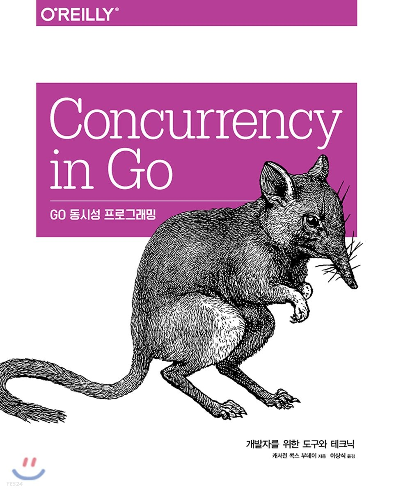

  

앞서 Go 기본 문법책을 살펴보면서 공부했던 동시성 개발에 대해 더 자세히 알고 싶어 동시성에 대해서만 다루고 있는 책을 살펴보았다.
`Go 동시성 프로그래밍`이라는 책인데, 동시성 개발의 역사부터 시작해서 Go언어에서 어떤 동시성 패턴을 제공하는지, 어떻게 더 편리하게 동시성을 관리할 수 있는지 패턴등을 알려주고 있다.

본 마크다운 문서에서는 책을 읽으면서 배운 용어들에 대해 정리하기 위해 작성을 시작하게 되었다.

# 1. 동시성 소개

## 1. 프로비저닝 (Provisioning)

프로비저닝이란 서버나 사용자등의 액세스를 설정하는 행위를 말한다. 클라우드 컴퓨팅이 대세가 된 2000년대 초부터 대부분의 IT 업체들은 자원을 프로비저닝하고, 장비 인스턴스 간에 통신하고, 결과를 집계하고 저장하는 문제를 겪어왔다. 무엇보다도 코드를 동시적으로 모델링하는 방법을 이해하는 것이 가장 어려웠는데, 이러한 모델링 시의 몇 가지 사안을 해결하면서 웹 스케일(Web Sacle)이라는 새로운 유명 소프트웨어 브랜드로 이어지게 되었다.

## 2. 웹 스케일 (Web Scale)

글로벌 수준 대규모의 환경에서도 높은 품질의 서비스를 영속적으로 제공하며, 비즈니스의 요구사항에 맞춰 신속하고 안정적으로 IT 자원을 설계, 구축, 관리하는 패턴이다. 주로 아마존, 구글, 페이스북 등 대형 클라우드 서비스 제공업체들의 클라우드 운영 방식을 말한다. 이들은 자신들의 인터넷 서비스를 더 빠르고 신속하게 전달하기 위해 데이터 센터를 짓고 클라우드를 운영한다. 이들의 만드는 웹 지향 아키텍쳐를 개발자가 장애를 더 빠르게 복구하며, 더 유연하고 탄력적인 시스템을 구축할 수 있도록 돕는다. 이들 회사들이 서버, 스토리지, 네트워크 등을 최적화하여 운영하게 된다.

## 3. 레이스 컨디션 (Race Condition)
둘 이상의 작업이 올바른 순서로 실행되어야 하지만, 프로그램이 그렇게 작성되지 않아서 순서가 유지되는 것이 보장되지 않을 때 발생. 두 프로세스가 서로 자원을 차지하기 위해 경쟁하는 상태를 의미.

## 4. 원자성
동작하는 Context 내에서 나누어지거나 중단되지 않는 것을 의미. 특정 연산에 대해 원자성이랑 더 이상 쪼개지지 않는 단위를 의미한다. Context에 따라서 원자성의 단위는 달라질 수 있다.

## 5. 컨텍스트(Context)
어떤 연산을 원자적이라고 판단할 수 있는 범위.

## 6. 임계 영역 (Critical Section)
프로그램에서 공유 리소스에 독점적으로 접근해야 하는 영역.

## 7. 데드락 (Dead Lock)
프로그램이 데드락 상태에 빠지면, 해당 프로그램에서 동시에 실행 중인 모든 프로세스는 자신이 아닌 다른 프로세스가 끝나길 기다린다. 데드락 상태는 외부 개입 없이는 결코 프로그램을 복구시킬 수 없다.

	- 코프먼 조건: 데드락의 발생 조건
	1. 상호 배제(Mutual Exclusion): 동시에 실행되는 프로세스가 어떤 임의의 시점에 하나의 리소스에 대한 배타적 권리를 보유한다.
	2. 대기 조건(Wait For Condition): 동시에 실행되는 프로세스는 하나의 리소스를 보유하고 있는 동시에 또 다른 리소스를 기다리고 있다.
	3. 비선점(Non Preemption): 동시에 실행되는 프로세스 중 하나를 보유하고 있는 리소스는 해당 프로세스에 의해서만 사용 해제될 수 있다. (외부에 의해 사용 해제될 수 없다.)
	4. 순환 대기(Circual Wait): 동시에 실행되는 프로세스들은 순환적으로 다음 프로세스가 요구하는 리소스를 가지고 있다.

## 8. 라이브락 (Live Lock)
프로그램들이 활동적으로 동시에 연산을 수행하고는 있지만, 이 연산들의 실제로 프로그램의 상태를 진행시키는 데 아무런 영향을 주지 못하는 의미 없는 연산 상태를 의미한다.

## 9. 기아 상태 (Starvation)
어떤 동시 프로세스가 작업을 수행하는 데 필요한 모든 리소스를 얻을 수 없는 상황.

## 10. 쓰레드 풀 (Thread Pool)
실행 중인 어플리케이션에서 사용자로부터 들어온 요청을 작업큐에 넣고, 쓰레드 풀은 이러한 작업큐에 들어온 작업들을 미리 생성해놓은 쓰레드에게 할당한다. 일을 다 처리한 쓰레드들은 다시 어플리케이션에 결과값을 리턴한다.

    - 쓰레드 풀의 장점
    1. 프로그램 성능저하를 방지
    매번 발생되는 작업을 병렬처리하기 위해 스레드를 생성/수거하는데 따른 부담은 프로그램 전체적인 퍼포먼스 저하시킨다. 따라서 쓰레드풀을 만들어 놓는다.

    2. 다수의 사용자 요청을 처리하기 위해
    서비스적인 측면으로 바라볼 때 특히 대규모 프로젝트에서 중요하다. 다수의 사용자의 요청을 수용하고, 빠르게 처리하고 대응하기 위해 스레드풀을 사용한다.

    - 쓰레드 풀의 단점
    1. 과생성된 쓰레드 풀은 메모리를 낭비한다.

    2. 제대로 설정하지 않으면 노는 쓰레드가 발생한다.

## 11. CSP (Communicationg Sequential Processes)
동시성을 다루는 고전적이지 않은 모델. 기존과 같이 공유 메모리에 대한 임계 지역을 설정하고 Mutex를 사용하여 프로세스간의 통신을 하는 방식이 아니라, 고루틴과 채널을 사용하여 프로세서간의 통신을 통해 메모리를 공유하는 방식이다. 1978년 찰스 안토니 리차드 호어의 미국 계산기 학회(ACM)에서 발표한 [논문](http://bit.ly/HoareCSP)의 내용을 기초로 한다.