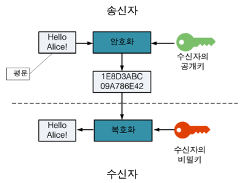

대학 때 컴퓨터 공학 과목을 들으며 한번 쯤은 외웠던 개념인데 몇 년이 지나다 보니 계속 까먹은 상태로 있어서... 한 번 정리해보자는 김에 작성하게 되었다. 보통 암호화, 복호화 시 사용하는 키가 같은지 다른지에 따라 개인키, 대칭키로 나뉜다. 용어가 여러 가지로 불리는데, 정리해보자면,

개인키 = 비밀키 = 대칭키 = 비공개키
공개키 = 비대칭키

# 1. 개인키 (대칭키)

    - 개인키 (대칭키) 기법은 하나의 비밀키를 client, server가 모두 같이 사용하는 기법이다.
    - 암호화, 복호화 시 사용하는 알고리즘이 동일하고 공개 키에 비해 계산 속도가 빠르다.
    - 다만, 해커에 의해 비밀키가 탈취되면 데이터를 안전하게 보관할 수 없다.
    - 대칭키는 암호화하는 단위에 따라 스트림암호화 블록암호로 나뉠 수 있다.
        - 스트림 암호화: 연속적인 비트/바이트를 계속하여 입력받아, 그에 대응하는 암호화 비트/바이트를 생성
        - 블록 암호화: 정해진 한 블록(단위)를 입력받아 그에 대응하는 암호화 블록을 생성. 블록암호의 경우 적절한 운용모드를 조합하면 블록 단위보다 큰 입력을 처리할  수 있음. 또한 스트림암호와 유사하게 지속적인 입력에 대해 동작할 수 있음. (대신 입출력 단위는 스트림암호보다 큰 블록 단위가 됨)
    - 개인키 기법 알고리즘: DES, 3-DES, AES, SEED, ARIA, MASK

# 2. 공개키 (비대칭키)

    - 공개키 (비대칭키) 기법은 공개키, 비밀키 두 개의 키가 존재한다.
    - 즉, 암호화와 복호화 시의 키가 다르다. 이에 비대칭 암호화 알고리즘을 사용한다.
    - 암호화할 때는 공개키(public key), 복호화할 때는 비밀키(private key)가 사용된다.
    - 공개키는 누구나 가지고 있지만, 비밀키는 소유자만 가지고 있어 특정 비밀키를 가지는 사용자만 내용을 볼 수 있다.
    - 송신자는 수신자에게 공개키를 받아 내용을 암호화하여 전달하고, 수신자는 비밀키를 사용하여 암호화된 내용을 평문으로 복호화한다.
    - 속도가 느리기 때문에 보통 긴 문서를 암호화하기 보다는, 대칭키를 암호화하는데 사용됨.
    - 공개키 기법 알고리즘: RSA, Elgamal

  

 

# 출처
https://gaeko-security-hack.tistory.com/123