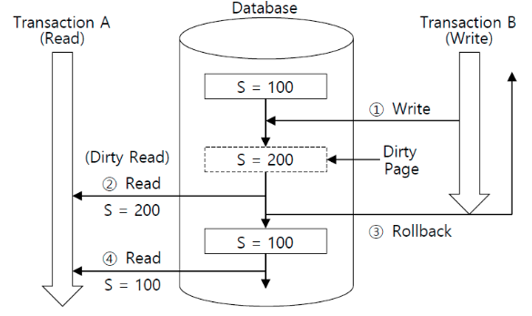

## 트랜잭션? ACID 원칙?

Database에는 ACID 원칙이란 것이 있다. 데이터베이스 트랜잭션이 안전하게 수행되는 것을 보장하기 위한 원칙을 말한다. 트랜잭션이란 데이터베이스에서 작업의 단위를 말하며 한 트랜잭션 안에는 여러 쿼리가 동작할 수 있다. 위키에 등록된 데이터베이스 트랜잭션의 정의에는 `데이터베이스 트랜잭션(Database Transaction)은 데이터베이스 관리 시스템 또는 유사한 시스템에서 상호작용의 단위이다. 여기서 유사한 시스템이란 트랜잭션이 성공과 실패가 분명하고 상호 독립적이며, 일관되고 믿을 수 있는 시스템을 의미한다.` 라고 되어 있다. 트랜잭션에는 이러한 성질히 안전하게 수행되기 위해 앞서 말한 ACID 원칙을 고려하여 개발되어 있다. 각각의 의미는 다음과 같다.

## ACID 원칙의 종류

- 원자성(Atomicity)은 트랜잭션과 관련된 작업들이 부분적으로 실행되다가 중단되지 않는 것을 보장하는 능력이다.
- 일관성(Consistency)은 트랜잭션이 실행을 성공적으로 완료하면 언제나 일관성 있는 데이터베이스 상태로 유지하는 것을 의미한다.
- 독립성(Isolation)은 트랜잭션을 수행 시 다른 트랜잭션의 연산 작업이 끼어들지 못하도록 보장하는 것을 의미한다. 이것은 트랜잭션 밖에 있는 어떤 연산도 중간 단계의 데이터를 볼 수 없음을 의미한다.
- 지속성(Durability)은 성공적으로 수행된 트랜잭션은 영원히 반영되어야 함을 의미한다. 시스템 문제, DB 일관성 체크 등을 하더라도 유지되어야 함을 의미한다. 전형적으로 모든 트랜잭션은 로그로 남고 시스템 장애 발생 전 상태로 되돌릴 수 있다. 트랜잭션은 로그에 모든 것이 저장된 후에만 commit 상태로 간주될 수 있다.

좀 더 알기 쉽게 풀어쓰지만, 원자성이란 한 트랜잭션은 내부 동작이 모두 완료되어야 종료된다는 것이다. `BEGIN`으로 시작해서, `COMMIT` 혹은 `ROLLBACK` 사이에 있는 모든 쿼리들은 하나의 트랜잭션에 묶여 하나의 동작 단위로 작동한다. 중간에 동작을 완료하지 못한 쿼리가 있다면 이전의 동작은 모두 취소된다. 일관성이란 트랜잭션의 이전과 이후 데이터베이스의 상태는 이전과 같이 유효해야 한다는 것이다. 즉, 제약(Constraint)이 위반되는 쿼리는 용납하지 않는다는 것이다. 독립성(혹은 고립성)이란 각 트랜잭션이 상호간에 영향을 주지 말아야 한다는 점이다. 마지막으로 지속성이란, 성공한 트랜잭션은 영원히 기록이 남아 있어야 한다는 점이다.

이러한 성질을 유지하기 위해 데이터베이스에는 Lock이 구현되어 있다. 동시성이 요구되는 소프트웨어를 개발하다 보면 서로 영향을 줄 수 있는 데이터 (Foriegn Key, Primary Key)에 동시에 접근하여 읽고 쓰는 작업을 수행하는 경우가 발생한다. 이러한 상황에서 경우에 따라서는 ACID 원칙이 위배되는 상황이 발생할 수 있는데, Lock을 통해 각 트랜잭션 간의 영향을 줄 수 있는 상황을 방지할 수 있다. 물론, Lock이 발생하면 소프트웨어가 먹통이 되므로 개발자는 이러한 상황이 발생하지 않도록 개발해야 한다.

하지만 실제 데이터베이스들은 ACID 원칙이 종종 지켜지지 않는다. ACID 원칙을 너무 확고하게 지키게 되면 동시성이 매우 떨어기지 때문이다. 동시성을 확보하기 위해 데이터베이스는 독립성의 수준을 유연하게 조절한다. 그로 인해 Read Phenomena라고 하는 하나의 데이터에 읽기/수정이 동시에 발생할때 나타나는 현상이 발생한다. 현재 많이 사용되고 있는 데이터베이스들은 각각 독립성 수준에 차이가 있으나, 이러한 현상을 해결하기 위한 방법을 가지고 있다.

## Read Phenomena

Read Phenomena는 독립성의 수준에 따라 트랜잭션간의 읽기/쓰기에 영향을 받아 발생하는 현상을 의미한다. 크게 4가지가 존재하며, 데이터베이스 엔진마다 적용되는 수준은 조금씩 다르다.

### Dirty Read

Dirty Read란 한 트랜잭션은 다른 트랜잭션에 아직 커밋하지 않은 자료도 읽을 수 있다. 동시에 실행중인 두 트랜잭션에서 한 트랜잭션이 데이터를 수정한 뒤, 아직 커밋을 찍지 않은 상황에서 다른 트랜잭션에서 그 데이터를 읽을 때 발생한다. 이 경우 한 트랜잭션은 다른 트랜잭션이 커밋했는지, 롤백했는지를 알 수 없기 때문에 부정확한 데이터를 가지고 쿼리를 수행하게 된다.

  

### Non-Repeatable Read

Non-Repeatable Read란 한 트랜잭션은 다른 트랜잭션에서 커밋한 자료를 읽을 수 있다. 한 트랜잭션에서 한 row를 두 번 읽을 때, 그 사이 다른 트랜잭션에 의애 수정되고 커밋되어 다른 값을 보게 되는 현상을 의미한다.

### Phantom Read

Phantom Read란 위와 같은 상황에서 다른 트랜잭션에 의한 커밋된 자료가 있다 하더라도, 항상 자신의 트랜잭션에서 조회 했던 그 자료값 그대로 보여준다. 한 트랜잭션에서 특정 조건에 부합하는 row들을 찾을 때, 그 사이 다른 트랜잭션에 의해 수정되고 커밋되어 다른 row들의 결과를 보게 되는 현상이다.

### Serialization Anomaly

Serialization Anomaly란 두 트랜잭션이 순서에 상관 없이 순차적으로 동작할 때 일관성이 없는 현상이다.

## 격리수준 (Isolation Level)

이 네 가지 현상들은 트랜잭션의 격리 수준에 따라 다르게 발생한다. 각 격리수준은 Consistent Read(일관성 있는 읽기)를 어느 정도 보장하느냐에 따라 달라진다. 격리수준은 ANSI(American National Standars Institue)에서 정의한 내용으로 각각 다음과 같다.

- Read Uncommited: 커밋되지 않는 트랜잭션에 의해 쓰여진 데이터를 읽을 수 있다. 공유 Lock 없음.
- Read Commited: 커밋된 트랜잭션에 의해 쓰여진 데이터만 읽을 수 있다. 공유 Lock 설정 후 완료 시 해제.
- Repeatable Read: 같은 읽기 쿼리는 항상 같은 결과를 보여준다. (다른 트랜잭션의 Update 금지) 공유 Lock 설정 후 트랜잭션 끝까지 유지.
- Serializable: Reapetable Read와 거의 동일하나 SELECT문이 모두 SELECT ... FOR SHARE로 변경된다. (다른 트랜잭션의 Insert, Delete, Update 금지) 공유 Lock 설정 후 트랜잭션 끝까지 유지.

|격리수준|Dirty Read|Non-Repeatable Read|Phantom Read|Serialization Anomaly|
|---|---|---|---|---|
|Read Uncommited|가능. PG에서는 불가능|가능|가능|가능|
|Read Commited|불가능|가능|가능|가능|
|Repeatable Read|불가능|불가능|불가능|가능|
|Serializable|불가능|불가능|불가능|불가능|

## 출처
http://blog.skby.net/dirty-read/ 
https://dev.to/techschoolguru/understand-isolation-levels-read-phenomena-in-mysql-postgres-c2e 
https://suhwan.dev/2019/06/09/transaction-isolation-level-and-lock/