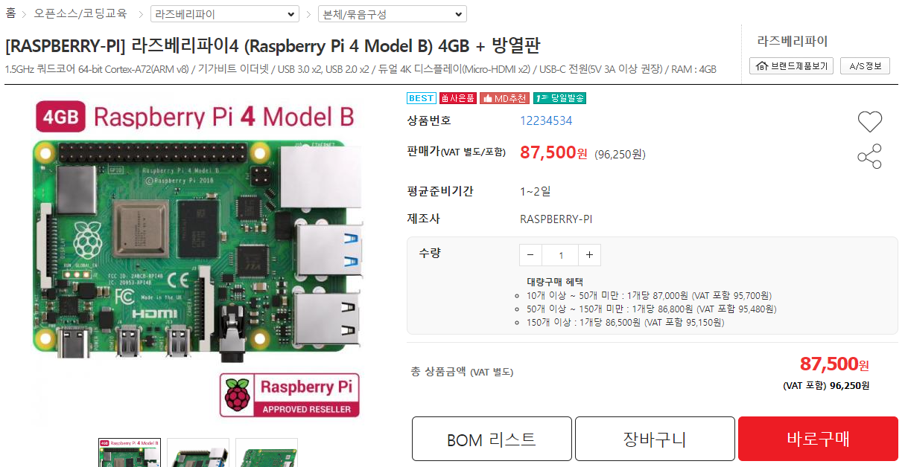
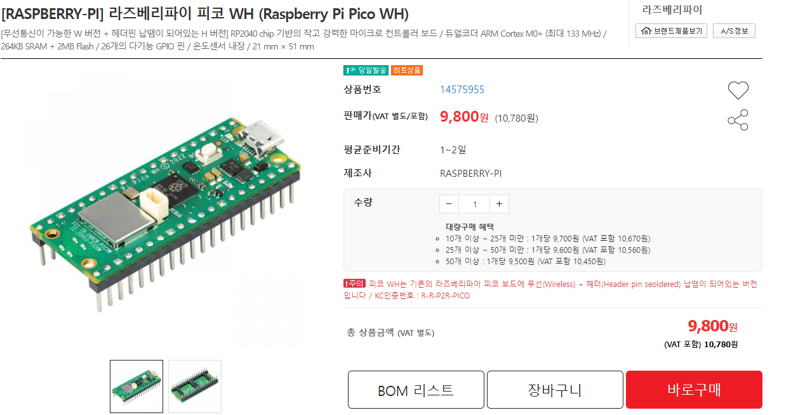
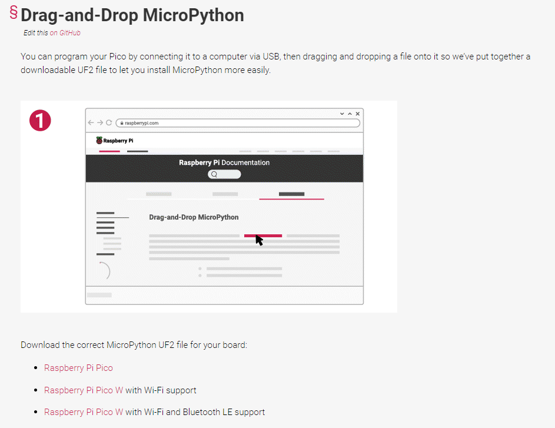

RaspberryPi Pico는 라이베리파이 재단에서 소형 MCU 보드로, 기존 라즈베리파이가 MPU를 사용하여 OS를 올리는 방식과 달리 마이크로컨트롤러를 이용하였다. 또한, 자체 설계한 RP2040 프로세서로 작지만 강력한 성능을 보여주는 장치이다. 내가 프로젝트를 하면서 이 녀석을 사용하게 된 이유는 가성비가 엄청나다는 점이었다. 단순하게 가격 비교만 해봐도 아래와 같이 비교가 된다.

  
  

 

위 사진은 본체 단위의 단순 가격을 비교한건데, 본체만 했을 때 거의 1/8 가격으로 구매 가능하다. Pico WH의 경우 헤더핀을 장착한 모델인데, 헤더핀을 빼고 구매하면 더 저렴하게 구매 가능하다. 불과 수 년 전만 해도 라즈베리파이가 이정도 가격은 아니였던 때도 있었는데, 코로나 시기 반도체 물량 부족으로 인해 가격이 천정부지로 올라버렸다.

 

물론, 기존 Raspberry Pi 4가 성능적으로도 더 우월하며, OS가 올라가 있어 각종 설정이 쉽다. 또한, 레퍼런스가 많아 다양한 작업을 빠르게 찾아 적용 가능하다는 점에서 구현 면에서는 훨씬 쉬울 것이다. 하지만, OS에서 제공하는 대부분의 기능은 내가 원하는 프로젝트에서는 너무 무겁게 느껴지게 되었고 Pico의 경우 아두이노보다도 더 저렴한 MCU다 보니 선택하게 되었다.

 

Pico는 아래와 같은 Pinout을 갖는다. I2C, SPI, UART 2개, 12 Bit ADC 3개, 16채널 PWM을 제공하며 USB 1.1 포트를 제공한다. USB 1.1 포트를 통해서 전원을 공급하거나 각종 파일 전달이 가능하다. Pico W의 경우 각종 무선 네트워크 기능이 추가로 제공된다. 지원되는 인터페이스로는 단일 밴드 2.4GHz 무선 인터페이스 (Wi-fi), WPA3, Blooth 5.2 (Blooth Classic, BLE 모두 지원)가 있다.

  

 

Pico는 기본적으로 C, C++ 기반의 임베디드 언어를 지원한다. 다만, 이를 위해서는 [pico SDK](https://github.com/raspberrypi/pico-sdk)를 사용하거나 [RTOS](https://www.freertos.org/index.html)와 같은 오픈소스 프로젝트를 공부해야 한다는 점에서 빠른 기능 구현을 위해 포기하게 되었다.

 

C나 C++을 제외한다면 가장 대중적으로 사용되는 언어는 [MicroPython](https://micropython.org/)이다. 라즈베리파이 재단에서 공식적으로 지원하는 언어는 이렇게 두 종류이다. 파이썬이라면 학부때 사용했던 기억이 있기에 이를 채택하게 되었다. 레퍼런스도 pico SDK 다음으로 많았기 때문에 대부분의 기능을 쉽게 구현 가능했다. (물론 성능을 고려한다면 C/C++를 사용하는게 좋다.)

 

앞서 너무 많은 TMI를 서술하였는데, 제목의 내용을 간단하게 설명해보고자 한다. C++/C 코드를 구현하는 방법은 차후에 다시 작성할 예정이다.

 

## 1. MicroPhton SDK 다운로드

먼저, SDK의 경우 [링크](https://www.raspberrypi.com/documentation/microcontrollers/micropython.html#what-is-micropython)에서 다운로드 가능하다. 페이지에 접속하여, 화면을 좀 내리다 보면 아래와 같은 부분을 발견할 수 있다.

 

  

 

각 링크는 라즈베리파이 피코, 라즈베리파이 피코 W (BLE 기능 제외 Wi-fi만 제공), 라즈베리파이 피코 W (BLE 기능 추가 지원)으로, 사용하고자 하는 라즈베리파이 버전과 용도에 맞게 다운로드를 하면 된다. 다운로드를 하면 `.uf2` 파일이 받아진다.

 

## 2. Raspberry Pi Pico 연결

Pico를 연결하면 Windows의 경우 자동으로 드라이버를 설치해준다. Mac이나 Linux의 경우 COM Port를 붙어서 진행하거나 [Thonny IDE](https://thonny.org/)를 통해서도 설치 가능하다. 처음 연결하면 바로 가능하나, 다시 SDK를 설치하고자 하면 pico의 `BOOTSET` 버튼을 꾹 누르면 SDK가 초기화되어 설치 가능하다.

 

## 3. SDK 설치

라즈베리파이가 연결되었고 내PC에서 연결된 것이 보이면 아까 다운받았던 `uf2` 파일을 넣어주면 끝이다. Thonny IDE로 다운받을 경우 pico를 연결한 뒤, 화면 우측 하단에서 `Install MicroPython`을 통해 설치 가능하다. 다만, 이 경로로 설치를 하면 pico W의 경우, BLE 기능이 지원되는 SDK를 설치할 수 없다는 단점이 있다.

 

코드 작성은 Visual Studio Code나 Thonny IDE를 통해서 가능하다. IDE로서의 기능은 VS Code가 좋지만, pico에 파일을 전달하거나 하는 UI는 Thonny가 더 낫다. 취향대로 사용하면 된다. 두 IDE 모두 pico 내부 혹은 PC의 `.py` 파일을 동작하도록 하는 것도 가능하다. 외부 전원을 넣고 전원이 들어올때마다 자동으로 동작시키고자 한다면 `main.py` 파일 내에 main 함수를 작성해주면 된다.

 

## 4. 초기화

만약, `main.py` 파일을 작성하여 동작시키도록 하였는데, 반복 루프를 걸어서 PC에 연결을 해도 동작이 멈추지 않는다면 어떻게 해야할까? 보통은 인터럽트를 걸어서 코드를 중단시키는 방법이 있으나 통하지 않는 경우도 있다. 이 경우 SDK 재설치 방법은 통하지 않는다. SDK 재설치는 SDK 파일만 날리는 거라 `.py` 파일들은 그대로 남아 있어 설치한 뒤에 바로 또 빠져나올 수 없는 루프로 진입하게 된다.

이때는 [flash_nuke.uf2](https://github.com/dwelch67/raspberrypi-pico/blob/main/flash_nuke.uf2) 파일을 넣어주면 된다. SDK 초기화와 마찬가지로 `BOOTSET` 버튼을 누른 뒤, 화면을 통해 flash_nuke.uf2 파일을 넣어주기만 하면 된다.

 

## 끝마치며

위 내용들은 사실 [메뉴얼](https://www.raspberrypi.com/documentation/microcontrollers/raspberry-pi-pico.html)만 천천히 읽어봐도 쉽게 확인 가능한 내용들이다. 나처럼 삽질하면서 하나씩 알아가는 사람이 없기를 바라며 이렇게 정리해보았다.

 

추가로, 지원되는 언어를 찾아보다 보니 Go언어에서도 이러한 임베디드 프로그래밍을 지원하기 위한 프로젝트가 있는 모양이다. [TinyGo](https://tinygo.org/)라고 하는데, 예시 코드가 돌아가는 MCU가 Raspberry Pi를 이용한 것 같다. 라이브러리를 대충 보니 공식 지원되는 언어와 비슷한 기능들이 대부분 지원되는 것 같아서 한번 고려해 보는 것도 좋을 것 같다. 빌드 후 바이너리의 형태를 pico에 넣는 방식인 것을 보니 MicroPython 보다는 성능적으로 더 좋지 않을까 싶다.