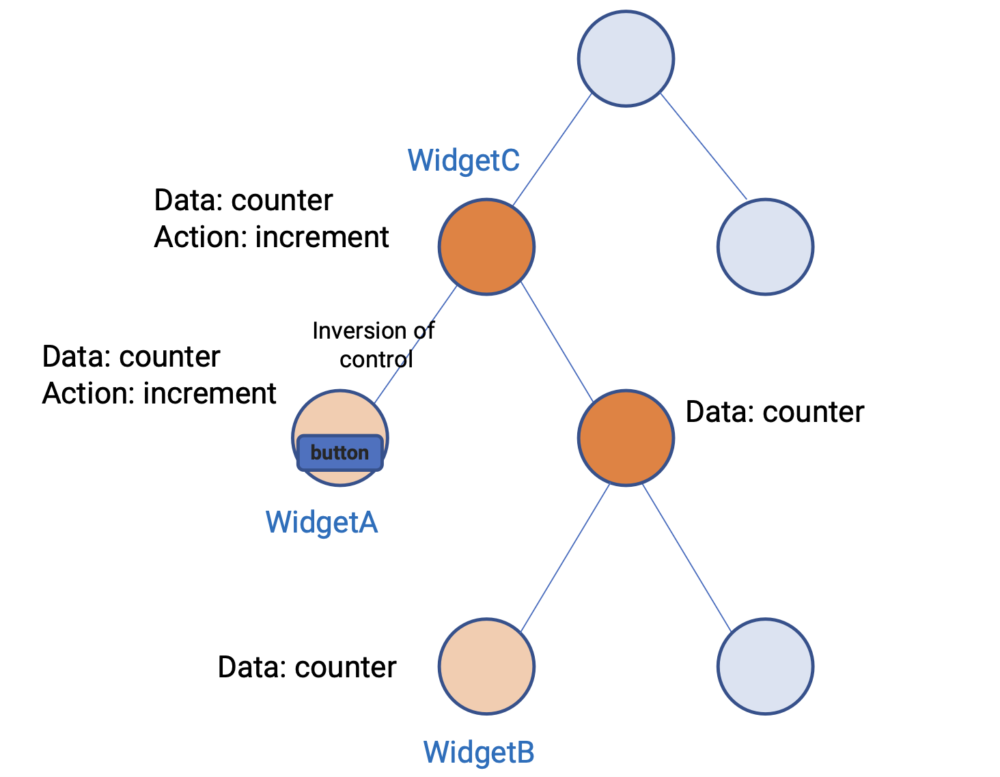
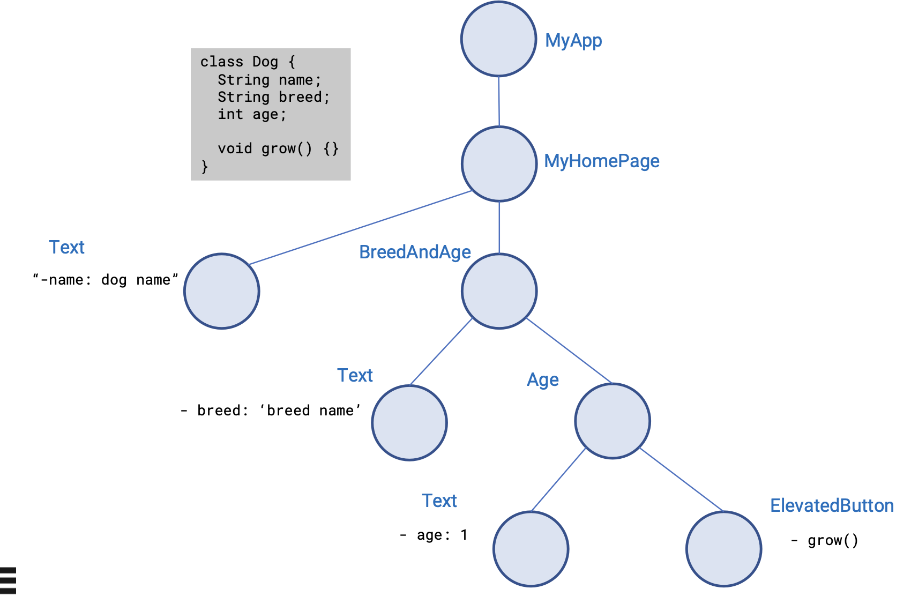
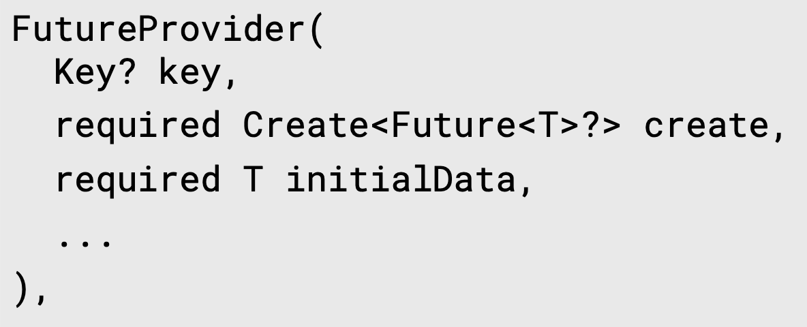
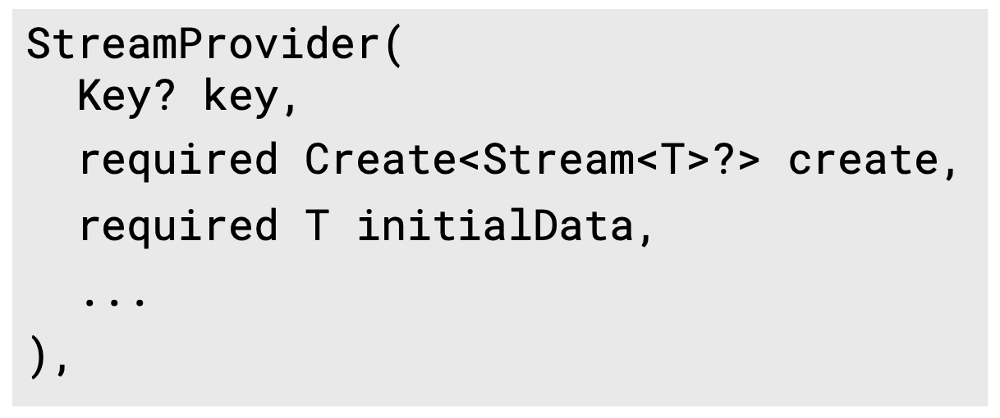

# 1. FE 상태 관리의 필요성

<div align="left">
  
</div>

FE 개발을 하다 보면 위와 같이 트리 구조의 위젯의 여러 부분에서 같은 값을 사용해야할 필요가 있다. 예를 들어 WidgetA의 카운터 값을 WidgetB에서도 사용하여 보여줄 필요가 있다는 말이다. 이를 위해서는, 두 위젯의 공통 부모인 WidgetC에서 counter 변수를 정의하고, 카운터 값을 변화시킬 수 있는 increment() 함수를 선언해줘야 한다. 또한, 실제 값의 변화 동작이 일어나는 WidgetA에는 counter 변수와 increment() 함수를 넘겨줘야 하고, WidgetB에도 counter 변수를 넘겨줘야 한다. 하지만, 트리구조 상 WidgetC -> WidgetB로 바로 넘겨주는 것이 불가능하니, 실제로 counter를 사용하지 않음에도 이를 받아서 WidgetB로 넘기는 구조가 되어야 한다.

</br>

이러한 구조를 inversion of control이라고 한다. 실제 동작과 값을 사용하지 않음에도 동작에 대한 부분과 동작을 통해 값이 변화하는 비즈니스 로직이 다른 곳에 구현되어야 하고, 실제 사용되지도 않는 위젯을 거쳐서 값을 전달해야 하는 이러한 상황을 의미한다. FE 개발을 하면서도 너무나도 직관적이지 못하고 쓸데 없이 복잡한 구조를 만들어낼 수 있다고 생각한 부분이었다.

</br>

이러한 구조에서는 다음과 같은 문제들이 있을 수 있다.

## 1.1. 복잡한 위젯일 수록 기하급수적으로 복잡해지는 상태 관리


위의 트리 이미지처럼 3-4 Depth의 UI 구조에서는 급하게 구현한다고 하면 그래도 관리할 수 있을 것이다. 하지만 Depth가 기하급수적으로 증가한다면, 상태 관리 시 관여되는 위젯의 수도 기하급수적으로 늘어나며, 코드 구현이 매우 어려워진다.

</br>

## 1.2. 유지보수의 어려움


마찬가지로, 실제로는 값을 사용하지 않음에도 값을 들고 있는 위젯 수가 많아지므로 실제로 값이 사용되고 변화하는 위젯들에 대한 코드 상의 추적 관리가 어려워진다. Dependency가 여기저기 있으므로 한번 수정할 때 모든 위젯의 전수 조사가 필요해지므로 그만큼 유지보수가 어려워진다.

</br>

## 1.3. 렌더링 오버헤드


여러 위젯이 같은 값이 존재하는 만큼 값이 변화할 때마다 불필요한 렌더링이 발생할 수 있다. 이는 화면상의 성능 저하에도 많은 부분관여될 것이다.


# 2. 이를 해결하기 위한 상태 관리 기법


이러한 문제들을 해결하기 위해 Flutter에서는 여러 가지 상태 기법들이 존재한다. 그 중 가장 대중적이면서 Google에서 공식적인 상태 관리 기법으로 이야기되는 것이 Provider이다. 사실 이 부분에서 여러 가지 상태 관리 기법들을 소개하고 비교해보고 싶었으나, 각 상태 관리 기법들의 차이점에 대해 자세히 알지는 못하기 때문에 정량적인 부분만 비교를 진행하겠다.

#### flutter 상태 관리 기법별 정량적 비교 (2024/01/06 기준)
|Name|Recent Stable Version|Star|Recent Update|
|---|---|---|---|
|Provider|6.1.1|5k|2023/11/26|
|GetX|4.6.6|9.5k|2023/11/02|
|Bloc|0.2.3|11.1k|2023/12/18|
|Redux|0.6.0|1.6k|2022/7/7|
|RiverPod|3.0.0|5.4k|2023/12/27|
|flutter_hooks|0.20.4|2.9k|2024/01/03|


이러한 상태 관리 기법들에서는 코드 상의 컨벤션이나 용어/방법의 차이는 조금씩 존재한다. 일부는 기존의 Vuex나 Redux같은 상태 관리 기법에서 방법을 가져온 것도 있을 것이다. 요점은 방식은 다르나, `1) Dependency Injection`, `2) Synchronizing data and UI` 을 제공한다는 점은 공통적이다.


## 2.1. Dependency Injection


위의 예제 사례와 다르게 필요한 UI 위젯에서만 값과 비즈니스 로직을 가져간다는 점이다. 불필요하게 값을 가지는 위젯을 줄일 수 있어야 한다.

</br>

## 2.2. Synchronizing data and UI


값이 변경되었을 때, 이를 UI에서 인지하고 바로 반영할 수 있어야 한다. 한가지 중요한 점은 렌더링 시 정말로 사용되는 곳만 정확하게 변경될 수 있어야 한다는 점이다.


</br>


# 3. 상태 관리 기법 적용 (Provider)


본 예시에서는 위의 기법들 중 `Provider`를 사용하여 상태 관리 방식을 적용해보겠다.

</br>

위의 예제에서 상태 관리 기법을 적용하면 아래와 같은 이미지가 될 수 있다. 이미지에는 표시되지 않았지만, Provider는 위젯의 한 종류로 사용되는데 Provider 하단의 모든 위젯에 상태가 제공될 수 있다. 따라서, MyApp 상단에 Provider으로 감싸준다. 그리고, 별도 class를 정의하여 상태를 공유할 값들을 정한다. Provider 위젯 내의 create에는 생성할 클래스를 넣어줄 수 있는데 여기에 생성한 class의 인스턴스를 넣어준다. (`create: (context) => T()`) 상태를 공유할 하단의 위젯에서는 `Provider<T>.of(context).Something`의 형태로 Method나 상태에 접근할 수 있다.


<div align="left">
  
</div>

</br>

만약, 동일한 클래스의 인스턴스를 여러 개 생성하게 된다면 어떻게 될까? 이 경우에는 트리상 가장 가까운 곳에서 생성한 인스턴스에 접근하게 된다.

</br>

# 4. ChangeNotifierProvider 적용


Provider를 적용하면 최상단에 정의된 인스턴스의 값을 깊은 depth의 모든 위젯에서 접근이 가능하다. 다만, 실제 값이 변화하는 부분을 UI에서 바로 반영시키지는 않는다. 이러한 기능은 ChangeNotifier를 통해 해결할 수 있다. ChangeNotifer에는 그냥 ChangeNotifier와 ChangeNotifierProvider가 있는데, 전자는 최상위 위젯에 Provider를 적용하지 않고 StatefulWidget 내에서 `initState`(addListener), `dispose`(deleteListener), `TListener`(Listener Callback) 함수들을 overrider 해주고, 각 위젯에 상태 class를 생성자로 넣어줘야 한다. 또한, 행위에 대한 비즈니스 로직을 수행하는 함수 내에서 `notifyListenr()`를 호출해줘서 위젯이 적용된 모든 UI의 화면을 갱신해줘야 한다.

</br>

반면, ChangeNotifierProvider는 Provider처럼 최상위 위젯으로 적용한 뒤, `notifyListenr()`만 제때 사용해주면 Provider를 통해 값을 가져오는 모든 UI에서 화면에 바로 반영되게 된다.

</br>

이러한 방법들을 통해 `Dependency Injection`과 `Synchronizing data and UI` 방식 구현이 가능하다.

## 4.1. Extension Methods


앞서 설명한 ChangeNotifierProvider는 Provider를 Consume하고 있는 모든 위젯이 상태를 보고 있다가, 변화가 있으면 화면에 적용할 수 있다. 이 때 Class 내에 정의된 값 하나만 변해도 화면이 갱신되게 되는데, 실제로는 값이 변하지 않았을 때도 화면이 갱신되므로 쓸데 없는 오버헤드가 발생된다.

</br>

이를 해결하는 방법으로는 Provider에서 제공하는 extension method를 사용하면 해결할 수 있다.


1. `context.read<T>() -> T`
  - 타입 T인 인스턴스를 가장 가까운 상위 Provider 위젯으로부터 가져옴
  - `Provider<T>.of(context, listen: false).Something`

2. `context.watch<T>() -> T`
  - 타입 T인 인스턴스를 가장 가까운 상위 Provider 위젯으로부터 가져옴. 또한, Provider 값을 구독함
  - `Provider<T>.of(context).Something`

3. `context.select<T, R>(R selector(T value)) -> R`
  - Provider를 통해 노출된 T 타입 값 중 한 부분만을 Listen함


1, 2는 값을 가져온 뒤 다시 렌더링을 할지 말지에 대한 차이가 있다면, 3은 인스턴스 내의 특정 value 하나만을 watch하는 방식이라고 볼 수 있다.


## 4.2. 그 외 Provider의 종류


### 4.2.1. MultiProvider


MultiProvider는 여러 타입으로 Provider를 먹이고 싶을 때 사용한다. 아래 예제를 보면 어떤 의미인지 바로 파악이 가능할 것이다.


```dart
MultiProvider(
  providers: [
    ChangeNotifierProvider<T>(
      create: (context) => T(),
    ),
    ChangeNotifierProvider<S>(
    ),create: (context) => S(),
    ChangeNotifierProvider<R>(
    ),create: (context) => R(),
  ],
),
```

</br>

### 4.2.2. FutureProvider

<div align="left">
  
</div>

</br>

FutureProvider는 위젯 트리에서는 이미 빌드되었는데, 사용하는 값이 아직 준비되지 않았을 때 사용하는 Provider이다. initialData가 required인데, 값을 가져올 때 까지 initialData를 보여주다가 Future가 Resolve되면 갱신된 값을 표시해준다. 이 때, 값은 두 번만 리빌드된다. (initialData로 한 번, Resolve된 Future 값으로 두 번) 여러 번 연속적으로 리빌드 되는 값을 사용하고 싶다면 StreamProvider를 사용하면 된다. 또한, 에러가 발생 가능한 FutureProvider일 경우 에러를 catch할 수 있는 함수로 제공해야 한다.

</br>

### 4.2.3. StreamProvider

<div align="left">
  
</div>

</br>

StreamProvider는 특정 값이 연속적으로 변경이 있을 때 주기적으로 이 값을 변경하여 적용하도록 사용된다. 보통은 이러한 기능은 StreamBuilder를 통해서도 가능하지만, 여러 위젯에서 동시에 사용하려면 StreamProvider를 사용하는 것이 편리하다. FutureProvider와 마찬가지로 계속 사용되는 타입이 StreamProvider의 타입으로도 사용된다.

</br>

이러한 StreamProvider는 Firebase처럼 Stream 형식으로 값을 주고받거나, 지속적인 값의 변화가 나타나는 기능들에서 사용될 수 있다.

# 5. 출처
https://www.udemy.com/course/flutter-provider-essential-korean/</br>