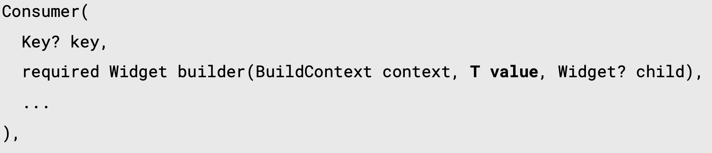
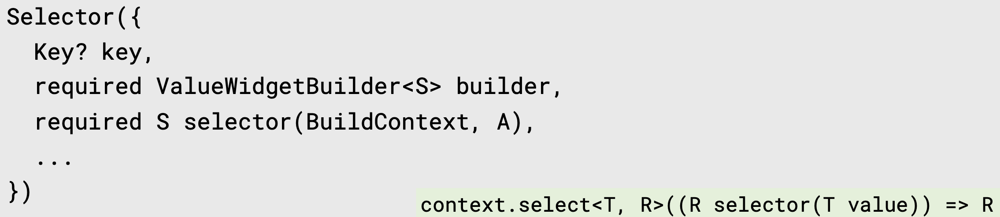

# 1. Consumer

</br>

<div align="left">
  
</div>

</br>

flutter의 공식 홈페이지를 살펴보면 Consumer의 정의는 다음과 같다. `개발자가 Provider<T>가 제공하는 타입을 명시적으로 builder에 제공해 줄 필요가 없다. 컨슈머 위젯은 굉장한 일을 하는 것이 아니라, 새로운 위젯에서 Provider.of를 호출하고 builder에게 이것의 구현을 위임한다. builder는 null이 될 수 없고, 값이 변할 때마다 호출되어야 한다` 즉, Consumer를 상위 위젯으로 지정해놓으면 하위 위젯에서는 Provier.of나 extension 메소드 없이 바로 Provider로 정의된 인스턴스에 접근할 수 있다는 것이다.

</br>

여기서 BuilderContext와 Widget을 사용하지 않는다면 언더바(_)로 생략 가능하다. child의 경우에는 변경이 일어나지 않아야 할 하위 위젯이 있을 때 사용된다.

</br>

```dart
Consumer<Dog>(
  builder: (BuildContext _, T t, Widget? child) {
    return Center(
      child: Column(
        mainAxisAlignment: MainAxisAlignment.center,
        mainAxisSize: MainAxisSize.min,
        children: [
          child!,
          SizedBox(height: 10),
          Text(
            '- name: ${T.name}',
            style: TextStyle(fontSize: 20.0),
          ),
          SizedBox(height: 10.0),
          BreedAndAge(),
        ],
      ),
    );
  },
  child:
      Text('I likes T very much', style: TextStyle(fontSize: 20.0))),
)
```

</br>

## 1.1. ProviderNotFoundException

ProviderNotFoundException이란 Provider를 생성할 때 context를 현재 위젯보다 상위 위젯(MaterialApp)의 context에 선언된 값을 가져와야 하는데, 상위 위젯에서는 Provider가 선언되어 있지 않을 때 발생한다. 즉, Provider에 접근하는 위젯이 Provider를 선언한 현재 위젯이거나, 그보다 상위에서 접근했다는 의미이다.

</br>

1) 더 상위 위젯에 Provider를 선언한다. Provider에 접근하는 위젯이 현재 Provider를 선언한 위젯이라면, child부분을 하위 위젯으로 분리한다.

2) Builder를 사용한다. build 콜백 함수를 통해 Builder라는 하위 위젯을 생성하므로, Provider에 접근 가능하다.

3) Consumer를 사용한다.

</br>

# 2. Selector

Selector 위젯은 Consumer와 유사한데, 한정된 수의 value들을 선택하여 값이 변하지 않으면 리빌드 하지 않는 위젯이다.

</br>

<div align="left">
  
</div>

</br>

Consumer와 거의 유사하나, selector 함수가 추가되었다. Extension method의 `select()`와 유사하게, Provider로 제공할 클래스, 리턴받을 값의 타입을 지정한다. builder 함수 역시 거의 유사하나, 타입 T가 아닌 앞서 selector에서 리턴받은 타입을 넣어준다.

# 3. 출처
https://www.udemy.com/course/flutter-provider-essential-korean/</br>