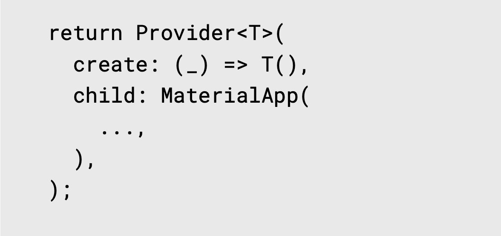

# 1. Provider Access

Provider의 화면 전환은 Navigator 위젯을 통해 이루어진다. 몇 가지 용어 설명을 덪붙이자면,

- 1. Route: Flutter에서 page, screen은 Route Object로 대표되며, Route Object는 Navigator 위젯으로 관리된다.

- 2. Navigator: Navigator 위젯은 Route Object 스택을 제어한다. 이 Navigator는 Route Obejct를 스택 내에 추가하고/제거할 수 있는 push/pop 함수를 제공한다. 이러한 기능을 통해 화면 전환이 가능하다.

- 3. MatrialPageRoute: screen은 Route Object이다. 명령형 탐색(Imperative Navigation)에서는 이러한 route는 통상적으로 MaterialPageRoute같은 클래스를 implement한다. MaterialPageRoute는 modal route이다. modal route는 해당 경로가 플랫폼에 적응하는 전환과 함께 전체 화면을 대체한다는 것을 의미한다.

Provider Access란 이러한 Navigator 위젯을 사용하여 기존 위젯의 화면과 다른 화면에서 Provider 인스턴스를 사용하는 기법들을 의미한다. 크게 3가지 기법이 존재하는데 다음과 같다.

- Anonymous route access
- Named route access
- Generated route access

## 1.1. Anonymous Route Access

Route 이름이 없는 Dynamic하게 짜여지는 Router를 의미한다. 앞서 설명한 대로, 페이지 전환은 Navigator 위젯의 `.push()`, `pop()` 함수들을 통해 구현되는데, 해당 함수의 2번째 파라미터로 MaterialPageRoute()를 제공하고, 해당 위젯의 builder 함수로 Provider 위젯을 리턴하는 방식이다. 이 때 사용되는 Provider 위젯은 ChangeNotifierProvider.value() 와 같이 value 함수를 사용하는 방식으로 제공해야 한다. 기존의 ChangeNotifierProvider 생성자 방식과 다른 점은 `create`을 통해 새로운 구조체를 생성하는 것이 아닌, `value`를 통해 이미 생성된 인스턴스를 넘겨주는 방식이다. 또한, provider에서 사용되는 context가 MaterialPageRoute의 context가 들어가지 않도록 주의해야 할 필요가 있다. Anonymous Router의 특징은 Route 시 직접 위젯을 넣는 방식을 의미한다.

</br>

```dart
class MyApp extends StatelessWidget {
  const MyApp({Key? key}) : super(key: key);

  @override
  Widget build(BuildContext context) {
    return MaterialApp(
      title: 'Anonymous Route',
      debugShowCheckedModeBanner: false,
      theme: ThemeData(
        primarySwatch: Colors.blue,
      ),
      home: ChangeNotifierProvider<Counter>(
        create: (context) => Counter(),
        child: const MyHomePage(),
      ),
    );
  }
}

class MyHomePage extends StatelessWidget {
  const MyHomePage({Key? key}) : super(key: key);

  @override
  Widget build(BuildContext context) {
    return Scaffold(
      body: Center(
        child: Column(
          mainAxisAlignment: MainAxisAlignment.center,
          children: [
            ElevatedButton(
              child: Text(
                'Show Me Counter',
                style: TextStyle(fontSize: 20.0),
              ),
              onPressed: () {
                // Navigator.push() 사용
                Navigator.push(
                  context,
                  MaterialPageRoute(builder: (_) {
                    return ChangeNotifierProvider.value(
                      value: context.read<Counter>(),
                      child: ShowMeCounter(),
                    );
                  }),
                );
              },
            ),
            SizedBox(height: 20.0),
            ElevatedButton(
              child: Text(
                'Increment Counter',
                style: TextStyle(fontSize: 20.0),
              ),
              onPressed: () {
                context.read<Counter>().increment();
              },
            ),
          ],
        ),
      ),
    );
  }
}

```

</br>

## 1.2. Named Route Access

 앞서 설명한 Anonymous Route Access와 다르게, Named Route Access는 이름에서 알 수 있듯이 각 위젯의 라우트 경로를 routes 프로퍼티에 사전에 정의하고, `Navigator.pushNamed(context, '/path')`를 통해서 라우트 경로를 통해 위젯의 화면을 전환시키는 방법이다. 이 때, Provider를 통해 생성되던 생성자가 State 위젯 내에서 정의되며, 이미 생성된 인스턴스를 ChangeNotifierProvider.value()에 제공되는 방식이다.

</br>

이전의 방식보다는 보다 직관적이나, 미리 생성한 인스턴스를 value로 넣어주는 방식이다 보니 위젯이 dispose될 때 인스턴스가 같이 dispose되지 않는다. 따라서, `dispose()` 함수를 override해주어야 한다.

</br>

```dart
class MyApp extends StatefulWidget {
  const MyApp({Key? key}) : super(key: key);

  @override
  State<MyApp> createState() => _MyAppState();
}

class _MyAppState extends State<MyApp> {
  // Counter 인스턴스를 미리 생성
  final Counter _counter = Counter();

  @override
  Widget build(BuildContext context) {
    return MaterialApp(
        title: 'Anonymous Route',
        debugShowCheckedModeBanner: false,
        theme: ThemeData(
          primarySwatch: Colors.blue,
        ),
        // home 부분을 routes로 교체
        routes: {
          '/': (context) => ChangeNotifierProvider.value(
                value: _counter,
                child: MyHomePage(),
              ),
          '/counter': (context) => ChangeNotifierProvider.value(
                value: _counter,
                child: ShowMeCounter(),
              )
        });
  }

  // dispose() 함수 override 하여 Counter 인스턴스도 dispose()
  @override
  void dispose() {
    _counter.dispose();
    super.dispose();
  }
}

class MyHomePage extends StatelessWidget {
  const MyHomePage({Key? key}) : super(key: key);

  @override
  Widget build(BuildContext context) {
    return Scaffold(
      body: Center(
        child: Column(
          mainAxisAlignment: MainAxisAlignment.center,
          children: [
            ElevatedButton(
              child: Text(
                'Show Me Counter',
                style: TextStyle(fontSize: 20.0),
              ),
              onPressed: () {
                // Navigator.pushNamed() 함수 사용
                Navigator.pushNamed(context, '/counter');
              },
            ),
            SizedBox(height: 20.0),
            ElevatedButton(
              child: Text(
                'Increment Counter',
                style: TextStyle(fontSize: 20.0),
              ),
              onPressed: () {
                context.read<Counter>().increment();
              },
            )
          ],
        ),
      ),
    );
  }
}
```

</br>

## 1.3 Generated Route Access

Named Route Access와 유사하나 routes 프로퍼티가 아니라 onGenerateRoute 프로퍼티를 사용한다.

</br>

```dart

class MyApp extends StatefulWidget {
  MyApp({Key? key}) : super(key: key);

  @override
  State<MyApp> createState() => _MyAppState();
}

class _MyAppState extends State<MyApp> {
  final Counter _counter = Counter();

  @override
  Widget build(BuildContext context) {
    return MaterialApp(
      title: 'Anonymous Route',
      debugShowCheckedModeBanner: false,
      theme: ThemeData(
        primarySwatch: Colors.blue,
      ),
      // routes 대신 onGenerateRoute 사용 후 switch 케이스로 분기 처리
      onGenerateRoute: (RouteSettings settings) {
        switch (settings.name) {
          case '/':
            return MaterialPageRoute(
                builder: (context) => ChangeNotifierProvider.value(
                      value: _counter,
                      child: MyHomePage(),
                    ));
          case '/counter':
            return MaterialPageRoute(
                builder: (context) => ChangeNotifierProvider.value(
                      value: _counter,
                      child: ShowMeCounter(),
                    ));
          default:
            return null; 
        }
      },
    );
  }

  @override
  void dispose() {
    _counter.dispose();
    super.dispose();
  }
}

class MyHomePage extends StatelessWidget {
  const MyHomePage({Key? key}) : super(key: key);

  @override
  Widget build(BuildContext context) {
    return Scaffold(
      body: Center(
        child: Column(
          mainAxisAlignment: MainAxisAlignment.center,
          children: [
            ElevatedButton(
              child: Text(
                'Show Me Counter',
                style: TextStyle(fontSize: 20.0),
              ),
              onPressed: () {
                Navigator.pushNamed(context, '/counter');
              },
            ),
            SizedBox(height: 20.0),
            ElevatedButton(
              child: Text(
                'Increment Counter',
                style: TextStyle(fontSize: 20.0),
              ),
              onPressed: () {
                context.read<Counter>().increment();
              },
            )
          ],
        ),
      ),
    );
  }
}
```

<br>

## 1.4 Global Access

Global Access란 방식은 말은 거창하지만 간단하게 최상위 MaterialApp 위젯에 Provider로 감싸는 기존에 배운 방식을 의미한다. 간단한 App이라면 각종 Provider Access 방식을 굳이 사용할 필요가 없겠으나, App의 규모가 커지고 복잡해진다면 바람직하지 않은 방식이다.

</br>

<div align="left">
  
</div>

</br>

# 2. 출처
https://www.udemy.com/course/flutter-provider-essential-korean/</br>