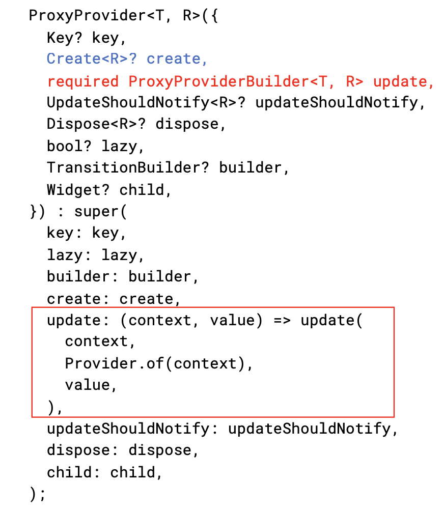
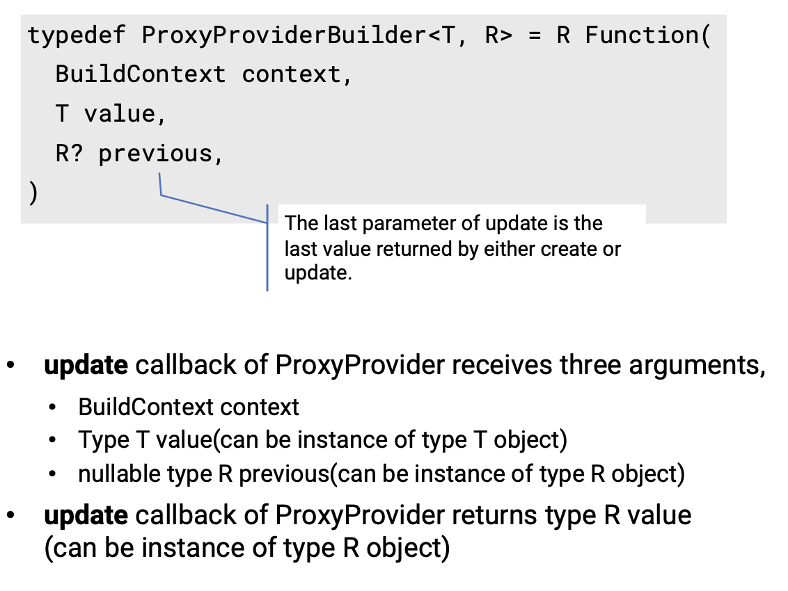
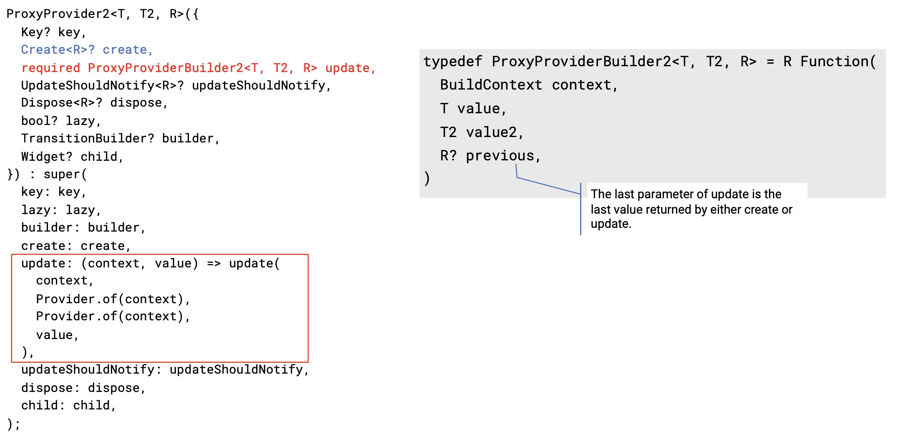
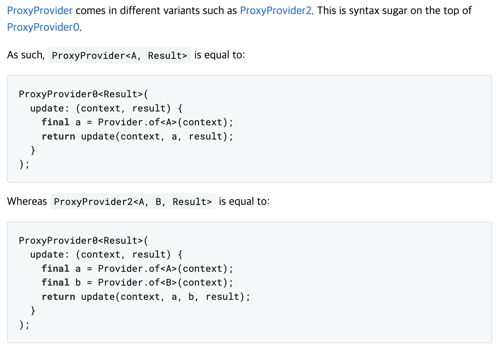
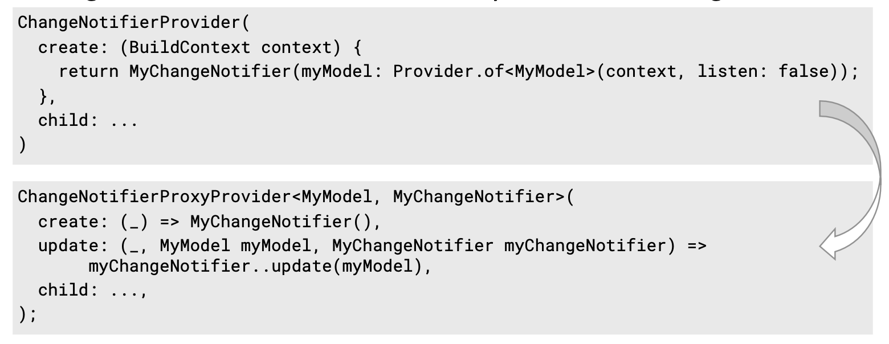

# 1. Proxy Provider

Provider란 위젯에 Non-위젯 오브젝트를 제공하는 위젯이라고 할 수 있다. 만약, 한 Provider에서 다른 Provider의 값이 필요한 경우에는 어떻게 해야할까? 이 때는 `Proxy Provider`를 사용할 수 있다. `Proxy Provider`는 다른 Provider들의 의존성을 가져와서 값을 만드는 Provider이다.

 

  

 

ProxyProvider의 명세를 보면 일반 Provider와 달리 create는 Optional이고, update가 required인 것을 볼 수 있다. 또한 create와 달리 update는 여러 번 호출 될 수 있다. create가 Optional인 이유는 자체적으로 핸들링할 오브젝트가 있을 경우 create를 만들어야 하지만, 이미 계산된 다른 오브젝트의 값을 가져오는 역할만이라면 꼭 create에 값을 넣어줄 필요가 없다. 또한, 다른 오브젝트의 값이 변경될 때마다 가져와야 하므로 update가 여러 번 호출될 수 있는 것이다. update가 호출될 수 있는 경우는 아래와 같다.

- ProxyProvider가 의존하는 Provider의 값을 처음으로 획득했을 때
- ProxyProvider가 의존하는 Provider의 값이 바뀔 때
- ProxyProvider가 리빌드될 때

 

  

 

ProxyProvider의 update 콜백은 빌드 context, Type T의 value, Optional인 Type R의 nullable value를 받아서, Type R의 값을 리턴하는 방식이다. update 함수의 또 다른 특징은 (context, value) 파라미터를 받는 argument 2개 짜리 함수가 (context, value, previous) 와 같은 argument 3개 짜리 함수를 리턴한다는 것이다.

 

  

 

ProxyProvider2의 update 콜백은 빌드 context, Type T의 value, Type T2의 value, Optional인 Type R의 nullable value를 받아서 Type R의 값을 리턴하는 방식이다. 앞서 설명한 ProxyProvider와의 차이는 argument에 Type T2가 늘어났다는 점이다.

 

  

 

이러한 ProxyProvider는 뒤에 숫자에따라 ProxyProviderN의 형태로 호출이 가능하다. N의 범위는 0~6까지이며 각각 T, T2 와 같은 여러 타입을 받아올 수 있는 형태이다. 그런데, ProxyProvider0의 경우 모든 케이스로 구현 가능하다.  ProxyProvider0는 모든 ProxyProvider의 `Sugar Syntax`라고 할 수 있다.

 

# 2. ChangeNotifierProxyProvider

  

 

`ChangeNotifierProxyProvider`는 외부 ChangeProvider와 값을 싱크로나이즈하는 ChangeNotifierProvider라고 할 수 있다. 이 개념에 대해 설명하기 위해 위의 예시를 가져왔다. ChangeNotifierProvider의 create 콜백에 MyChangeNotifier를 리턴하였는데, 이 위젯은 MyModel에 의존성을 가지며 Provider를 통해 의존성을 제공하였다. create()은 최초 생성될 때 한번만 호출되기 때문에 listen을 false로 주었다. 만약, listen이 true로 주어 MyModel이 변했을 때 MyChangeNotifier의 값도 변하길 바랄테지만 이건 불가능하다. 이를 해결하기 위해서는 아래의 ChangeNotifierProxyProvider와 같이 update 콜백을 제공해주면 된다.

 

`ChangeNotifierProxyProvider`를 사용함에 있어서 몇 가지 주의할 점이 있다.

 

첫 번째는, ChangeNotifier를 update 내부에서 직접적으로 만들지 말라는 것이다. 의존하는 값이 update될 때 state가 lost될 수 있다는 것이다. 즉, 잘못된 state의 값으로 update가 이루어질 수 있다. 또한, 이전에 ChangeNotifier가 dispose되면서 새로운 ChangeNotifier가 생성되는 오버헤드가 발생할 수 있다.

 

두 번째는, 가능하면 ProxyProvider를 사용하라는 점이다. 생성된 생성된 오브젝트가 http 호출이나 다른 유사한 사이드 이펙트들에 의해 합쳐진 오브젝트들이라면, 이것은 매번 ProxyProvider를 사용하여 영속적인 오브젝트들이 생성된다는 것을 의미한다.

 

# 3. 참조
`Sugar Syntax`: Syntax Sugar는 한국어로 문법 설탕이라고 번역됩니다. JS뿐만 아니라 프로그래밍 언어 전반적으로 적용되는 개념이며, 달달한 이름에 걸맞게 읽는 사람 또는 작성하는 사람이 편하게 디자인 된 문법이라는 뜻을 갖고 있습니다. 직관적으로 작성자의 의도를 알 수 있는 코드라면 Syntax Sugar를 사용하는 것이 생산성을 높여줄 것입니다. 

# 4. 출처
https://www.udemy.com/course/flutter-provider-essential-korean/ 
https://dkje.github.io/2020/09/02/SyntaxSugar/ 