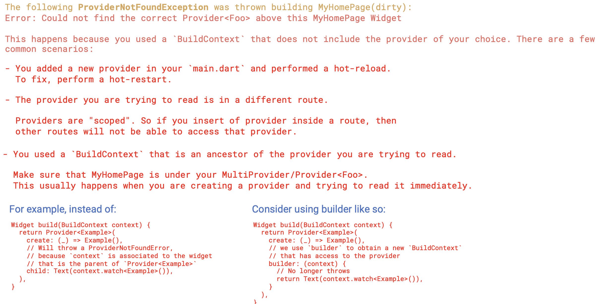
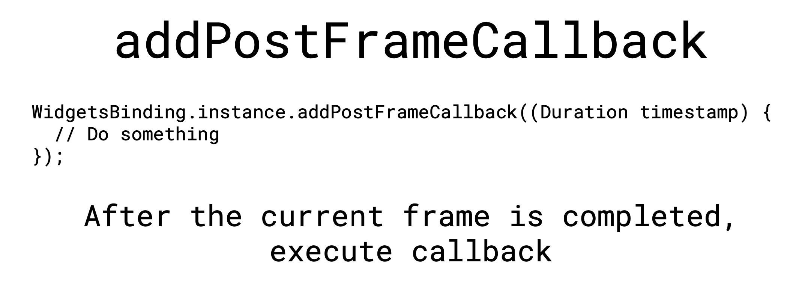
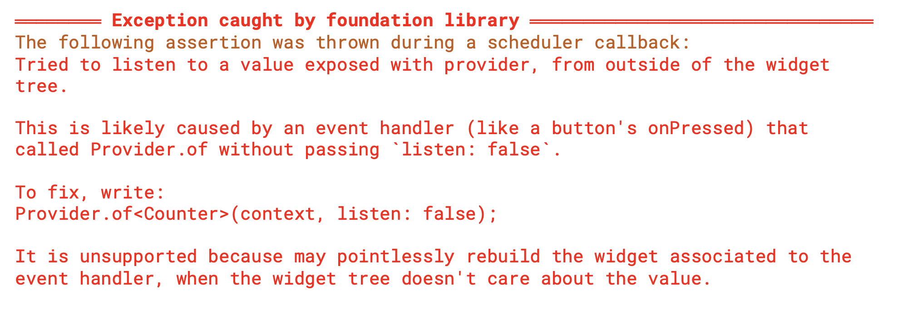
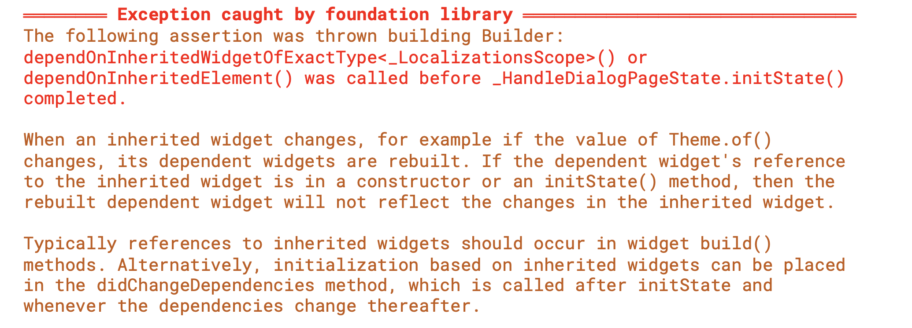
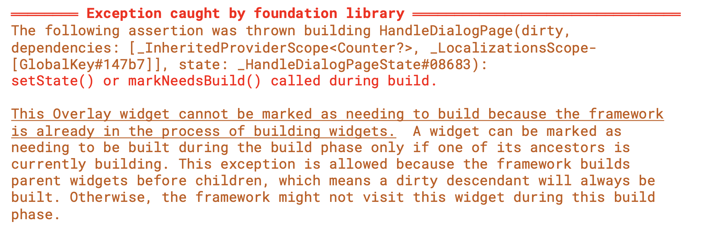

# 1. 개요

flutter를 사용하다 보면 자주 마주하게 되는 에러들이 있다. 이러한 에러들에 대한 정리와, 이를 어떻게 처리하면 좋을지에 대해 정리해보았다.

</br>

# 2. 에러들의 종류

## 2.1. ProviderNotFound Error

<div align="left">
  
</div>

</br>

앞서 자주 보게되었던 ProviderNotFound에러이다. 이 에러가 발생하는 케이스는 몇 가지 있는데, 다음과 같다.

</br>

첫 번째로는,
새로운 Provider를 생성했음에도 Hot-restart를 하지 않았을 때 발생하는 에러이다. Hot-restart 후 확인하면 해결되는 문제이다.

</br>

두 번째로는, 잘못된 route로 발생하는 에러이다. Route 내에 정의된 Provider는 다른 route에서는 접근할 수 없는 유형으로, Provider를 보다 상단의 위젯에서 정의하거나, Builder 위젯을 사용하거나, ProxyProvider 등의 방법으로 해결할 수 있다.

</br>

마지막으로는, 잘못된 BuildContext를 사용했을 경우 발생할 수 있는 에러로 앞선 예제에서는 Provider를 감싼 Route 위젯의 context가 사용되거나 해서 발생하는 에러로 context를 사용하지 않도록 수정해주면 대부분 해결된다. 혹은, Provider의 생성 위치를 변경해주는 방법으로도 해결 가능하다.

</br>

## 2.2. setState() or markNeedsBuild() called during build.

<div align="left">
  
</div>

</br>

위 에러는 framework가 위젯을 그리고 있는데, 다시 위젯을 그려달라는 요청이 들어왔을 때 발생한다. Stateful 위젯의 State 위젯 내에서 initState 중간에 Provider의 값을 변경하는 경우 발생할 수 있다. 이러한 에러가 발생하는 이유는 Provider에서 화면을 렌더링하는 절차를 살펴보면 알 수 있다.

</br>

- 화면 렌더링 절차

1) 화면 구성 요소 생성 (BuildContext)
2) initState
3) didChangeDependencies
4) Build

</br>

페이지가 빌드된 이후부터 우리는 다른 것들을 그릴 수 있게 되는데, initState의 경우 렌더링 중간에 진행되는 절차이므로, 해당 단계에서 context를 이용하여 다른 것들을 화면에 그리는 것이 불가능하다. 마찬가지로, 페이지에 무언가를 그리면서 다른 화면으로 이동시킬 때도 마찬가지로 발생할 수 있다.

</br>

이러한 케이스를 방지하기 위해 flutter 프레임워크에서는 자체적으로 해결할 수 있는 방안을 제공해준다. `addPostFrameCallback()` 함수이다.

</br>

### 2.2.1. addPostFrameCallback

<div align="left">
  
</div>

</br>

이 함수의 역할을 화면이 렌더링 된 이후, 등록된 콜백을 실행시키는 역할이다. UI에 영향을 주는 행동을 현재 frame 이후로 지연시킨다.

</br>

```dart
  @override
  void initState() {
    super.initState();
    WidgetsBinding.instance.addPostFrameCallback((_) {
      context.read<Counter>().increment();
      myCounter = context.read<Counter>().counter + 10;
    });
  }
```

</br>

이와 유사한 또 다른 방법으로는 `Future.delayed(Duration)`, `Future.microtask()` 함수를 이용하는 방법이다.

</br>

```dart
  @override
  void initState() {
    super.initState();
    Future.Delayed(Duration(seconds: 0), () {
      context.read<Counter>().increment();
      myCounter = context.read<Counter>().counter + 10;
    });
  }
```

</br>

```dart
  @override
  void initState() {
    super.initState();
    Future.microtest(() {
      context.read<Counter>().increment();
      myCounter = context.read<Counter>().counter + 10;
    });
  }
```

</br>

## 2.3. Widget 트리 밖에서 Provider value를 listen했을 때

<div align="left">
  
</div>

</br>

위 에러는 제목에서 설명한 대로, Widget 트리 밖에서 Provider value를 Listen하려 했을 때 발생한다. 즉, Build하는 위젯의 변경사항을 watch하는 것이 안된다는 뜻이다. 이를 해결하기 위해서는 `Provider.of` 함수의 listen 파라미터를 false로 주거나, `read` extension 함수를 사용하면 된다.

</br>

## 2.4. 의존성 있는 Widget이 변경될 때 발생하는 에러

<div align="left">
  
</div>

</br>

이 에러는 특정 위젯이 빌드되고 있는 시점에 다른 위젯을 그려달라고 요청 했을 때 발생한다. 위젯이 빌드되는 프로세스 중간 단계인 `initState()` 함수나 constructor 내에서 다른 위젯을 그려달라는 요청이 있을 때 발생할 수 있다. 마찬가지로, `addPostFrameCallback()` 함수로 파훼가 가능하다.

</br>

## 2.5. 빌드되는 중간에 Widget을 그려달라고 했을 때

<div align="left">
  
</div>

</br>

이전에 설명한 2.2의 케이스와 유사하게, 빌드되는 중간에 위젯의 값이 변경되어 다시 그려달라고 했을 때 발생하는 에러이다. 에러 내용이 조금 다른건 initState가 아닌, Build 함수의 return 이전에 호출했을 경우이다. 이 경우에도 역시 `addPostFrameCallback()` 함수를 사용하면 된다.

</br>

# 3. 출처
https://www.udemy.com/course/flutter-provider-essential-korean/</br>