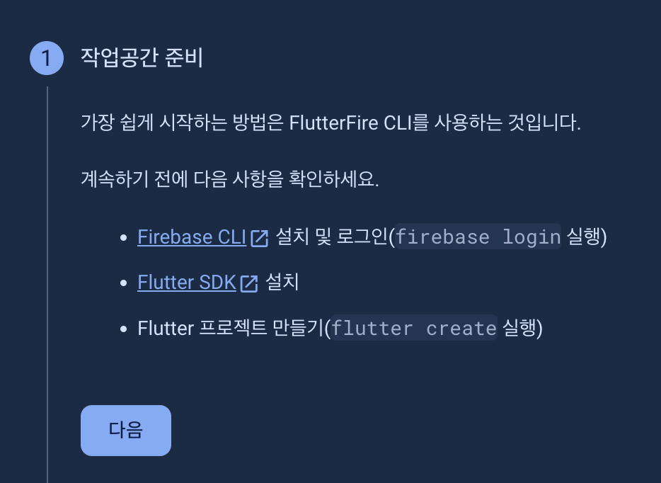

# 1. Flutter Firebase 연동

Flutter Provider 강의를 듣다가 Flutter 프로젝트 내에서 Firebase 연동하는 방법을 배우고 있었는데, Firebase 화면에서 Flutter 연동 아이콘이 있음을 확인하고 Flutter 프로젝트에 바로 연동할 수 있다는 것을 확인하였다.

</br>

## 1.1. Firebase 프로젝트 생성

<div align="left">
  
</div>

</br>

먼저, Firebase 콘솔로 이동하여, Firebase 프로젝트부터 생성해준다. 생성하는 방법이 간단해서 상세한 방법은 따로 적지 않았다.

</br>

## 1.2. Flutter 프로젝트 앱 등록

<div align="left">
  
</div>

</br>

다음으로는, 프로젝트 내에서 앱을 연동해야 한다. 생성된 콘솔 내 프로젝트 화면의 상단 좌측에서 Flutter 아이콘을 클릭해준다.

</br>

<div align="left">
  
</div>

</br>

가장 첫 번째 단계는 prerequisite들을 설치하는 단계이다. Firebase CLI, flutter SDK 등을 설치해준다. flutter SDK는 이미 설치되어 있을 테니 Firebase CLI 설치 후, `firebase login`을 통해 Firebase 계정에 접근할 수 있도록 로그인 해준다.

</br>

## 1.3. Firebase CLI를 사용하여 앱 등록

```sh
dart pub global activate flutterfire_cli
flutterfire configure --project=프로젝트명
```

다음으로는, 위의 명령어들을 통해서 Firebaes 앱 등록을 위한 CLI를 다운받아주어야 한다. 이 때, `flutterfire` 명령어가 없다는 에러가 발생하면, `export PATH="$PATH":"$HOME/.pub-cache/bin"` 다음과 같은 환경변수를 shell Profile 파일에 입력해주어야 한다.

</br>

혹자의 경우 Macbook M1에서 진행하였는데, 진행 도중 아래와 같은 Ruby 스크립트 관련 에러가 발생하였다.

```sh
jsx
Exception: /System/Library/Frameworks/Ruby.framework/Versions/2.6/usr/lib/ruby/2.6.0/rubygems/core_ext/kernel_require.rb:54:in `require': cannot load such file -- xcodeproj (LoadError)
        from /System/Library/Frameworks/Ruby.framework/Versions/2.6/usr/lib/ruby/2.6.0/rubygems/core_ext/kernel_require.rb:54:in `require'
        from -e:1:in `<main>'
```

</br>

다음 커맨드를 사용해주면 된다.

```sh
sudo gem install cocoapods && pod install
```

</br>

`flutterfire configure --project=프로젝트명` 명령어 사용 시 등록할 수 있는 앱 옵션을 선택할 수 있다. 원하는 앱 옵션을 선택하여 설정하자.

```sh
$ trailer_manager_web % flutterfire configure --project=프로젝트명
i Found 1 Firebase projects. Selecting project 프로젝트명.
✔ Which platforms should your configuration support (use arrow keys & space to select)? · android, ios, macos, web
i Firebase android app com.example.프로젝트명 is not registered on Firebase project 프로젝트명.
i Registered a new Firebase android app on Firebase project 프로젝트명.
i Firebase ios app com.example.trailerManagerWeb is not registered on Firebase project 프로젝트명.
i Registered a new Firebase ios app on Firebase project 프로젝트명.
i Firebase macos app com.example.trailerManagerWeb.RunnerTests is not registered on Firebase project 프로젝트명.
i Registered a new Firebase macos app on Firebase project 프로젝트명.
i Firebase web app 프로젝트명 (web) is not registered on Firebase project 프로젝트명.
i Registered a new Firebase web app on Firebase project 프로젝트명.
? Generated FirebaseAppID file /프로젝트명/ios/firebase_app_id_file.json already exists, do you want to override it? (y/n) › yes
```

</br>

# 2. 출처
https://www.udemy.com/course/flutter-provider-essential-korean/</br>
https://velog.io/@hee_mm_/Flutter-Firebase-%EC%97%B0%EB%8F%99</br>