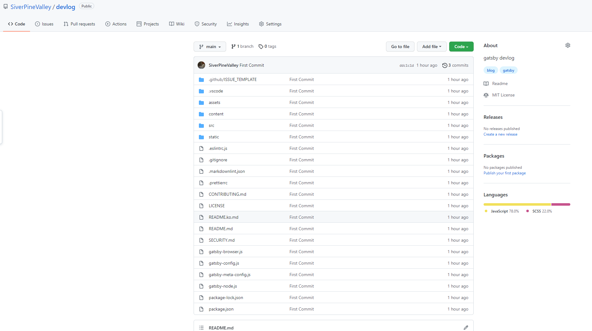
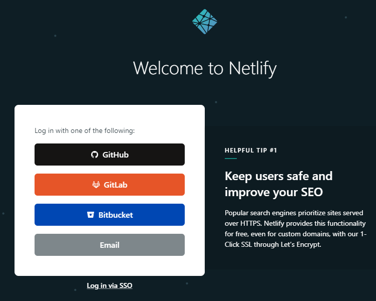
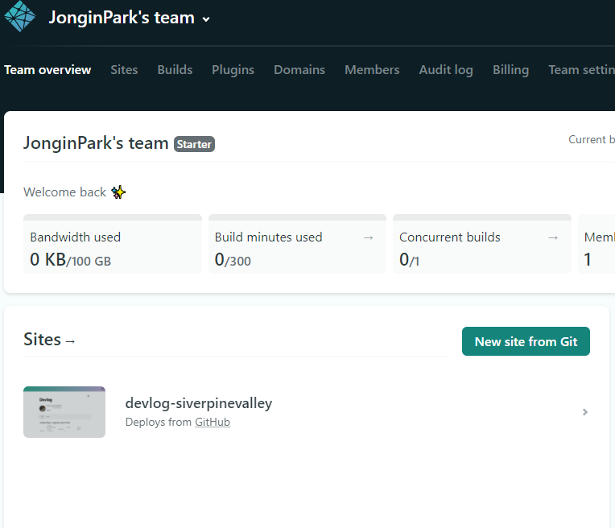
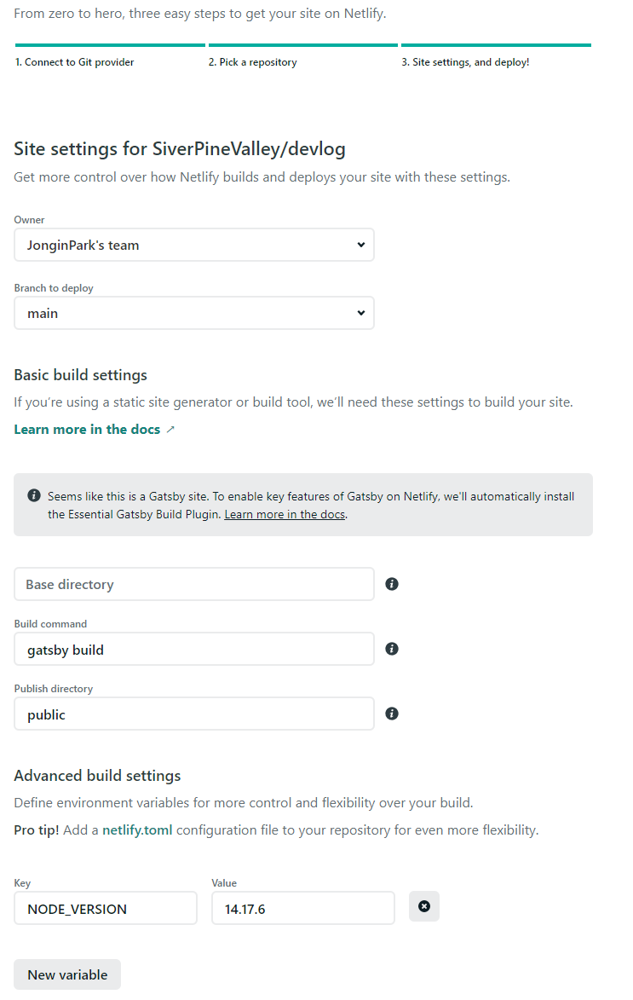

이번에는 생성한 gatsby 프로젝트를 Netlify를 사용해 배포하는 법에 대해 적어보겠다. 설치 과정이 좀 고됬지만 배포는 그보다는 훨씬 간단하다. Netlify라는 정적 웹사이트 배포 도구가 있어 별도 도메인을 빌려야할 필요도 없고, github 계정만 있으면 된다.

# 배포 방법

## 1. git repository 생성


<div align="left">
  
</div>


Netlify에 연동하기 전에, git에 repository를 생성해둬야 한다. [기존에 생성한 gatsby 프로젝트](./gatsby_start.md)에서 생성한 프로젝트를 git repository에 연결한다.
자세한 방법은 구글링하면 자세히 나오므로... 이 부분은 생략.

## 2. [Netlify](https://app.netlify.com/) 접속

<div align="left">
  
</div>


상기 링크를 접속해서 GitHub로 로그인한다. Email로 계정 생성 후 github를 연결해도 되지만 귀찮으므로 그냥 github 소셜 로그인을 이용한다. 로그인 이후, 아래의 `New site from Git` 버튼 클릭


<div align="left">
  
</div>


## 3. Netlify - github 연결

gatsby용으로 생성한 repository 선택 후, 빌드 파라미터를 아래와 같이 입력해야 한다.

특히 환경변수가 중요한데, 내가 선택한 [gatsby-starter-bee](https://github.com/JaeYeopHan/gatsby-starter-bee)의 경우 node-sass를 사용하는데, 16 버전 이상의 Node에서는 정상적으로 빌드가 불가능하다.

Stable 최신 버전인 14.17.6을 입력하였다. 다 입력했으면, 아래에서 `Deploy Site` 버튼 클릭.

<div align="left">
  
</div>


## 4. 빌드

정상적으로 빌드되었다면 아래와 같은 문구로 끝나게 된다. 이제 빌드된 사이트로 접속하면 끝~ 😎😎😎

```sh
Finished processing build request in 3m19.334334179s
```

## 5. 도메인 설정

추가적으로, 처음 Netlify를 통해 배포하면 자동으로 도메인을 부여받는데, 내가 일부 도메인을 설정할 수 있다.
Netlify 홈에서 `Domain Settings` -> `Options` -> `Edit site name` 을 통해 변경 가능하다.

또, 별도로 커스텀 도메인을 구입한게 있다면 역시 설정 가능하다.
