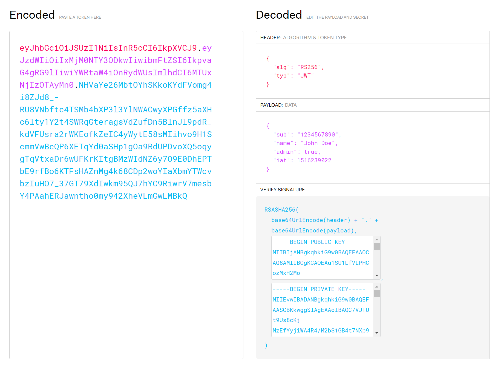
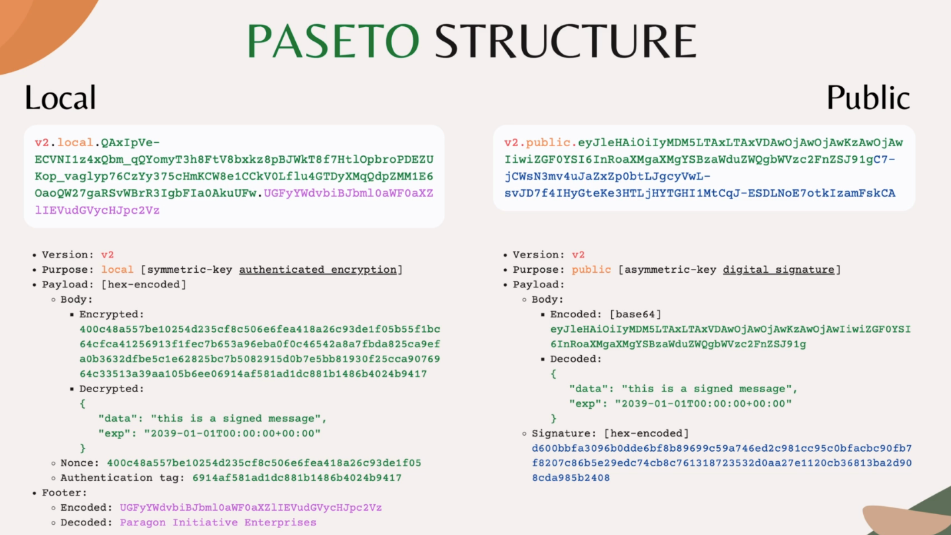

# JWT Token과 PASETO에 대한 비교

웹 개발 공부를 하던 중 JWT Token에 대응되는 PASETO 대해 알게 되어 관련 내용을 정리해보고자 한다.

## 1. JWT Token 이란?

JWT Token은 웹 개발자에게는 매우 익숙한 개념이다. 사용자의 로그인에 대한 인가를 위해 Access, Refresh 토큰 등을 발행하여 브라우저에서는 해당 정보를 가지고 서버에 호출하게끔 한다. 만료되지 않고 인가된 사용자는 토큰 인증을 통과하여 서버의 리소스를 받아가고, 토큰이 만료되었을 때는 Refresh 토큰을 사용하여 갱신하며 사용한다. 이러한 방식을 OAuth라고 하는데, 이 부분에 대해서는 따로 다룰 예정이다.

## 2. JWT Token의 구조

  

JWT 토큰은 위와 같이 세 부분으로 나뉜다. 각 부분은 .으로 구분되며, 각각 Base64로 인코딩되어 있으며 역할이 조금씩 다르다.

- Header: 서명의 암호화에 사용된 알고리즘 정보
- Payload: 토큰에서 담고 싶은 정보 (보통 사용자 ID, 만료시간 등이 담김)
- Verify Signature: 서버에서만 비밀키로 복호화가 가능한 인증 서명. 서버에서는 헤더의 알고리즘 정보와 서명 정보를 바탕으로 복호화하여 인가 여부를 확인한다.

## 3. JWT Token의 알고리즘

JWT Token의 알고리즘으로는 여러 가지 종류가 있지만, 크게 대칭키/비대칭키로 나뉜다.

### 대칭키 알고리즘

- 토큰의 암호화, 복호화에 같은 비밀키를 사용
- 키가 안전하게 보관될 수 있는 내부망에서만 사용됨
- HS256, HS384, HS512
    - HS256 = HMAC(Hash-based Message Authentication Code) + SHA256(Secure Hash Algorithm)

### 비대칭키 알고리즘

- 비밀키는 토큰의 암호화에 사용됨
- 공개키는 토큰의 복호화(인가)에 사용됨
- 공개된 사이트에서 사용 가능. 내부에서는 키를 암호화하고, 외부에서는 토큰을 검증받아 사용.
- RS256, RS384, RS512 || PS256, PS384, PS512 || ES256, ES384, ES512

## 4. JWT Token의 문제점?

JWT 토큰은 적당한 유연성과 체계를 갖춘 방법이라 아직도 수많은 사이트들에서 널리 쓰이고 있다. 하지만 안전해보이는 이 방식에도 몇 가지 문제점이 존재한다.

### 알고리즘의 취약성

- 개발자들에게 많은 종류의 알고리즘을 제공하여 최적의 선택을 하기 어렵게 만든다.
- 몇몇 알고리즘은 취약성을 가진다.
    - RSA PKCSv1.5: padding oracle attack
    - ECDSA: invalid-curve attack

### 쉬운 토큰 위조

- 어떤 토큰 라이브러리를 사용했냐에 따라 위조가 매우 쉬운 토큰을 양산할 수 있다.
- 여러 공격 방식에 취약함.
    - 헤더의 알고리즘(alg)를 None으로 둬서 통과하게 한다.
    - 헤더의 알고리즘(alg)를 HS256으로 둬서 RSA 공개키로 토큰을 검증하게 만들어버림.
- 개발자는 인가 전 헤더의 알고리즘을 꼭 체크하도록 해야 한다.

## 5. PASETO(Platform-Agnostic SEcurity TOkens)

### 강력한 알고리즘 사용

- 개발자가 굳이 알고리즘을 선택하여 사용할 필요가 없다. PASETO의 버전만 선택하여 사용.
- 각 버전은 단 하나의 암호화 스위트(Cipher Suite)를 사용.
- 오직 가장 최근의 2개 PAESTO 버전만 허용됨. (현재는 v1, v2)

#### v1

- 오래된 버전. Modern 암호화 기술을 사용할 수 없는 Legacy 호환용.
- 대칭키: JWT 토큰처럼 Base64가 아니라, 토큰의 모든 데이터를 암호화.
    - 내부망용
    - AEAD(Authenticated Encryption with Associated Data) 알고리즘 사용.
    - AES256 CTR + HMAC SHA384
- 비대칭키: JWT와 동일하게 Base64 인코딩. 비밀키를 사용하여 디지털 서명 검증.
    - 외부 공개용
    - RSA PSS + SHA384

#### v2

- 권장되는 버전. 
- 대칭키
    - 내부망용
    - XChaCha20-Poly1305 사용.
- 비대칭키: JWT와 동일하게 Base64 인코딩. 비밀키를 사용하여 디지털 서명 검증.
    - 외부 공개용
    - ED25519 (EdDSA + Curve25519)

### 쉽지 않은 토큰 위조

- 공격자가 헤더의 알고리즘을 변경할 수 없음.
- 토큰의 모든 내용은 AEAD 알고리즘으로 인증됨.
- 두 특성으로 위조 가능성을 매우 낮춤.
- 내부망용 대칭키도 payload를 인코딩 하는 것이 아니라 암호화함.

## 6. PASETO의 구조

  

- Version: PASETO의 버전 (v1, v2)
- Purpose: PASETO의 목적
    - local: (대칭키 암호화 방식)
    - public: (비대칭키 암호화 방식)
- Payload: 
    - Local:
        - Body: 암호화된 토큰 정보 (JSON 형태)
        - Nonce: 암호화와 인가 시 사용되는 Nonce 정보
        - Authentication Tag: 암호화된 메시지와 관련된 비암호화된 정보를 사용하여 인가용으로 사용 
    - Public:
        - Body: Base64 인코딩된 토큰 정보
- Signature (Public):
    - hex-인코드된 서명 정보
- Footer (Local): 
    - Base64 인코드된 추가 정보

#### 출처
https://inspirit941.tistory.com/435 
https://autoever.udemy.com/course/backend-master-class-golang-postgresql-kubernetes/learn/lecture/25822332#overview