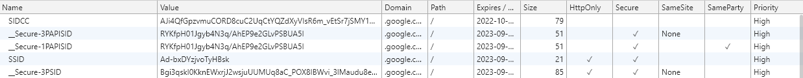

# 크롬 브라우저의 쿠키 정책과 SameSite
  
작년 중 고객 정보 관련 업무를 처리하다 크롬 브라우저의 정책 변경으로 인해 곤혹을 치른적이 있다. 
결론부터 말하자면 SameSite의 Default 설정이 변경된 것인데, 이 변경이 일부 환경에서 서비스 장애를 초래한 것이다. 
간단히 말하자면, SameSite 기본 설정의 변경으로 크로스 도메인간 http 메소드의 쿠키 유지 정책이 변경된 것인데, 내가 담당한 서버는 여러 third Party에 Oauth2.0 인증 방식을 제공하고 있었다. 
우리 인증 서버로 리다이렉트 시 쿠키가 유지되지 않는 현상이 발견된 것이다.  

   
</br>

  
## 쿠키(Cookie)란?

웹 개발을 하다보면 쿠키(Cookie)란 용어를 자주 듣게 된다.
브라우저에 특정 데이터를 저장하기 위한 방법 중 하나로 쓰이는데, 주로 로그인 정보나 장바구니 정보를 담는 용도로 사용하는데, 클라이언트단에서 정보를 유지하기 위해 사용된다. 
쿠키를 설정하기 위해 서버에서는 들어온 요청의 응답의 `Set-Cookie` 헤더에 값을 설정하여 내려주고, 이를 브라우저에서 저장하게 된다. 
Cookie는 key와 value 값으로 나뉘는데, 아래와 같이 `session=sessionId`의 경우 session이라는 key 값에 sessionId 라는 value를 가지게 된다.

```http
Set-Cookie: session=sessionId
```


실제 브라우저의 개발자 도구를 통해서는 아래와 같이 확인 가능하다. 
브라우저에서는 쿠키의 key, value, 생성된 도메인과 uri, 만료 날짜와 쿠키에 대한 설정 값도 같이 저장한다. 
각 쿠키의 설정 정보는 다음과 같다.

|쿠키 설정|내용|
|:---:|---|
|domain|현재 쿠키가 어떤 서버로 전송되어져야 하는지를 지정할 수 있는 속성이다.</br>속성을 지정하지 않을경우에는 생성된 서버로만 전송되며, 지정할 수 있는 값으로는 현재 서버의 주소 혹은 상위 도메인까지만 지정할 수 있다.|
|path|path 속성은 웹서버의 디렉터리 단위로 지정이 가능하며, 디렉터리를 지정하면 지정한 해당 디렉터와 그 하위 경로에만 쿠키가 전송된다.</br>디렉터리 단위라는것은 URL 경로상에 / (슬래쉬)로 구분되어지는 단위이다.|
|HttpOnly|자바스크립트를 통해 브라우저에서 쿠키에 접근이 가능한데, 이를 차단하기 위해 사용되는 설정이다.</br> 주로 CCS(Cross-Site Scripting)과 같은 공격을 차단하기 위해 사용된다.|
|Secure|HTTPS 통신에서만 쿠키의 전송을 허용하는 설정.</br> HTTPS 프로토콜의 경우 쿠키를 암호하하여 전달하기 때문에 쿠키 정보를 비교적 안전하게 전달이 가능하다.|
|SameSite|서드 파티 도메인(third-Party)으로 요청을 보낼 때 쿠키를 보낼지에 대한 설정 값을 나타낸다.|

<div align="left">
  
</div>

</br>

## First-party 쿠키와 Third-party 쿠키


최근 많이 사용되는 웹 사이트에서는 대부분 쿠키를 통해 클라이언트에 세션 ID를 저장하고, 서버로 보내는 모든 요청에 이 세션 ID를 같이 전달하여 로그인한 유저의 세션을 유지할 수 있는 방법을 제공한다. 
즉, 최초의 세션 정보는 서버에서 생성되는데 이것이 위에서 설명한 Set-Cookie 설정을 통해 클라이언트로 전달되게 된다. 
여기서 위의 몇 가지 쿠키 설정들은 서버에서 따로 설정하지 않으면 default로 설정되게 되는데, domain의 경우 쿠키가 생성된 서버 도메인 정보가 default로 설정된다.  


이렇게 설정된 도메인을 기준으로 쿠키는 크게 First-Party cookie와 Third-Party cookie로 나뉘게 된다. 
First-party cookie는 현재 사용자가 접속한 페이지의 도메인으로 전송되는 쿠키를 의미한다. 
반대로 Third-party cookie는 현재 사용자가 접속한 페이지의 도메인과는 다른 도메인으로 전송되는 쿠키를 의미한다.  

쿠키에 별도로 설정을 가하지 않는다면, 크롬을 제외한 브라우저들은 모든 HTTP 요청에 대해서 쿠키를 전송하게 된다. 
그 요청에는 HTML 문서 요청, HTML 문서에 포함된 이미지 요청, XHR 혹은 Form을 이용한 HTTP 요청등 모든 요청이 포함된다. 
이러한 특징은 보안 위협이 되는데, 이를 CSRF(Cross Site Request Forgery)라고 한다. CSRF는 아래와 같은 공격 방식을 의미한다.  

```
1. 공격대상 사이트는 쿠키로 사용자 인증을 수행함.
2. 피해자는 공격 대상 사이트에 이미 로그인 되어있어서 브라우저에 쿠키가 있는 상태.
3. 공격자는 피해자에게 그럴듯한 사이트 링크를 전송하고 누르게 함. (공격대상 사이트와 다른 도메인)
4. 링크를 누르면 HTML 문서가 열리는데, 이 문서는 공격 대상 사이트에 HTTP 요청을 보냄.
5. 이 요청에는 쿠키가 포함(서드 파티 쿠키)되어 있으므로 공격자가 유도한 동작을 실행할 수 있음.
```

즉, 원래의 도메인에서 사용자 인증을 거쳐 생성된 쿠키 정보를 탈취하여 해당 도메인에 인가된 요청을 전달할 수 있다는 것이다. 
SameSite 설정은 이러한 문제를 해결하기 위해 도입되었다.  

</br>

## SameSite 설정이란?


SameSite 설정이란 앞서 설명한 대로 Third-party 쿠키 문제를 해결하기 위해 쿠키 전송에 제한을 두는 설정을 의미한다. 
크게 세 가지 정책이 있는데, 각각 아래와 같다.

|쿠키 설정|내용|
|:---:|---|
|None|SameSite 가 탄생하기 전 쿠키와 동작하는 방식이 같습니다. `None`으로 설정된 쿠키의 경우 크로스 사이트 요청의 경우에도 항상 전송됩니다.</br>즉, 서드 파티 쿠키도 전송됩니다. 따라서, 보안적으로도 SameSite 적용을 하지 않은 쿠키와 마찬가지로 문제가 있는 방식입니다.</br>최근의 정책 변경으로는 None으로 설정 시 Secure 설정도 같이 적용해줘야 정상적으로 동작합니다.|
|Strict|가장 보수적인 정책입니다. `Strict`로 설정된 쿠키는 크로스 사이트 요청에는 항상 전송되지 않습니다.</br>즉, 서드 파티 쿠키는 전송되지 않고, 퍼스트 파티 쿠키만 전송됩니다.|
|Lax|`Strict`에 비해 상대적으로 느슨한 정책입니다. `Lax`로 설정된 경우, 대체로 서드 파티 쿠키는 전송되지 않지만, 몇 가지 예외적인 요청에는 전송됩니다.|


크롬 브라우저는 80버전 업데이트 이후로는 `Lax`를 SameSite Default 설정으로 사용하고 있고, 따로 서버에서 설정하지 않는다면 자동으로 `Lax`로 설정된다.

</br>

## Lax 설정을 통해 쿠키가 전송되는 경우?


[Chrominus Pojects에서 올린 크롬 브라우저](https://www.chromium.org/administrators/policy-list-3/cookie-legacy-samesite-policies)의 설명을 살펴보면, 
First-part 도메인일 경우에는 쿠키를 당연히 전송하고, 이 외에는 Top Level Navigation(웹 페이지 이동)과, "안전한" HTTP 메서드 요청의 경우에만 전송된다는 것이다.


Top Level Navigation에는 유저가 링크(`<a>`)를 클릭하거나, window.location.replace 등으로 인해 자동으로 이뤄지는 이동, 302 리다이렉트를 이용한 이동이 포함된다. 
하지만 `<iframe>`이나 ``를 문서에 삽입함으로서 발생하는 HTTP 요청은 "Navigation"이라고 할 수 없으니 Lax 쿠키가 전송되지 않고, `<iframe>` 안에서 페이지를 이동하는 경우는 "Top Level"이라고 할 수 없으므로 Lax 쿠키는 전송되지 않는다. 
또한 "안전하지 않은" POST나 DELETE 같은 요청의 경우, Lax 쿠키는 전송되지 않는다. 하지만 GET처럼 서버의 서버의 상태를 바꾸지 않을 거라고 기대되는 요청에는 Lax 쿠키가 전송된다.  


|Request Type|Sample Code|Cookies Sent|
|---|---|---|
|Link|`<a href="..."></a>`|Normal, Lax|
|Prerender|`<link rel="prerender" href=".."/>`|Normal, Lax|
|Form GET|`<form method="GET" action="...">`|Normal, Lax|
|Form POST|`<form method="POST" action="...">`|Normal|
|iframe|`<iframe src="..."></iframe>`|Normal|
|AJAX|`$.get("...")`|Normal|
|Image|``|Normal|

</br>

## SameSite 예외 설정을 추가하는 방법


이와 같이 Lax로 설정된 경우 Third-Party 도메인에서 나의 도메인으로 접근할 때 쿠키가 제대로 전달되지 않기 때문에 인증에 문제가 발생할 수 있다. 
이러한 방법을 피하기 위해 SameSite 설정을 None으로 변경해줘 이러한 제한을 우회할 필요가 있다. 
(Lax가 보안상 훨씬 안전하겠지만, 당장 적용하기에는 많은 수정 사항을 요하기 때문에...)  


내가 찾아본 방법으로는 크게 두 가지 방법으로 적용이 가능했다. Web 서버(Apache, Nginx)에 설정을 추가하는 방법과 WAS(Web Application Server)에 추가하는 방법인데 
결국 쿠키를 생성하는 WAS에서 추가해야 정상적으로 먹혔었다. 또한, 단순히 SameSite=None으로 설정을 주는 것 뿐만 아니라, Secure 설정도 추가해야 정상적으로 동작한다. 
즉, HTTPS 통신이 아니라면 쿠키를 사용할 생각을 하지 말라는 뜻과도 같다... ㅡㅡ;;  


### 1. Web 서버의 경우


Apache 또는 Nginx의 서버 설정에 추가하여 유저가 받는 모든 쿠키 속성에 한 번에 추가가 가능하다.


* Apache
```apache
Header always edit Set-Cookie (.*) "$1; Secure; SameSite=None;"
```

* Nginx
```nginx
location / {
    # your usual config ... # hack, set all cookies to secure, httponly and samesite (strict or lax)
    proxy_cookie_path / "/; secure; SameSite=None";
    }
```

### 2. WAS(Web Application Server)에 설정할 경우


1번 방법의 경우 간편하지만, 쿠키가 서버에서 생성된 경우라면, 2번 방법을 적용해야할 것이다. 
내가 담당했던 인증서버의 경우 golang으로 WAS를 구성하였기 때문에 golang에 대한 예시만 사용하였다. 
물론 실제 적용한 내용은 아래보단 복잡했지만 대략적으로 요청에 대한 Response Writer 객체의 헤더 값을 가져와서, 해당 설정에 SameSite None과 Secure 설정을 추가하기만 하면 된다는 내용이다. 
다른 언어의 경우 구글에서 제공한 [example 코드](https://github.com/GoogleChromeLabs/samesite-examples)를 참고하면 된다.  


```go
cs := w.Header().Get("Set-Cookie")
cs += "; SameSite=None; Secure"
w.Header().Set("Set-Cookie", cs)
```


하지만, 이렇게 간단했으면 좋았겠지만... 몇몇 버전의 접속 환경에서는 이러한 설정 변경이 제대로 먹히지 않기 때문에 SameSite 설정 변경에 대한 예외처리를 해야하는 경우도 있다. 
이를 UserAgent를 사용하여 분기처리 해야 하는데, [예외처리에 대한 내용](https://www.chromium.org/updates/same-site/incompatible-clients)에 올라온 소스 코드대로 참고하여 추가해야 한다.  


</br>

## 향후 전망?


전 세계적으로 크롬 브라우저의 점유율이 가장 높고, 대부분의 브라우저들이 크롬에서 변경된 사양을 따라가는 경우가 많으므로, 이러한 SameSite 설정은 타 브라우저에서도 적용될 가능성이 매우 높다. 
또한, 크롬은 장기적으로는 서드 파티 쿠키에 대한 지원을 단계적으로 제거하고 모든 쿠키가 Strict로 설정된 것 처럼 동작하도록 변경할 예정이라고 한다. 
물론, 서드 파티 쿠키를 아예 지원하지 못하도록 하는 것은 아니고 이를 완화할 방안 역시 제공할 예정이라고 한다. 
찾아본 바로는, SameParty라는 설정이 이러한 역할을 할 것으로 보이는데, 아직 한글화된 문헌이 많지 않아서... 나중에 정리해보려 한다.  


</br>

### 참조

https://ifuwanna.tistory.com/223</br>
https://seob.dev/posts/%EB%B8%8C%EB%9D%BC%EC%9A%B0%EC%A0%80-%EC%BF%A0%ED%82%A4%EC%99%80-SameSite-%EC%86%8D%EC%84%B1/</br>
https://docs.microsoft.com/ko-kr/azure/active-directory/develop/howto-handle-samesite-cookie-changes-chrome-browser?tabs=dotnet</br>
https://umbum.dev/1061
