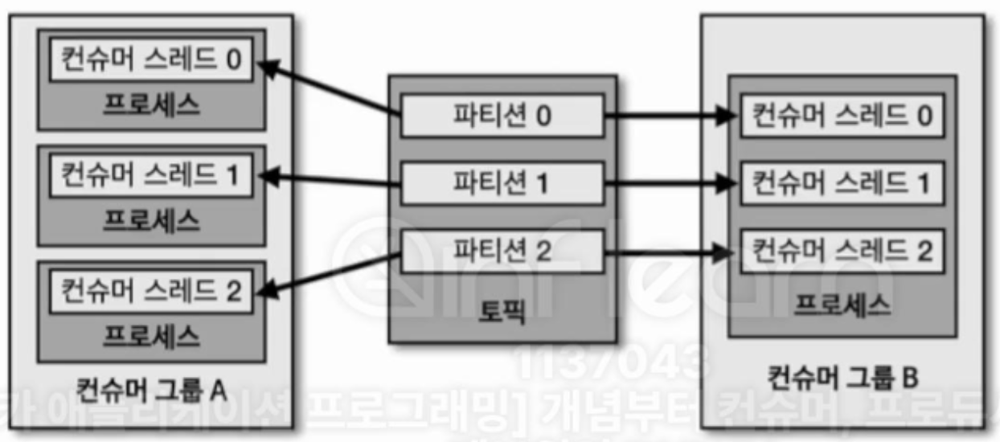

## 6-2-1) java를 이용한 컨슈머 애플리케이션 개발

```java
package com.example;  
  
import org.apache.kafka.clients.consumer.ConsumerConfig;  
import org.apache.kafka.clients.consumer.ConsumerRecord;  
import org.apache.kafka.clients.consumer.ConsumerRecords;  
import org.apache.kafka.clients.consumer.KafkaConsumer;  
import org.apache.kafka.common.serialization.StringDeserializer;  
import org.slf4j.Logger;  
import org.slf4j.LoggerFactory;  
  
import java.time.Duration;  
import java.util.Arrays;  
import java.util.Properties;  
  
public class SimpleConsumer {  
    private final static Logger logger = LoggerFactory.getLogger(SimpleConsumer.class);  
    private final static String TOPIC_NAME = "test";  
    private final static String BOOTSTRAP_SERVERS = "my-kafka:19092";  
    private final static String GROUP_ID = "test-group";  
  
    public static void main(String[] args) {  
        Properties configs = new Properties();  
        configs.put(ConsumerConfig.BOOTSTRAP_SERVERS_CONFIG, BOOTSTRAP_SERVERS);  
        configs.put(ConsumerConfig.GROUP_ID_CONFIG, GROUP_ID);  
        configs.put(ConsumerConfig.KEY_DESERIALIZER_CLASS_CONFIG, StringDeserializer.class.getName());  
        configs.put(ConsumerConfig.VALUE_DESERIALIZER_CLASS_CONFIG, StringDeserializer.class.getName());  
  
        KafkaConsumer<String, String> consumer = new KafkaConsumer<>(configs);  
  
        consumer.subscribe(Arrays.asList(TOPIC_NAME));  
  
        while (true) {  
            ConsumerRecords<String, String> records = consumer.poll(Duration.ofSeconds(1));  
            for (ConsumerRecord<String, String> record : records) {  
                logger.info("record:{}", record);  
            }  
        }  
    }  
}
```

- 각 토픽을 컨슘하기 위해서는 `subscribe()`를 통해서 구독할 수 있다. 이후, 무한 루프 내에서 `poll()` 메소드를 사용하여 주기적으로 메시지를 가져올 수 있다. 여기서 `poll()` 메소드를 너무 오래 사용하게 되면 리밸런싱이 발생하므로 주의하여야 한다.

</br>

## 6-2-2) 수동 커밋 컨슈머 애플리케이션

</br>

### 6-2-2-1) 동기 커밋 컨슈머

```java
public static void main(String[] args) {  
    Properties configs = new Properties();  
    configs.put(ConsumerConfig.BOOTSTRAP_SERVERS_CONFIG, BOOTSTRAP_SERVERS);  
    configs.put(ConsumerConfig.GROUP_ID_CONFIG, GROUP_ID);  
    configs.put(ConsumerConfig.KEY_DESERIALIZER_CLASS_CONFIG, StringDeserializer.class.getName());  
    configs.put(ConsumerConfig.VALUE_DESERIALIZER_CLASS_CONFIG, StringDeserializer.class.getName());  
    configs.put(ConsumerConfig.ENABLE_AUTO_COMMIT_CONFIG, false);  
  
    KafkaConsumer<String, String> consumer = new KafkaConsumer<>(configs);  
    consumer.subscribe(Arrays.asList(TOPIC_NAME));  
  
    while (true) {  
        ConsumerRecords<String, String> records = consumer.poll(Duration.ofSeconds(1));  
        for (ConsumerRecord<String, String> record : records) {  
            logger.info("record:{}", record);  
        }  
        consumer.commitSync();  
    }  
}
```

- 수동으로 커밋을 하기 위해서는 `ENABLE_AUTO_COMMIT_CONFIG`을 false로 설정하고, `poll()` 메소드 사용 이후 `commitSync()`를 통해 오프셋 커밋을 명시적으로 수행할 수 있다.

</br>

### 6-2-2-2) 레코드 단위 동기 커밋 컨슈머

```java
public static void main(String[] args) {  
    Properties configs = new Properties();  
    configs.put(ConsumerConfig.BOOTSTRAP_SERVERS_CONFIG, BOOTSTRAP_SERVERS);  
    configs.put(ConsumerConfig.GROUP_ID_CONFIG, GROUP_ID);  
    configs.put(ConsumerConfig.KEY_DESERIALIZER_CLASS_CONFIG, StringDeserializer.class.getName());  
    configs.put(ConsumerConfig.VALUE_DESERIALIZER_CLASS_CONFIG, StringDeserializer.class.getName());  
    configs.put(ConsumerConfig.ENABLE_AUTO_COMMIT_CONFIG, false);  
  
    KafkaConsumer<String, String> consumer = new KafkaConsumer<>(configs);  
    consumer.subscribe(Arrays.asList(TOPIC_NAME));  
  
    while (true) {  
        ConsumerRecords<String, String> records = consumer.poll(Duration.ofSeconds(1));  
        Map<TopicPartition, OffsetAndMetadata> currentOffset = new HashMap<>();  
  
        for (ConsumerRecord<String, String> record : records) {  
            logger.info("record:{}", record);  
            currentOffset.put(  
                    new TopicPartition(record.topic(), record.partition()),  
                    new OffsetAndMetadata(record.offset() + 1, null));  
            consumer.commitSync(currentOffset);  
        }  
    }  
}
```

- 레코드 단위 오프셋 커밋을 위해서는 `Map<TopicPartition, OffsetAndMetadata> currentOffset`과 같이 현재의 파티션과 오프셋 정보의 맵을 생성하고, 레코드가 들어올 때 마다  토픽의 파티션을 키, 오프셋의 +1한 값을 값으로 맵에 설정한 뒤 해당 레코드의 오프셋을 커밋하는 방식으로도 커밋할 수 있다.

</br>

### 6-2-2-3) 비동기 커밋 컨슈머

```java
public static void main(String[] args) {  
    Properties configs = new Properties();  
    configs.put(ConsumerConfig.BOOTSTRAP_SERVERS_CONFIG, BOOTSTRAP_SERVERS);  
    configs.put(ConsumerConfig.GROUP_ID_CONFIG, GROUP_ID);  
    configs.put(ConsumerConfig.KEY_DESERIALIZER_CLASS_CONFIG, StringDeserializer.class.getName());  
    configs.put(ConsumerConfig.VALUE_DESERIALIZER_CLASS_CONFIG, StringDeserializer.class.getName());  
    configs.put(ConsumerConfig.ENABLE_AUTO_COMMIT_CONFIG, false);  
  
    KafkaConsumer<String, String> consumer = new KafkaConsumer<>(configs);  
    consumer.subscribe(Arrays.asList(TOPIC_NAME));  
  
    while (true) {  
        ConsumerRecords<String, String> records = consumer.poll(Duration.ofSeconds(1));  
        for (ConsumerRecord<String, String> record : records) {  
            logger.info("record:{}", record);  
        }  
        consumer.commitAsync(new OffsetCommitCallback() {  
            public void onComplete(Map<TopicPartition, OffsetAndMetadata> offsets, Exception e) {  
                if (e != null)  
                    System.err.println("Commit failed");  
                else  
                    System.out.println("Commit succeeded");  
                if (e != null)  
                    logger.error("Commit failed for offsets {}", offsets, e);  
            }  
        });  
    }  
}
```

- 동기 오프셋 커밋은 커밋 응답을 기다리는 동안 데이터 처리 자체가 중단되게 된다. 단위 시간 당 더 많은 데이터를 처리하기 위해서는 비동기 오프셋 커밋을 사용해야 한다. 비동기 오프셋 커밋은 `commitAsync()` 메서드를 통해 가능하다.

- 비동기로 커밋을 처리하더라도 간혹 에러가 발생할 수도 있다. 해당 경우를 위해 `commitAsync()` 메서드에 파라미터로 `OffsetCommitCallback()` 메서드를 넘긴다.

</br>

## 6-2-3) 리밸런스 리스너를 가진 컨슈머 애플리케이션

-  리밸런스 발생을 감지하기 위해서는 카프카 라이브러리는 `ConsumerRebalanceListener` 인터페이스를 지원하고 있다. `ConsumerRebalanceListener`로 구현된 클래스는 `onPartitionAssigned()`와 `onPartitionRevoked()` 메서드로 이루어져 있다.
- `onPartitionAssigned()`: 리밸런스가 끝난 뒤 파티션이 할당되면 호출되는 메서드
- `onPartitionRevoked()`: 리밸런스가 시작되기 직전에 호출되는 메서드로, 리밸런스 직전에 어떻게 파티션이 할당되어 있었는지 확인할 수 있다. 마지막에 처리한 레코드를 기준으로 커밋을 하기 위해서는 리밸런스가 시작하기 직전에 커밋을 하면 되므로 이 메서드에 커밋을 구현하여 처리할 수 있다.

```java
package com.example;  
  
import org.apache.kafka.clients.consumer.ConsumerRebalanceListener;  
import org.apache.kafka.common.TopicPartition;  
import org.slf4j.Logger;  
import org.slf4j.LoggerFactory;  
  
import java.util.Collection;  
  
public class RebalanceListener implements ConsumerRebalanceListener {  
    private final static Logger logger = LoggerFactory.getLogger(RebalanceListener.class);  
  
    public void onPartitionsAssigned(Collection<TopicPartition> partitions) {  
        logger.warn("Partitions are assigned : " + partitions.toString());  
  
    }  
  
    public void onPartitionsRevoked(Collection<TopicPartition> partitions) {  
        logger.warn("Partitions are revoked : " + partitions.toString());  
    }  
}
```

```java
public static void main(String[] args) {  
    Properties configs = new Properties();  
    configs.put(ConsumerConfig.BOOTSTRAP_SERVERS_CONFIG, BOOTSTRAP_SERVERS);  
    configs.put(ConsumerConfig.GROUP_ID_CONFIG, GROUP_ID);  
    configs.put(ConsumerConfig.KEY_DESERIALIZER_CLASS_CONFIG, StringDeserializer.class.getName());  
    configs.put(ConsumerConfig.VALUE_DESERIALIZER_CLASS_CONFIG, StringDeserializer.class.getName());  
  
    consumer = new KafkaConsumer<>(configs);  
    consumer.subscribe(Arrays.asList(TOPIC_NAME), new RebalanceListener());  
    while (true) {  
        ConsumerRecords<String, String> records = consumer.poll(Duration.ofSeconds(1));  
        for (ConsumerRecord<String, String> record : records) {  
            logger.info("{}", record);  
        }  
    }  
}
```

- 리밸런스 리스너를 사용하기 위해서는 `subscribe()`메소드를 호출할 때 `RebalanceListener()`에 리스너 클래스를 추가하여야 한다.
- 위의 소스 코드를 사용하면 아래와 같은 로그가 발생한다. test-group 컨슈머 그룹 ID로 컨슈머가 새로 추가되어 리밸런스가 발생하고 0번 파티션을 할당받았기 때문이다.

```
[main] INFO org.apache.kafka.clients.consumer.internals.ConsumerRebalanceListenerInvoker - [Consumer clientId=consumer-test-group-1, groupId=test-group] Adding newly assigned partitions: test-0
[main] WARN com.example.RebalanceListener - Partitions are assigned : [test-0]
```

- 이 상황에서 같은 컨슈머 그룹 ID로 새롭게 컨슈머를 실행시키면 아래와 같이 로그가 발생한다. 파티션이 0번만 있는 상황에서 이미 파티션을 다른 컨슈머가 할당받고 있기 때문에 어떠한 파티션도 할당받지 못했다.

```
[main] WARN com.example.RebalanceListener - Partitions are assigned : []
```

- 이 때 기존 컨슈머가 종료되면 다시 리밸런스가 발생하면서 살아있는 컨슈머에 0번 파티션을 할당받게 된다. 이 때 Revoke, Assign 메서드가 모두 호출되는 것을 확인할 수 있다.

```
[main] WARN com.example.RebalanceListener - Partitions are revoked : []
...
[main] INFO org.apache.kafka.clients.consumer.internals.ConsumerRebalanceListenerInvoker - [Consumer clientId=consumer-test-group-1, groupId=test-group] Adding newly assigned partitions: test-0
[main] WARN com.example.RebalanceListener - Partitions are assigned : [test-0]
```

</br>

## 6-2-4) 파티션 할당 컨슈머 애플리케이션

```java
public static void main(String[] args) {  
    Properties configs = new Properties();  
    configs.put(ConsumerConfig.BOOTSTRAP_SERVERS_CONFIG, BOOTSTRAP_SERVERS);  
    configs.put(ConsumerConfig.KEY_DESERIALIZER_CLASS_CONFIG, StringDeserializer.class.getName());  
    configs.put(ConsumerConfig.VALUE_DESERIALIZER_CLASS_CONFIG, StringDeserializer.class.getName());  
  
    KafkaConsumer<String, String> consumer = new KafkaConsumer<>(configs);  
    consumer.assign(Collections.singleton(new TopicPartition(TOPIC_NAME, PARTITION_NUMBER)));  
    while (true) {  
        ConsumerRecords<String, String> records = consumer.poll(Duration.ofSeconds(1));  
        for (ConsumerRecord<String, String> record : records) {  
            logger.info("record:{}", record);  
        }  
    }  
}
```

- 컨슈머 역시 특정 파티션에 대해서만 지정해서 subscribe할 수 있다. 이 경우 `assign()` 메서드를 직접 할당하여 처리하도록 할 수 있다. 이 경우 컨슈머 그룹 ID를 필수로 넣지 않아도 된다.

</br>

## 6-2-5) 컨슈머 애플리케이션의 안전한 종료

```java
public class ConsumerWithSyncOffsetCommit {  
    private final static Logger logger = LoggerFactory.getLogger(ConsumerWithSyncOffsetCommit.class);  
    private final static String TOPIC_NAME = "test";  
    private final static String BOOTSTRAP_SERVERS = "my-kafka:19092";  
    private final static String GROUP_ID = "test-group";  
    private static KafkaConsumer<String, String> consumer;  
  
    public static void main(String[] args) {  
        Runtime.getRuntime().addShutdownHook(new ShutdownThread());  
  
        Properties configs = new Properties();  
        configs.put(ConsumerConfig.BOOTSTRAP_SERVERS_CONFIG, BOOTSTRAP_SERVERS);  
        configs.put(ConsumerConfig.GROUP_ID_CONFIG, GROUP_ID);  
        configs.put(ConsumerConfig.KEY_DESERIALIZER_CLASS_CONFIG, StringDeserializer.class.getName());  
        configs.put(ConsumerConfig.VALUE_DESERIALIZER_CLASS_CONFIG, StringDeserializer.class.getName());  
        configs.put(ConsumerConfig.ENABLE_AUTO_COMMIT_CONFIG, false);  
  
        consumer = new KafkaConsumer<>(configs);  
        consumer.subscribe(Arrays.asList(TOPIC_NAME));  
  
        try {
            while (true) {  
                ConsumerRecords<String, String> records = consumer.poll(Duration.ofSeconds(1));  
                for (ConsumerRecord<String, String> record : records) {  
                    logger.info("{}", record);  
                }  
                consumer.commitSync();  
            }  
        } catch (WakeupException e) {  
            logger.warn("Wakeup consumer");  
        } finally {  
            logger.warn("Consumer close");  
            consumer.close();  
        }  
    }  

	// ShutdownThread를 사용하여 종료 시 트리거되는 훅을 extend 해야 한다.
    static class ShutdownThread extends Thread {  
        public void run() {  
            logger.info("Shutdown hook");  
            consumer.wakeup();  
        }  
    }  
}
```

- 컨슈머 역시 안전하게 종료되어야 한다. 정상적으로 종료되지 않은 컨슈머는 세션 타임아웃이 발생할 때 까지 컨슈머 그룹에 남게 된다. 컨슈머를 안전하게 종료하기 위해서는 KafkaConsumer 클래스는 `wakeup()` 메서드를 지원한다. `wakeup()` 메서드를 사용하여 KafkaConsumer 인스턴스를 안전하게 종료할 수 있다. `wakeup()` 메서드가 호출 된 이후 `poll()` 이 호출되면 `WakeupException` 예외가 발생하게 된다. 이 예외가 발생한 뒤 데이터 처리를 위해 사용된 자원을 해제하면 된다.
- 런타임에서 훅을 지정하기 위해서는 `Runtime.getRuntime().addShutdownHook(new ShutdownThread());` 부분과 같이 설정할 수 있다.
- 실행된 프로세스를 강제로 종료하면 아래와 같은 로그가 발생함을 확인할 수 있다.

```sh
kill -term (프로세스 ID)
```

```
[main] INFO org.apache.kafka.clients.consumer.internals.ConsumerRebalanceListenerInvoker - [Consumer clientId=consumer-test-group-1, groupId=test-group] Adding newly assigned partitions: 
[Thread-0] INFO com.example.ConsumerWithSyncOffsetCommit - Shutdown hook
[main] WARN com.example.ConsumerWithSyncOffsetCommit - Wakeup consumer
[main] WARN com.example.ConsumerWithSyncOffsetCommit - Consumer close
```

</br>

## 6-2-6) 멀티스레드 컨슈머 애플리케이션

- 기본적으로 카프카 컨슈머는 스레드 한개당 하나씩만 할당된다. 카프카 처리량을 늘리기 위해서는 파티션과 컨슈머 개수를 늘려야 가능한데, 파티션을 여러개 운영하는 경우 데이터 병렬 처리를 위해 파티션과 컨슈머 개수를 맞추는 것이 좋다. 이를 위해 보통 멀티 스레드를 이용하는데, 하나의 프로세스에 컨슈머 스레드를 여러 개 사용하거나, 한개의 컨슈머 스레드를 갖는 프로세스를 여러 개 띄우는 방법이 있다.
- 첫 번째 방식은 스레드 간 에러에 대한 영향이 다른 프로세스에 영향을 주지 않는다. 다만 여러 프로세스를 띄워야 하므로 이에 대한 관리가 복잡해질 수 있다.
- 두 번째 방식은 고사양 자원에서 활용할 수 있는데, 비교적 컨슈머에 대한 관리는 편할 수 있다. 다만 스레드에서 발생한 에러가 다른 스레드에도 영향을 끼칠 수 있다.

</br>

<div align="left">
  
</div>

</br>

```java
package com.example;  
  
import org.apache.kafka.clients.consumer.ConsumerRecord;  
import org.apache.kafka.clients.consumer.ConsumerRecords;  
import org.apache.kafka.clients.consumer.KafkaConsumer;  
import org.slf4j.Logger;  
import org.slf4j.LoggerFactory;  
  
import java.time.Duration;  
import java.util.Arrays;  
import java.util.Properties;  
  
public class ConsumerWorker implements Runnable {  
    private final static Logger logger = LoggerFactory.getLogger(ConsumerWorker.class);  
    private Properties prop;  
    private String topic;  
    private String threadName;  
    private KafkaConsumer<String, String> consumer;  
  
    ConsumerWorker(Properties prop, String topic, int number) {  
        this.prop = prop;  
        this.topic = topic;  
        this.threadName = "consumer-thread-" + number;  
    }  
  
    @Override  
    public void run() {  
        consumer = new KafkaConsumer<>(prop);  
        consumer.subscribe(Arrays.asList(topic));  
        while (true) {  
            ConsumerRecords<String, String> records = consumer.poll(Duration.ofSeconds(1));  
            for (ConsumerRecord<String, String> record : records) {  
                logger.info("{}", record);  
            }  
            consumer.commitSync();  
        }  
    }  
}
```

```java
public class MultiConsumerThread {  
  
    private final static String TOPIC_NAME = "test";  
    private final static String BOOTSTRAP_SERVERS = "my-kafka:19092";  
    private final static String GROUP_ID = "test-group";  
    private final static int CONSUMER_COUNT = 3;  
  
    public static void main(String[] args) {  
        Properties configs = new Properties();  
        configs.put(ConsumerConfig.BOOTSTRAP_SERVERS_CONFIG, BOOTSTRAP_SERVERS);  
        configs.put(ConsumerConfig.GROUP_ID_CONFIG, GROUP_ID);  
        configs.put(ConsumerConfig.KEY_DESERIALIZER_CLASS_CONFIG, StringDeserializer.class.getName());  
        configs.put(ConsumerConfig.VALUE_DESERIALIZER_CLASS_CONFIG, StringDeserializer.class.getName());  
  
        ExecutorService executorService = Executors.newCachedThreadPool();  
        for (int i = 0; i < CONSUMER_COUNT; i++) {  
            ConsumerWorker worker = new ConsumerWorker(configs, TOPIC_NAME, i);  
            executorService.execute(worker);  
        }  
    }  
}
```