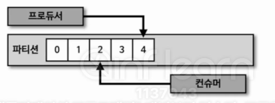
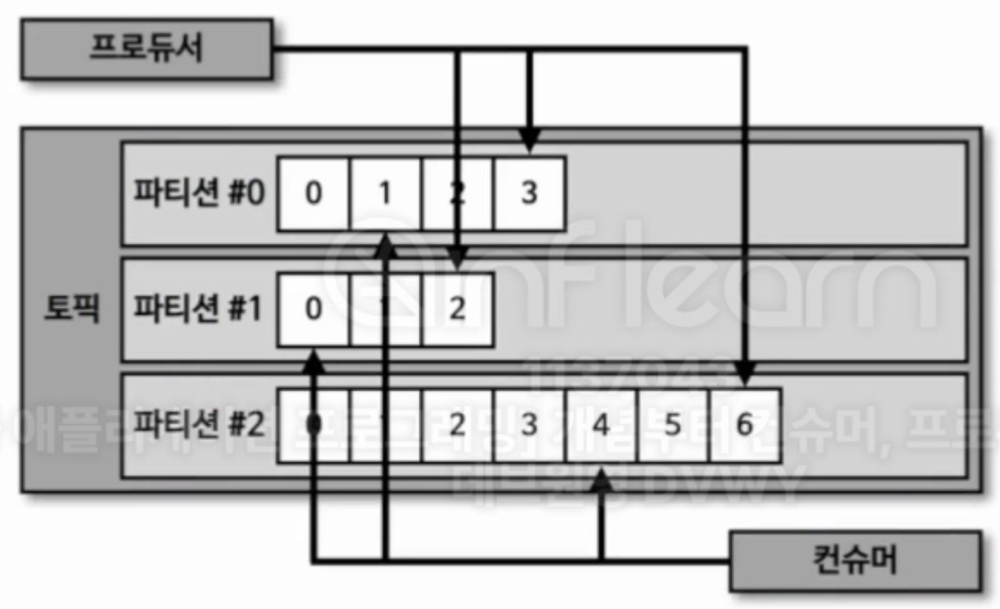

## 6-3-1) 컨슈머 랙

</br>

<div align="left">
  
</div>

</br>

- 컨슈머 랙(Lag)은 파티션의 최신 오프셋과 컨슈머 오프셋간의 차이이다. 프로듀서는 계속해서 새로운 레코드를 파티션에 저장하고, 컨슈머는 처리할 수 있는 만큼 데이터를 가져간다. 컨슈머 랙은 컨슈머가 정상적으로 동작하는지 여부를 확인할 수 있기 때문에 컨슈머 애플리케이션을 운영하면 필수적으로 모니터링해야 하는 요소이다.


</br>

<div align="left">
  
</div>

</br>

- 컨슈머 랙은 컨슈머 그룹과 토픽, 파티션 별로 생성된다.

## 6-3-2) 컨슈머 랙 모니터링

- 컨슈머 랙을 모니터링하는 것은 카프카를 통해 데이터파이프라인을 운영하는 데 있어서는 핵심적인 역할을 한다. 컨슈머 랙을 모니터링함으로써 컨슈머의 장애를 확인할 수 있고 파티션 개수를 정하는 데 참고할 수 있다.
- 프로듀서의 데이터 양이 일정함에도 컨슈머의 장애로 컨슈머 랙이 증가할 수도 있다. 컨슈머는 파티션 개수만큼 늘려서 병렬처리하며 파티션마다 컨슈머가 할당되어 데이터를 처리한다.

</br>

## 6-3-3) 컨슈머 랙을 모니터링하는 방법 3가지

</br>

### 6-3-3-1) Kafka CLI를 사용하는 방법

- `kafka-consuemr-groups.sh` 명령어를 사용하면 컨슈머 랙을 포함하여 특정 컨슈머 그룹의 상태를 확인할 수 있다. 컨슈머 랙을 확인하기 위한 가장 기초적인 방법이라고 생각하면 된다.

```sh
./kafka-consumer-groups.sh --bootstrap-server=my-kafka:19092 --group test-group --describe

Consumer group 'test-group' has no active members.

GROUP           TOPIC           PARTITION  CURRENT-OFFSET  LOG-END-OFFSET  LAG             CONSUMER-ID     HOST            CLIENT-ID
test-group      test            0          6               6               0               -               -               -%
```

</br>

### 6-3-3-2) `metrics()` 메서드 사용

 - 컨슈머 애플리케이션의 `KafkaConsumer` 인스턴스의 `metric()` 메서드를 활용하면 컨슈머 랙 지표를 확인할 수 있다. 컨슈머 인스턴스가 제공하는 컨슈머 랙 관련 모니터링 지표는 3가지로 `records-lag-max`, `records-lag`, `records-lag-avg` 가 있다.
- 다만 이 방법은 몇 가지 문제가 있는데, 첫 번째로는 컨슈머가 정상 동작할 때만 확인할 수 있다는 점이다. `metric()` 메서드는 컨슈머가 정상적으로 실행될 경우에만 호출된다. 그렇기 때문에 컨슈머 애플리케이션이 비정상적으로 종료된다면 더는 컨슈머 랙을 확인할 수 없다.
- 두 번째로, 모든 컨슈머 애플리케이션에 컨슈머 랙 모니터링 코드를 중복해서 작성해야 한다. 왜냐하면 특정 컨슈머 그룹에 해당하는 애플리케이션이 수집하는 컨슈머 랙은 자기 자신 컨슈머 그룹의 컨슈머 랙에 한정되기 때문이다.
- 세 번째로, 컨슈머 랙을 모니터링하는 코드를 추가할 수 없는 카프카 서드 파티 애플리케이션의 컨슈머 랙 모니터링이 불가능하다.
- 마지막으로, 공식 java 라이브러리에서만 지원되므로 각 언어별로 지원되는지는 별도 확인이 필요하다.

</br>

### 6-3-3-3) 외부 모니터링 툴 사용

- 데이터 톡(Datadog), 컨플루언트 컨트롤 센터(Confluent Control Center), 버로우(Burrow), 펠리체(Felice) - 국내 기업용 등을 활용할 수 있다.