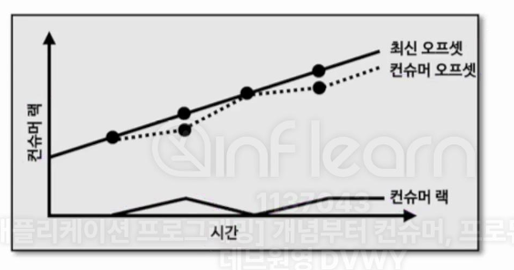
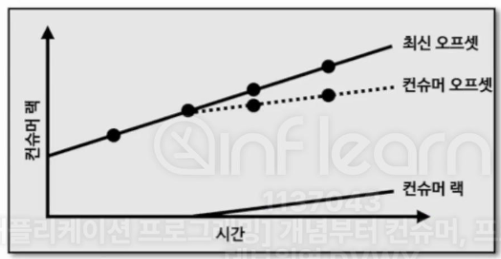
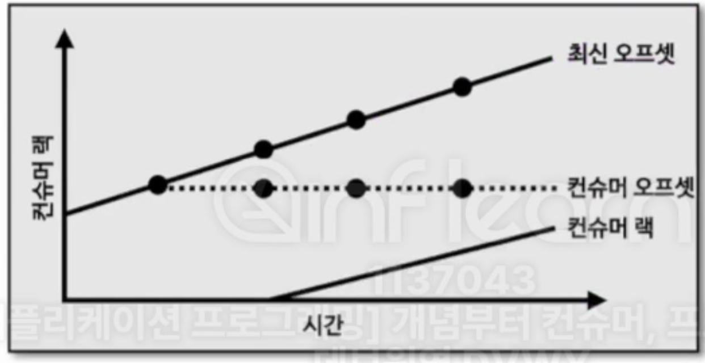

## 6-4-1) 카프카 버로우

- 버로우는 링크드인에서 개발하여 오픈소스로 공개한 컨슈머 랙 체크 툴로서 RestAPI를 통해 컨슈머 그룹 별로 컨슈머 랙을 확인할 수 있다. 외부 모니터링 툴을 사용하면 카프카 클러스터에 포함된 모든 컨슈머, 토픽들의 랙 정보를 한번에 모니터링할 수 있다는 장점이 있다. 또한, 모니터링 툴들은 클러스터와 연동되어 컨슈머의 데이터 처리와는 별개로 지표를 수집하기 때문에 데이터를 활용하는 프로듀서나 컨슈머의 동작에는 영향을 주지 않는다.
- 버로우는 다수의 클러스터에 연결하여 동작할 수 있다. 버로우를 카프카 클러스터에 연동하면 REST API를 통해 컨슈머 그룹 별 랙을 조회할 수 있다.

 

## 6-4-2) 컨슈머 랙 이슈 판별

- 버로우의 기능 중 가장 돋보이는 점은 컨슈머와 파티션의 상태를 단순히 랙의 임계치(threshold)로 나타내지 않았다는 점이다. 특정 파티션의 랙이 100만이 넘었다고 해서 단순히 컨슈머 또는 파티션에 문제가 있다고 단정지을 수 없다. 왜냐하면 프로듀서가 데이터를 많이 보내면 일시적으로 임계치를 넘어가는 현상이 발생할 수 있기 때문이다. 컨슈머 애플리케이션을 운영할 때 컨슈머 랙이 임계치에 도달할 때마다 알람을 받는 것은 무의미한 일이다.

 

### 6-5-2-1) 컨슈머 랙 평가 (Evaluation)

- 버로우는 단순히 임계치를 통해 판별하는 것이 아닌 슬라이딩 윈도우 (Sliding Window) 계산을 통해 문제가 생긴 파티션과 컨슈머의 상태를 표현한다. 이렇게 버로우에서 컨슈머 랙 상태를 표현하는 것을 컨슈머 랙 평가 (evalution)이라고 한다. 컨슈머 랙과 파티션의 오프셋을 슬라이딩 윈도우로 계산하면 상태가 정해진다. 결과적으로 파티션의 상태를 OK, STALLED, STOPPED로 표시하고, 컨슈머의 상태를 OK, WARNING, ERROR로 표시한다.

 

### 6-5-2-2) 정상적인 상태

 

  

 

- 일반적으로 컨슈머를 운영하면서 자주 볼 수 있는 그래프이다. 이렇게 컨슈머 랙이 낮은 상태가 유지되거나 거의 없는 경우 버로우는 파티션은 OK, 컨슈머도 OK로 표현한다.

 

### 6-5-2-3) 컨슈머 처리량 이슈
 
 

  

 

- 프로듀서가 추가하는 최신 오프셋에 비해 컨슈머 오프셋이 따라가지 못하는 추이를 볼 수 있다. 이런 그래프가 나오는 이유는 컨슈머의 데이터 처리량이 프로듀서가 보내는 데이터 양에 비해 적기 때문이다. 이 경우 파티션은 OK, 컨슈머는 WARNING 상태로 나타낸다.

 

### 6-5-2-4) 컨슈머 이슈

 

  

 

- 최신 오프셋이 지속적으로 증가하지만, 컨슈머 오프셋이 멈춘 상태이다. 이로 인해 컨슈머 랙이 증가하고 있는데, 컨슈머가 어떠한 이유로 데이터를 가져가지 않고 있는 것이다. 이 경우 파티션은 STALLED, 컨슈머는 ERROR 상태로 표신된다.
