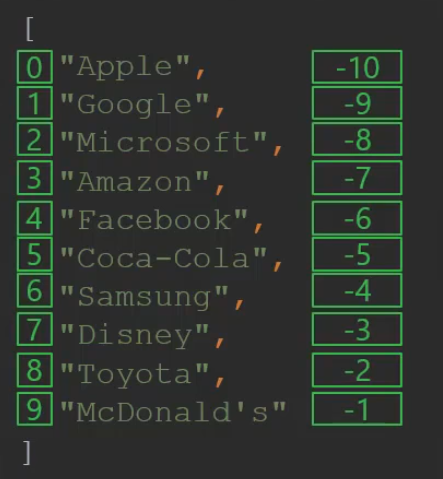

# 1. JSONPath
k8s에서는 각종 오브젝트의 세팅 정보를 YAML과 JSON 형태로 보여주는 경우가 많다. 대부분의 매니페스트 파일들이 YAML 형식이지만, YAML은 JSON으로도 쉽게 변경 가능하다. k8s 오브젝트를 운영하면서 `kubectl get {obejct}` 명령어는 엄청 자주 사용하게 되는데, 특정 오브젝트의 핵심적인 정보들은 `kubectl get {obejct} -o=wide` 명령어를 사용하여 조회 가능하다. 하지만, 내가 보고 싶은 정보만을 가져오기 위해서는 `kubectl get {obejct} -o=jsonpath=` 옵션을 사용해야 한다. 이 옵션으로 조회하기 위해서는 Json path라는 쿼리 명령어를 사용해야 한다.

</br>


## 1.1 JSONPath의 기본 문법


Json 파일은 key 와 value로 구성되며, key는 String 형식으로, value에는 Number, String, Boolean, Dictionary 형식으로 구성된다. 여기서 Dictionary란 key와 value로 구성된 Object이며, Json path는 특정 value를 찾아내기 위한 경로를 나타내는 표현식을 말한다.

기본적으로는 아래와 같은 문법을 가진다.


```json
{
  "vehicles": {
      "car": {
      "color": "blue",
      "price": "$20,000",
      "wheels": [
        {
          "model": "X345ERT",
          "location": "front-right"
        },
        {
          "model": "X346GRX",
          "location": "front-left"
        },
        {
          "model": "X236DEM",
          "location": "rear-right"
        }
      ]
    },
    "bus": {
      "color": "white",
      "price": "$120,000"
    }
  }
}
```

</br>

- Json path에서 각 키 값을 통해 쿼리 가능하다.
</br> `vehicles.car`

```json
{
  "color": "blue",
  "price": "$20,000"
}
```
- 가장 바깥쪽 중괄호`({})`는 Root를 의미한다.
</br> `$.vehicles.car.color`

```json
"blue" 
```
- Array 요소는 대괄호`[]`를 통해 접근 가능하다.
</br> `$.vehicles.car.wheels[1].model`

```json
"X346GRX"
```

- Array 요소의 Filter는 `?()`를 통해 가능하다. 각 요소를 나타내는 표현은 `@` 이다.
</br> `$.vehicles.car.wheels[?(@.location == "rear-right")]`

``` json
"X236DEM"
```

</br>

## 1.2 Wildcard


```json
{
  "vehicles": {
      "car": {
      "color": "blue",
      "price": "$20,000",
      "wheels": [
        {
          "model": "X345ERT",
          "location": "front-right",
          "brand": "K"
        },
        {
          "model": "X346GRX",
          "location": "front-left",
          "brand": "K"
        }
      ]
    },
    "bus": {
      "color": "white",
      "price": "$120,000",
      "wheels": [
        {
          "model": "Z227KLJ",
          "location": "front-right",
          "brand": "N"
        },
        {
          "model": "Z226KLJ",
          "location": "front-left",
          "brand": "K"
        }
      ]
    }
  }
}
```


- 모든 요소를 표현할 때는 와일드카드`(*)`를 사용한다.
</br> `$.vehicles.*.color.`


```json
[ "blue", "white" ]
```


- List 내부에서도 와일드카드`(*)`를 사용하여 접근 가능하다.
</br> `$.vehicles.*.wheels[*].model`


```json
[ "X345ERT", "X346GRX", "Z227KLJ", "Z226KLJ" ]
 ```


- Filter 내부의 And 조건은 `&&`를 통해서 가능하다.
</br> `$.vehicles.*.wheels[?(@.location == "front-left" && @.brand == "K")]`

```json
[ "X346GRX", "Z226KLJ" ]
```

</br>

## 1.3 Lists


```json
[
  "Apple",
  "Google",
  "Microsoft",
  "Amazon",
  "Facebook",
  "Coca-Cola",
  "Samsung",
  "Disney",
  "Toyota",
  "McDonald's"
]
```


- List에서 특정 범위 내의 요소는 `(:)`를 통해 조회 가능하다. 예를 들어, [0:8:2]의 경우 0번째 요소부터, 8번째 요소까지, 2번씩 건너뛰어서 조회를 하게 된다.
</br> `$[0:8:2]`

```json
[
  "Apple",
  "Microsoft",
  "Facebook",
  "Samsung"
]
```


- 뒤에서부터 조회할 때는 -1부터 시작하게 된다. 즉, 항상 맨 마지막 요소를 조회하기 위해서는 -1 인덱스를 사용한다.
</br> `$[-3:]`

```json
[
  "Disney",
  "Toyota",
  "McDonald's"
]
```

<div align="left">
  
</div>


</br>


## 1.4 K8S에서의 JSONPath

k8s 공식 문서에서 설명하는 JSONPath는 아래와 같다.

  1. 큰따옴표를 사용하여 JSONPath 표현식 내부의 텍스트를 인용한다.
  2. 목록을 반복하려면 range, end 오퍼레이터를 사용한다.
  3. 목록에서 뒤로 이동하려면 negative slice 인덱스를 사용한다. negative 인덱스는 목록을 "순환(wrap around)" 하지 않으며, -index + listLength >= 0 인 한 유효하다.
  4. 표현식은 항상 루트 오브젝트에서 시작하므로 $ 오퍼레이터는 선택 사항이다.
  5. 결과 오브젝트는 String() 함수로 출력된다.


```json
{
  "kind": "List",
  "items":[
    {
      "kind":"None",
      "metadata":{"name":"127.0.0.1"},
      "status":{
        "capacity":{"cpu":"4"},
        "addresses":[{"type": "LegacyHostIP", "address":"127.0.0.1"}]
      }
    },
    {
      "kind":"None",
      "metadata":{"name":"127.0.0.2"},
      "status":{
        "capacity":{"cpu":"8"},
        "addresses":[
          {"type": "LegacyHostIP", "address":"127.0.0.2"},
          {"type": "another", "address":"127.0.0.3"}
        ]
      }
    }
  ],
  "users":[
    {
      "name": "myself",
      "user": {}
    },
    {
      "name": "e2e",
      "user": {"username": "admin", "password": "secret"}
    }
  ]
}
```


|기능|설명|예시|결과|
|---|---|---|---|
|text|일반 텍스트|kind is {.kind}|kind is List|
|@|현재 오브젝트|{@}|입력과 동일|
|. or []|자식 오퍼레이터|{.kind}, {['kind']} or {['name\.type']}|List|
|..|재귀 하향(recursive descent)|{..name}|127.0.0.1 127.0.0.2 myself e2e|
|\*|와일드 카드. 모든 오브젝트 가져오기|{.items[*].metadata.name}|[127.0.0.1 127.0.0.2]|
|[start:end:step]|아래 첨자 오퍼레이터|{.users[0].name}|myself|
|[,]|조합 오퍼레이터|{.items[*]['metadata.name', 'status.capacity']}|127.0.0.1 127.0.0.2 map[cpu:4] map[cpu:8]|
|?()|필터|{.users[?(@.name=="e2e")].user.password}|secret|
|range, end|반복 목록|{range .items[*]}[{.metadata.name}, {.status.capacity}] {end}|[127.0.0.1, map[cpu:4]] [127.0.0.2, map[cpu:8]]|
|''|해석된 문자열 인용|{range .items[*]}{.metadata.name}{'\t'}{end}|127.0.0.1 127.0.0.2|


kubectl 명령어에서는 JSONPATH를 지원하는데, 다음과 같은 방법으로 사용 가능하다.


    - JSONPATH를 사용할 kubectl 명령어를 식별한다.
    - json output 결과의 위치를 확인한다.
    - JSONPATH를 설정한다.
    - `kubectl get {object} -o=jsonpath=`에 생성한 JSONPATH를 붙여넣는다.

</br>

- 각 결과를 별도 row로 표현하려면 `{\n}`을 사용한다.
</br> `kubectl get nodes -o=jsonpath='{.items[*].metadata.name}{"\n"}{.items[*].status.capacity.cpu}'`


```sh
master  node01
4       4
```

</br>

- 위와 동일한 결과를 `range`를 통해서도 출력 가능하다.
</br> `kubectl get nodes -o=jsonpath='{range .items[*]}{.metadata.name}{"\t"}{.status.capacity.cpu}{"\n"}{end}'`


```sh
master  4
node01  4
```


- `-o=jsonpath` 옵션 말고, `-o=custom-columns` 옵션을 통해서도 사용 가능하다.
</br> `kubectl get nodes -o=custom-columns=NODE:.metadata.name,CPU:.status.capacity.cpu`


```sh
NODE    CPU
master  4
node01  4
```


- `--sort-by=` 옵션을 통해서는 특정 필드로 정렬 가능하다.
</br> `kubectl get nodes -o=custom-columns=NODE:.metadata.name,CPU:.status.capacity.cpu --sort-by=.status.capacity.cpu`


```sh
NODE    CPU
master  2
node01  3
node02  4
```