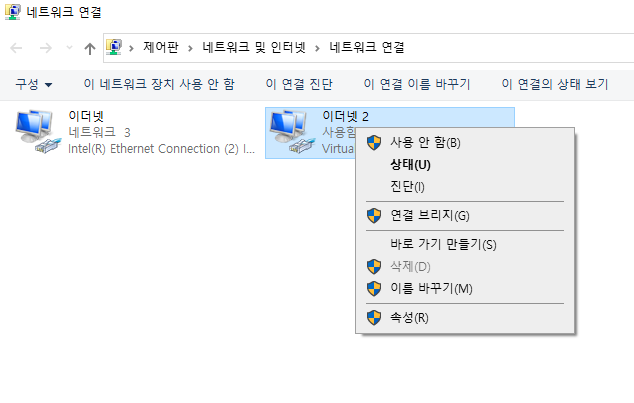
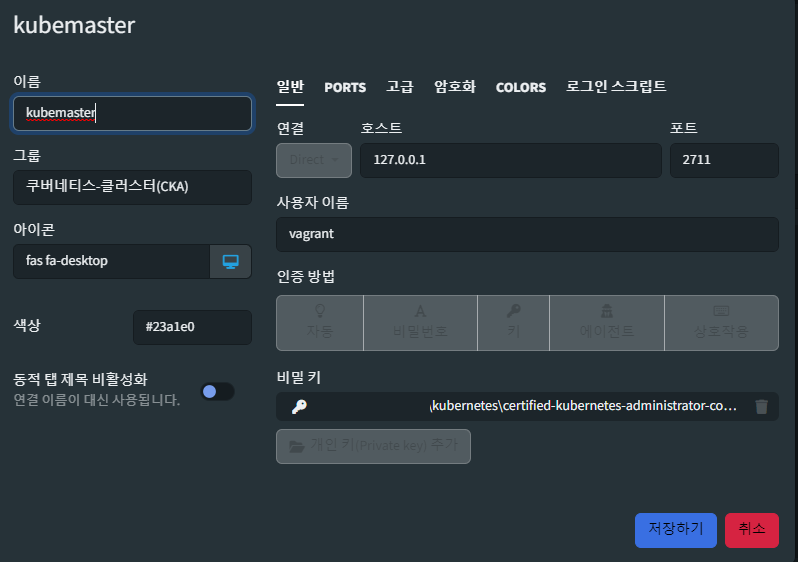
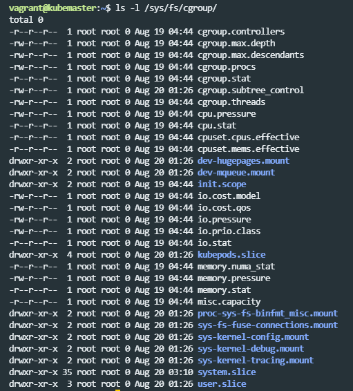
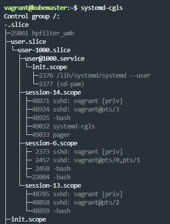

얼마 전 wsl2 커널을 잘못 건드렸다가 설치된 리눅스가 먹통이 되면서 재설치를 한 적이 있다. 재설치가 끝난 후 Virtual Box로 구성해놓은 k8s 클러스터 랩 환경이 박살나 있어서 다시 구축하려니 기존과 똑같이 하는데도 잘 안되는 부분이 있었다. 기존에는 [CKA 강의](https://autoever.udemy.com/course/certified-kubernetes-administrator-with-practice-tests/learn/lecture/20666298?start=1410#overview)를 보며 쉽게 구축했었는데, 다시 하려니 자꾸 뭔가가 안되는 것이다.

</br>

구체적으로는 kubeadm으로 초기 클러스터를 구성하고, CNI를 설치하였는데 `kube-system` 네임 스페이스의 Pod들이 제대로 기동되지 않고 자꾸 재기동되는 현상이 발생하는 것이다. 또한, `kube-apiserver` 역시 자꾸 다운되다보니 kubectl 명령어도 먹통이되고 트러블 슈팅 자체가 안되서 2주간 엄청난 삽질을 거듭했었다.

</br>

그러다 우연하게 세팅한 것이 제대로 적용되지 않았던 점이 문제였던 것을 발견하게 되었고, 나처럼 삽질하는 사람이 없었으면 하는 마음에 블로그에 끄적이게 되었다.

</br>

# Vagrant + VirtualBox + kubeadm 으로 Local Lab 환경을 구축해보자


사실 로컬 환경에서 도커만 설치되어 있다면 쿠버네티스 클러스터를 구축하여 실습 가능한 여러 방법들이 있다. 다만 여러 이유에서 이러한 방법들을 제하고 Vagrant를 이용한 프로비저닝을 선택하게 되었다.


</br>

## Tools for setting up Kubernetes clusters in a local environment

</br>

### Minikube


</br>

[minikube](https://minikube.sigs.k8s.io/docs/start/)

</br>


가장 많이 사용되는 방법인데, CLI를 다운받아 설치하고 Virtual Box에 단일 클러스터로 구축된다. 사용 방법이 쉽고 간단하나 단일 클러스터로 구축된다. 멀티 클러스터를 구축하여 실습하고 싶은 나에게는 좋은 선택지가 아니였다.

</br>

### Kind

</br>

[kind](https://kind.sigs.k8s.io/)

</br>

로컬에 Docker 데몬이 돌아간다면 역시나 쉽게 구축이 가능하다. YAML 파일에 마니페스트를 작성하여 멀티 클러스터로 구축 가능하다. 다만, MacOS나 Windows 환경일 경우에 일부 기능이 제한된다. 대표적으로 로드밸런스나 인그레스 기능을 사용하려다가 머리가 터질 뻔한 적이 있다. 간단하게 Pod를 배포하고 클러스터 내에서 잘 동작하는지 확인하는 것이 목적이라면 Kind를 사용해도 어느 정도 실습은 가능하다.


</br>


### Vagrant


Vagrant는 HashCorp에서 만든 프로비저닝 툴로, Vagrantfile에 이미지와 생성될 VM의 설정 파일을 미리 스크립트화 하여 이를 제공한다. 즉, 가상화 소프트웨어를 사용하여 Vagrantfile에 작성된 대로 VM을 생성하여 설정을 프로비저닝해주는 역할이라고 할 수 있다. Vagrant에는 Vagrantfile이라는 VM에 대한 설정 정보를 담는 파일이 있는데, Ruby 문법을 따르나 문법 자체가 복잡하지는 않다 보니 대충 찾아서 해봐도 어느 정도 쉽게 설정이 가능하다. 제목이 `Vagrant + VirtualBox + kubeadm 으로 Local Loab 환경을 구축해보자`인 만큼 필수로 설치가 필요하다.


Vagrant는 기존 Virtual Box를 사용하는 것과 다르게 다음과 같은 특징들을 가진다.


- 커맨드 하나로 가상 구축이 완료된다.
- 가상 머신의 설정이 간단하다.
- 설정 정보의 공유가 가능하다.
- 환경 구축을 자동화할 수 있다.


</br>


Vagrantfile은 앞서 설명한 대로 Vagrant를 통해 구축할 VM의 설정 정보가 담기는데, 보통 설정하는 부분은 대부분 각 VM이 가질 네트워크 I/F의 IP 주소, 각 VM의 hostname, VM에서 사용할 이미지 정보, 22번 포트를 로컬 PC로 포워딩할 때 사용할 포트 정보, 프로비저닝 후 VM에서 실행할 sh 파일 등에 대한 정의, 접속 정보 등을 설정할 수 있다.

</br>

## Prerequisite


본격적인 설치 과정에 앞서, 다음과 같은 것들이 준비되어 있어야 한다. Virtual Box는 Vagrant를 통해 프로비저닝되는 VM이 올라갈 하이퍼바이저 역할을 한다. 다른 가상화 툴도 사용이 가능하다고는 하나, Virtual Box에서 가장 안정적으로 구축된다고 한다. Tabby는 SSH를 통해 VM에 접속할 때 사용할 툴로, Putty와 같은 간단한 툴로도 대체 가능하다.


- [Virtual Box](https://www.virtualbox.org/)
- [Vagrant](https://www.vagrantup.com/)
- [Tabby](https://tabby.sh/)

</br>


## Installation


### 1. Vagrant Manifest clone and Vagrant up


먼저, Vagrant와 Virtual Box를 사용하여 VM을 프로비저닝 해야 한다. 리눅스 버전은 Ubuntu 22.04.3 (Jammy Jellyfish)을 사용하였고, 최대한 깨끗한 형태로 준비하였다. Vagrantfile의 설정에서 볼 수 있듯이, k8s 클러스터 내의 Pod 네트워크 구성을 위해 enp0s8 I/F를 추가하였고, 각 VM의 IP주소와 호스트네임을 매핑하여 로컬 DNS 파일(/etc/hosts)에 추가하였다. 이는 구성된 VM에 접속하여 `ip add` 명령어를 통해 확인 가능하다.


```sh
git clone https://github.com/SiverPineValley/k8s_installation_by_kubeadm.git
cd k8s_installation_by_kubeadm
vagrant up
```


<br>

#### 1-1. Troubleshooting 'vagrant up' in the Windows environment


vagrant up으로 모든 환경에서 한 번에 구축이 되면 참 좋을 것 같지만, Windows 환경에서 간혹 네트워크 구성 에러가 발생하기도 한다. 그럴 경우 아래와 같이 [파일 탐색기 네트워크 오른쪽 버튼] -> [`네트워크 및 공유 센터`] -> [좌측 하단 `어댑터 설정 변경`] -> [Vagrant로 추가된 이더넷 사용 안 함] -> [다시 사용] 설정한 뒤, 다시 `vagrant up` 해주면 다음으로 진행된다. 아마 Virtual Box를 통해 이더넷이 제대로 구성되기 전에 다음으로 넘어가다가 에러가 나는 듯 싶다.

</br>

<div align="left">
  
</div>

</br>

### 2. SSH Connection


vagrant로 구성한 VM은 `vagrant ssh` 명령어를 통해 접속이 가능하다. 다만, 이 방법은 매번 번거로운데 tabby를 통해 쉽게 접속하는 방법이 있다. 내가 구성한 이미지의 경우 SSH 접속을 private_key를 통해서만 가능하도록 설정되어 있는데, 이 key 파일은 `{Installation Path}/certified-kubernetes-administrator-course-master/.vagrant/machines/kubemaster/virtualbox/private_key` 에 있다.

</br>

Tabby에서 새로운 프로필을 생성하면서, 인증 방법에서 키를 선택하고 위의 경로대로 private key를 선택해주면 tabby에서 인증 정보를 저장해줘서 쉽게 접속이 가능하다. 접속 포트 정보는 Vagrant에서 설정한대로 `kubemaster: 2711`, `kubenode01: 2721`, `kubenode02: 2722`로 설정하면 된다.

</br>

<div align="left">
  
</div>

</br>


### 3. CRI (Container Runtime Interface)

</br>

[CRI (Container Runtime Interface)](https://kubernetes.io/docs/setup/production-environment/container-runtimes/#containerd)

</br>

앞선 방법을 잘 따라왔으면, Virtual Box에 kubemaster, kubenode01, kubenode02 와 같이 세 개의 VM이 구성되어 있는 것을 볼 수 있다. 이제부터 본격적으로 k8s 클러스터를 구성할 예정인데, 각 VM에서 모두 동일한 방법으로 설치를 진행해야 한다.

</br>

kubeadm을 본격적으로 설치하기 전에 사전에 `CRI(Container Runtime Interface)`을 설치해줘야 한다. 각 노드에서 k8s에서 Scheduler를 통해 전송된 컨테이너 생성 요청을 kubelet이 전달받고, kubelet이 해당 노드에 컨테이너를 생성하기 위해 사용하는 플러그인 인터페이스이다. 즉, 컨테이너 런타임(실제로 컨테이너 생성)과 kubelet(각 노드에서 엔드포인트 역할을 하며 컨테이너 생성에 관여) 사이에서 통신을 위한 주요 프로토콜이라고 보면 된다.

</br>

k8s에서는 이러한 CRI 표준을 따르는 대부분의 플러그인들을 지원하는데, 대표적으로 [Docker Engine](https://kubernetes.io/docs/setup/production-environment/container-runtimes/#docker), [CRI-O](https://kubernetes.io/docs/setup/production-environment/container-runtimes/#cri-o), [containerd](https://kubernetes.io/docs/setup/production-environment/container-runtimes/#containerd) 등이 있는데, 우리는 여기서 `containerd`를 사용할 예정이다.


</br>

과거에는 k8s에서도 Docker Engine만을 지원했었다. 하지만, Docker에는 컨테이너를 생성하고 관리하는 역할 뿐만 아니라, API, CLI, 네트워크, 스토리지 등 다양한 기능들이 한데 뭉쳐 있었다. Docker 측에서는 이러한 `Monolithic`한 구조를 탈피하고자 기능별로 나누는 작업을 시작했다. Docker 버전이 올라가면서 많은 부분이 변경되었고 이에 종속되어 있던 k8s에도 큰 영향을 끼치게 되자, Docker를 중심으로 구글 등 컨테이너에 관심이 있는 여러 집단이 모여 Open Container Initiative, 일명 OCI 프로젝트를 시작하게 된다. OCI는 Container Runtime에 대한 표준을 정하였고, Docker에서는 이러한 표준을 지키기 위해 Container Runtime으로 containerd를 만들게 된다.


</br>

요약하자면, containerd는 Docker에서 Container Runtime 기능만을 수행하는 플러그인이라고 보면 된다. 최근 버전의 k8s에서는 이러한 OCI 표준을 지키는 거의 모든 CRI를 지원하므로, Docker 보다 훨씬 가벼운 containerd 만 설치할 예정이다. 참고로, containerd의 CLI는 `crictl` 이다. `docker` 명령어와 매우 유사한 I/F를 가지므로 찾아보길 권장한다. k8s가 비정상 작동할 때 이러한 `crictl` 명령어를 쓸 일이 많을 것이다.

</br>

먼저, IPv4를 포워딩하여 iptables가 브리지된 트래픽을 보게 하는 작업을 수행해줘야 한다.

```sh
cat <<EOF | sudo tee /etc/modules-load.d/k8s.conf
overlay
br_netfilter
EOF

sudo modprobe overlay
sudo modprobe br_netfilter

# sysctl params required by setup, params persist across reboots
cat <<EOF | sudo tee /etc/sysctl.d/k8s.conf
net.bridge.bridge-nf-call-iptables  = 1
net.bridge.bridge-nf-call-ip6tables = 1
net.ipv4.ip_forward                 = 1
EOF

# Apply sysctl params without reboot
sudo sysctl --system

lsmod | grep br_netfilter
lsmod | grep overlay

sysctl net.bridge.bridge-nf-call-iptables net.bridge.bridge-nf-call-ip6tables net.ipv4.ip_forward
```

</br>

다음으로는, [containerd](https://docs.docker.com/engine/install/ubuntu/)를 설치하면 된다.


```sh
# Remove Previous Docker
for pkg in docker.io docker-doc docker-compose podman-docker containerd runc; do sudo apt-get remove $pkg; done

sudo apt-get update
sudo apt-get install ca-certificates curl gnupg
sudo install -m 0755 -d /etc/apt/keyrings
curl -fsSL https://download.docker.com/linux/ubuntu/gpg | sudo gpg --dearmor -o /etc/apt/keyrings/docker.gpg
sudo chmod a+r /etc/apt/keyrings/docker.gpg
echo \
  "deb [arch="$(dpkg --print-architecture)" signed-by=/etc/apt/keyrings/docker.gpg] https://download.docker.com/linux/ubuntu \
  "$(. /etc/os-release && echo "$VERSION_CODENAME")" stable" | \
  sudo tee /etc/apt/sources.list.d/docker.list > /dev/null

# install containerd
sudo apt-get update
sudo apt-get install containerd.io

# check installed containerd
crictl ps
```

</br>


다음으로는, `cgroup` 설정을 해주어야 한다. `cgroup` 이란 단일 또는 태스크 단위의 프로세스 그룹에 대한 자원 할당을 제어하는 커널 모듈이다. `cgroup을` 이용하면 다음의 자원들을 제한할 수 있다. `cgroup`을 관리하는 방법은 다음과 같다. `1) cgroup 파일 시스템에 직접 접근`, `2) cgmanager 이용`, `3) cgroup-tools 이용`


    - Memory
    - CPU
    - Network
    - Device
    - I/O


</br>

k8s에서는 컨테이너 런타임이 `cgroup`을 사용하여 컨테이너에 자원을 할당한다. cgroup을 관리하기 위한 기술에는 크게 `cgroupfs`와 `systemd`가 있다. cgroup이 관리할 수 있는 자원의 컨트롤러는 파일의 형태로 관리되고 있다. 이와 같이 관련된 정보를 파일 시스템의 형태로 변환시켜 주는 매니저가 `cgroupfs`이다. `cgroupfs`는 `/sys/fs/group` 경로의 하위에 이 정보를 마운트하여 관리한다. `systemd` 역시 `cgroup`을 관리하기 위해 동작하지만, `cgroupfs`와는 차이점이 있다.

</br>

`cgroupfs`는 cgroup(v1) 디렉터리 하위에 리소스를 직접 매핑한다. `systemd`는 slice > scope > system 단위의 계층 구조를 만들어 각 단위에 자원을 할당한다. 이러한 계층 구조는 `systemd-cgls` 명령어가 표현해주는 구조 혹은 `/sys/fs/cgroup/systemd` 하위의 파일 시스템 계층 구조를 통해 확인할 수 있다.

<div align="left">
  
  
</div>

</br>

갑자기 왜 이런 복잡한 설명을 했냐하면... 쿠버네티스 v1.22 부터는 cgroup으로 `systemd`를 사용하도록 강제해두었기 때문이다. 따라서 containerd를 설치한 뒤, cgroup 설정을 변경해주어야 하기 때문이다. `/etc/containerd/config.toml` 경로의 설정 파일을 열어서 전체 삭제 후, 아래와 설정을 복사 붙여넣기 한다.

```toml
[plugins."io.containerd.grpc.v1.cri".containerd.runtimes.runc]
  [plugins."io.containerd.grpc.v1.cri".containerd.runtimes.runc.options]
    SystemdCgroup = true
```

</br>

그 다음으로는, containerd를 재기동한다.

```sh
sudo systemctl restart containerd
sudo systemctl status containerd
```

</br>

### 4. kubeadm Installation

</br>

[kubeadm 설치](https://kubernetes.io/docs/setup/production-environment/tools/kubeadm/install-kubeadm/)

</br>

먼저, kube-apiserver가 사용할 6443 포트가 미사용중인지 확인한다.

```sh
nc 127.0.0.1 6443
```


6443 포트를 점유하는 프로세스가 없다면 다음으로 진행한다. 여기서는 쿠버네티스의 필수 도구들인 kubeadm, kubelet, kubectl을 설치할 예정이다. 아래와 같은 절차대로 진행하면 된다. 한 가지 주의할 점은 쿠버네티스 버전에 따라 인증서 파일의 위치가 다른데, 설치 시 오류가 지속적으로 발생한다면 최신 공식 문서를 확인해보는 것이 좋다.


```sh
sudo apt-get update
# apt-transport-https may be a dummy package; if so, you can skip that package
sudo apt-get install -y apt-transport-https ca-certificates curl

curl -fsSL https://pkgs.k8s.io/core:/stable:/v1.28/deb/Release.key | sudo gpg --dearmor -o /etc/apt/keyrings/kubernetes-apt-keyring.gpg

# This overwrites any existing configuration in /etc/apt/sources.list.d/kubernetes.list
echo 'deb [signed-by=/etc/apt/keyrings/kubernetes-apt-keyring.gpg] https://pkgs.k8s.io/core:/stable:/v1.28/deb/ /' | sudo tee /etc/apt/sources.list.d/kubernetes.list

sudo apt-get update
sudo apt-get install -y kubelet kubeadm kubectl
sudo apt-mark hold kubelet kubeadm kubectl

# Check installation success
kubeadm version
```

</br>

### 5. kubeadm init

</br>

[kubeadm init](https://kubernetes.io/docs/setup/production-environment/tools/kubeadm/create-cluster-kubeadm/)

</br>

이제 쿠버네티스 클러스터를 올리기 직전이다. 본 작업은 Control Plane 노드에서만 진행할 작업이므로, Worker 노드에서는 진행하면 안된다. Control Plane 노드에서 처음 쿠버네티스 클러스터를 올리기 위해서는 `kubeadm init` 명령어를 사용한다.
이 명령어를 사용할 때 여러 옵션들이 존재하지만, 우리는 여기서 두 가지 옵션만을 사용할 예정이다.

</br>

`--apiserver-advertise-address`는 특정 Control Plane 노드의 API 서버를 알리기 위한 엔드포인트를 세팅한다. 여기서는 단일 Control Plane 노드를 사용하므로 `--control-plane-endpoint` 와 같은 설정은 사용하지 않는다. `--pod-network-cidr`은 파드 네트워크를 구성할 때 사용할 IP 대역대를 설정한다.


```sh
sudo kubeadm init --apiserver-advertise-address=192.168.56.2 --pod-network-cidr=10.244.0.0/16
```

위의 명령어를 치고 나서 시간이 좀 지나면 완료되었다는 문구를 볼 수 있다. 해당 문구에는 추가로 진행할 작업에 대해 설명하는데, 우선 아래 명령어로 `~/.kube/config` 경로에 설정 파일을 생성하고 쿠버네티스에서 설정을 잘 가져오는지 확인하자.


```sh
mkdir -p $HOME/.kube
sudo cp -i /etc/kubernetes/admin.conf $HOME/.kube/config
sudo chown $(id -u):$(id -g) $HOME/.kube/config

# Check Setting Import
kubectl config view
```

</br>

`kubectl config view`의 결과로 아래와 같은 문구가 보인다면 제대로 설정된 것이다.


```yaml
apiVersion: v1
clusters:
- cluster:
    certificate-authority-data: DATA+OMITTED
    server: https://192.168.56.2:6443
  name: kubernetes
contexts:
- context:
    cluster: kubernetes
    user: kubernetes-admin
  name: kubernetes-admin@kubernetes
current-context: kubernetes-admin@kubernetes
kind: Config
preferences: {}
users:
- name: kubernetes-admin
  user:
    client-certificate-data: DATA+OMITTED
    client-key-data: DATA+OMITTED
```


추가로 진행해야할 부분으로는 `CNI(Container Network Interface)` 플러그인을 설치하라는 문구가 있는데, 진행하기 전에 제일 하단부에 아래와 같은 `kubeadm join ...` 문구를 복사해놓는다. 나중에 Worker 노드들을 클러스터에 합류시킬 때 사용할 명령어이다.


```sh
You can now join any number of machines by running the following on each node
as root:

  kubeadm join <control-plane-host>:<control-plane-port> --token <token> --discovery-token-ca-cert-hash sha256:<hash>
```


</br>


### 6. CNI(Container Network Interface)

</br>

[CNI(Container Network Interface)](https://kubernetes.io/docs/concepts/cluster-administration/addons/)

</br>

다음으로는 CNI 플러그인을 설치한다. 쿠버네티스에서는 빌트인으로 kubelet을 이용한 자체 네트워크를 지원하나, 파드 네트워크와 같이 클러스터의 필수 네트워킹을 지원하지 않는다. 위의 링크에 접속해보면 쿠버네티스에서 지원하는 다양한 플러그인들을 확인할 수 있다. 보통 `Calico`나 `Flannel`을 많이 사용하는데, 매우 빠르고 간단한 설치를 위해 우리는 `Weave net`을 설치할 예정이다. 각 플러그인들은 기능상으로는 거의 동일하나 약간의 성능 차를 갖는다고 한다.


```sh
# https://www.weave.works/docs/net/latest/kubernetes/kube-addon/
kubectl apply -f https://github.com/weaveworks/weave/releases/download/v2.8.1/weave-daemonset-k8s.yaml
```


시간이 조금 흐르면 완료되었다는 문구를 볼 수 있다. `kubectl get` 명령어를 통해 제대로 배포되었는지 확인한다.


```sh
kubectl get po -n kube-system
coredns-5dd5756b68-bvcr9             1/1     Running   2 (32h ago)    33h
coredns-5dd5756b68-psv44             1/1     Running   7 (32h ago)    33h
etcd-kubemaster                      1/1     Running   27 (31h ago)   33h
kube-apiserver-kubemaster            1/1     Running   29 (31h ago)   33h
kube-controller-manager-kubemaster   1/1     Running   32 (31h ago)   33h
kube-proxy-65ckq                     1/1     Running   0              31h
kube-proxy-jvm9g                     1/1     Running   0              31h
kube-proxy-lvhn2                     1/1     Running   30 (31h ago)   33h
kube-scheduler-kubemaster            1/1     Running   38 (31h ago)   33h
weave-net-5mk7n                      2/2     Running   0              31h
weave-net-cm7w8                      2/2     Running   0              31h
weave-net-j9qf7                      2/2     Running   19 (31h ago)   32h
```


Weave net의 설치 페이지에서 조금 내려다보면, 파드 네트워크에 사용할 CIDR을 `IPALLOC_RANGE`를 통해 설정해야 한다고 되어 있다. 따라서 우리는 Weave net Pod의 설정을 건드려야 한다. 하지만 위의 명령어 결과에서도 알 수 있듯이, Weave net은 단순히 Pod로만 배포된 오브젝트가 아니다. 아래와 같이 Weave-net은 각 노드마다 하나씩 배포되어 있는 데몬 셋 오브젝트이다. 따라서 이 데몬 셋 오브젝트를 수정한다.


```sh
kubectl get ds -n kube-system weave-net
NAME         DESIRED   CURRENT   READY   UP-TO-DATE   AVAILABLE   NODE SELECTOR            AGE
weave-net    3         3         3       3            3           <none>                   32h

kubectl edit ds -n kube-system weave-net
```

파일을 아래로 내리다 보면 `.spec.template.spec.containers[].env`가 있다. 이 부분에 환경변수를 추가해주면 된다. 저장하고 닫으면, 자동으로 Pod들을 재배포하게 된다.


```yaml
...
    spec:
      containers:
      - command:
        - /home/weave/launch.sh
        env:
        - name: IPALLOC_RANGE       # 이 부분 추가
          value: 10.244.0.0/16      # 이 부분 추가
        - name: INIT_CONTAINER
          value: "true"
        - name: HOSTNAME
          valueFrom:
            fieldRef:
              apiVersion: v1
              fieldPath: spec.nodeName
...
```


```sh
k get po -n kube-system
NAME                                 READY   STATUS    RESTARTS       AGE
coredns-5dd5756b68-bvcr9             1/1     Running   2 (32h ago)    33h
coredns-5dd5756b68-psv44             1/1     Running   7 (32h ago)    33h
etcd-kubemaster                      1/1     Running   27 (32h ago)   33h
kube-apiserver-kubemaster            1/1     Running   29 (32h ago)   33h
kube-controller-manager-kubemaster   1/1     Running   32 (31h ago)   33h
kube-proxy-65ckq                     1/1     Running   0              31h
kube-proxy-jvm9g                     1/1     Running   0              31h
kube-proxy-lvhn2                     1/1     Running   30 (32h ago)   33h
kube-scheduler-kubemaster            1/1     Running   38 (31h ago)   33h
weave-net-bpxqj                      2/2     Running   0              56s
weave-net-j9qf7                      2/2     Running   19 (32h ago)   32h
weave-net-pkn85                      2/2     Running   0              13s
```

</br>

### 7. kubeadm join

</br>

[kubeadm join](https://kubernetes.io/docs/setup/production-environment/tools/kubeadm/create-cluster-kubeadm/)

</br>

이제 대망의 Worker 노드들을 클러스터에 join 시키는 작업만 남았다. 아까 복사해둔 `kubeadm join` 부분을 각 Worker 노드에서 sudo로 동작시킨다. 네트워크가 잘 구성되었다면 금방 join이 되며 모두 join되고 나서 `kubectl get no` 명령어로 확인해보자. 또한, 파드가 잘 배포되는지 확인해보면서 설치 작업을 마무리할 수 있을 것 같다.


```sh
kubectl get no
NAME         STATUS   ROLES           AGE   VERSION
kubemaster   Ready    control-plane   33h   v1.28.0
kubenode01   Ready    <none>          31h   v1.28.0
kubenode02   Ready    <none>          31h   v1.28.0

kubectl run nginx --image=nginx:latest
pod "nginx" created

kubectl get po
NAME    READY   STATUS    RESTARTS   AGE
nginx   1/1     Running   0          14s
```


</br>

### 8. Troubleshooting kubeadm

</br>

[Troubleshooting kubeadm](https://kubernetes.io/docs/setup/production-environment/tools/kubeadm/troubleshooting-kubeadm/)

</br>

설치 과정 시 발생하는 거의 대부분의 에러는 위의 링크에서 조치할 수 있다. 나같은 경우 최초 설치 때는 문제가 없었는데, 재설치할 때 발생한 문제가 있다. 정확한 원인이 뭐였는지는 잘 모르겠지만... 짐작컨데 쿠버네티스 버전을 올려서 혹은 Ubuntu 버전을 올려서 설치한 것이 문제였는지는 잘 모르겠지만, 아무튼 최초 설치때와는 확연히 다른 현상이 있었다.

</br>

다른 절차는 다 잘 되었는데, `kubeadm init`을 진행하고 나서 Control Plane 노드를 구성하였는데, kube-system 네임스페이스의 Pod들이 자꾸 종료되었다가 재시작하는 현상이 있던 것이다. 특히 kube-apiserver가 종료되면 로그도 볼 수 없어서 치명적이였는데, `crictl ps` 명령어를 통해 살펴보면 컨테이너가 아예 죽은 것으로 보였다. 원인을 찾기 위해 쿠버네티스 포럼부터 시작해서 스택오버플로우를 뒤져봤지만 하나같이 `swapoff -a`와 같은 메모리 스왑 방지 명령어만 알려주었다.

</br>

하지만, 내가 설치한 모든 VM에서는 당연하게도 swap 관련 기능이 켜져있지 않았다. 그러다가 스택오버플로우에 올라온 한 가지 질문을 확인하다가 원인을 발견할 수 있었다.


```sh
cat /etc/fstab
LABEL=cloudimg-rootfs   /        ext4   discard,errors=remount-ro       0 1
#VAGRANT-BEGIN
# The contents below are automatically generated by Vagrant. Do not modify.
vagrant /vagrant vboxsf uid=1000,gid=1000,_netdev 0 0
#VAGRANT-END
```

</br>

[Control Plane Pods in restart loop after installation with kubeadm](https://stackoverflow.com/questions/76041535/control-plane-pods-in-restart-loop-after-installation-with-kube-adm)

</br>

위 링크의 질문을 올린 사람은 나와 비슷한 현상을 겪고 있었는데, 그에 대한 답변은 cgroup이 제대로 설정되지 않았을 테니 cgroup을 확인해보라는 것이었다. 실제로 확인 결과 `SystemdCgroup` 설정이 false로 되어 있는 것이 아닌가... 앞에서 쿠버네티스 가이드대로 설정한 것이 제대로 먹히지 않은 것이다. 바로 아래 답변에서는 해결 방법도 알려주었는데, containerd의 기본 설정을 복사 붙여넣기 해서 `SystemdCgroup` 만 `true`로 설정해주라는 것이었다. 아래 방법대로 따라하니 `kube-system` 네임 스페이스의 파드들이 하나씩 재기동되면서 전체 다 정상적으로 돌아가게 되었다.


```sh
containerd config dump | grep SystemdCgroup
            SystemdCgroup = false

containerd config default > /etc/containerd/config.toml

containerd config dump | grep SystemdCgroup
            SystemdCgroup = true

sudo sytemctl restart containerd
```

</br>

적다 보니 매우 긴 글이 되었는데, 요지는 반복해보면 생각보다 어렵지 않다는 것이다. 사실 이 장문의 글을 적게 된 이유는 마지막 트러블슈팅 때 발견한 사실 때문이었다. 2주간 원인을 찾지 못해서 맘썩히다가 겨우 찾아낸 기쁨을 기록으로 남기고자 이렇게 장문으로 설치 방법을 작성하게 되었다. 아무쪼록 다른 사람들도 같은 이유로 이렇게 해메지 않도록 하는 마음으로 글을 마치고자 한다.

</br>

## 출처

[Vagrant 설명](https://engineer-mole.tistory.com/324)</br>
[CRI(Container Runtime Interface)](https://kubernetes.io/docs/concepts/architecture/cri/)</br>
[containerd](https://kr.linkedin.com/pulse/containerd%EB%8A%94-%EB%AC%B4%EC%97%87%EC%9D%B4%EA%B3%A0-%EC%99%9C-%EC%A4%91%EC%9A%94%ED%95%A0%EA%B9%8C-sean-lee)</br>
[cgroup](https://hwwwi.tistory.com/12)</br>
[cgroup과 systemd](https://www.slideshare.net/JoHoon1/systemd-cgroup)</br>