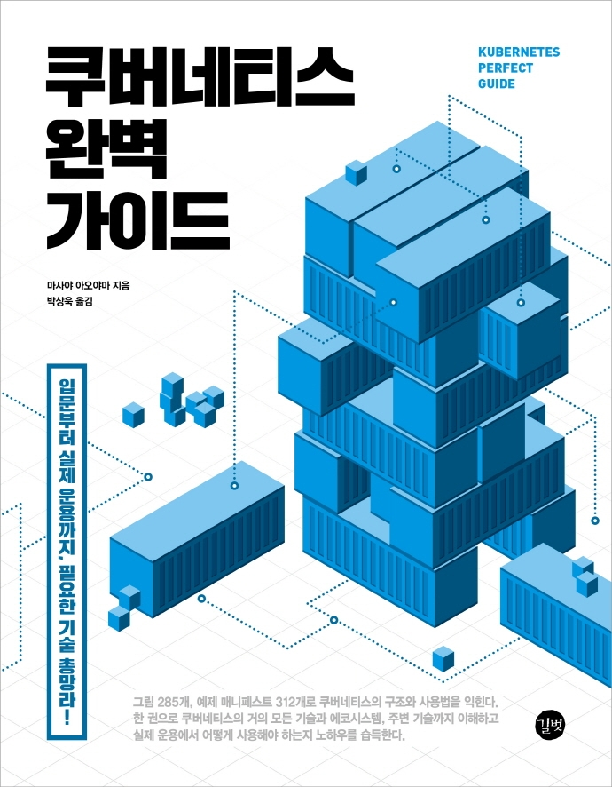

<div align="left">
  
</div>

쿠버네티스 관련 자격증인 CKA/CKAD에 대해 찾아보다가 이 책이 초보자부터 보기 좋다는 이야기를 들어서 구입하여 보게 되었다.


본 페이지에서는 이 책을 읽으며 새로 알게된 내용들을 정리하고자 작성하게 되었다.

# 1. 도커(Docker)
도커(Docker)는 컨테이너를 실행하기 위한 실행 환경(컨테이너 런타임) 및 툴킷을 의미한다. 쿠버네티스는 도커 외에도 다른 컨테이너 런터임도 지원한다.

## 1.1 도커 컨테이너
도커 컨테이너는 도커 이미지를 기반으로 실행하는 프로세스이다. 도커 이미지만 있다면 환경의 영향을 받지 않고 다양한 환경에서 컨테이너 기동이 가능하여 이식성이 높다. 도커 컨테이너는 가상 머신에 비해 가볍고, 시작과 중지가 빠른 장점이 있다. 가상 머신은 하이퍼바이저를 이용하여 게스트 OS를 작동시키지만, 도커 컨테이너는 호스트 머신의 커널을 이용하면서 네임스페이스 분리와 cgroups를 이용한 제어를 통해 독립적인 OS와 같은 환경을 만들 수 있다. 따라서 게스트 OS 기동을 기다릴 필요 없이 프로세스를 빠르게 시작하고 중지할 수 있다.

## 1.2 도커 컨테이너 설계
도커 컨테이너 생성에는 다음과 같은 주의점이 있다.

|설명|내용|
|---|---|
|1컨테이너당 1프로세스|기존 가상 머신처럼 하나의 이미지 안에 여러 프로세스를 올리면 주변 에코 시스템과 맞지 않거나 관리가 힘들어진다.|
|변경 불가능한 인프라(Immutable Infrastructure) 이미지로 생성|컨테이너 기동 후에 외부에서 실행 바이너리를 가져오거나 패키지를 설치하면 외부 영향에 따라 이미지 실행 결과가 달라지므로, 이미지 안에 애플리케이션 실행 바이너리나 관련 리소스를 포함시켜 변경 불가능하게 만들어야 한다.|
|경량의 도커 이미지 생성|컨테이너를 실행할 때 노드상에서 사용할 도커 이미지가 없다면 외부에서 이미지를 풀하여 가져와야 하므로, 이미지는 가급적 경량인 상태로 만들어야 한다.|
|실행 계정은 root이외의 사용자로 한다.|내부 프로세스 실행 계정 권한은 최소화해야 한다.|


## 1.3 도커 파일 작성법
도커 이미지는 도커 파일을 기반으로 이미지가 빌드된다. 도커 파일은 컨테이너 이미지 작성 메뉴얼이다.

```
# Alpine 3.11 버전 golang 1.14.1 이미지를 사용
FROM golang:1.14.1-alpine3.11

# 빌드할 머신에 있는 main.go 파일을 컨테이너에 복사
COPY ./main.go ./

# 컨테이너 내부에서 명령어 실행
RUN go build -o ./go-app ./main.go

# 실행 계정을 nobody로 변경
USER nobody

# 컨테이너가 기동할 때 실행할 명령어 정의
ENTRYPOINT ["./go-app"]
```

각 예약어를 간단하게 설명하면 다음과 같다.


|예약어|설명|
|---|---|
|FROM|기반이 되는 도커 이미지 지정|
|MAINTAINER|컨테이너 이미지 관리자 정보를 기입 (현재는 비추천. 아래 LABEL 명령을 사용함)|
|LABEL|컨테이너 이미지의 메타데이터를 키:밸류 형식으로 지정(예: LABEL maintainer="..."|
|WORKDIR|명령어를 실행할 작업 디렉터리를 지정 (디렉터리가 없을 경우 생성)|
|EXPOSE|컨테이너 실행 시 Listen할 포트 지정|
|ADD|로컬에 있는 tar.gz 압축을 풀고 파일을 컨테이너로 복사|
|COPY|로컬에 있는 파일을 컨테이너로 복사할 때 지정|
|RUN|빌드 명령어 지정|
|USER|실행 계정 지정|
|ENTRYPOINT|컨테이너 기동 시 실행할 명령어|
|CMD|컨테이너 기동 시 실행할 명령어에 입력되는 파라미터|


## 1.4 도커 파일 빌드
위의 도커 파일을 실행하면 기반 이미지로 golang:1.14.1-alpine3.11을 사용했다. golang:1.14.1-alpine3.11은 alpine 이미지(5.6MB)를 기반으로 만들어진 아주 작은 이미지다. 그러나, golang의 도커 이미지에는 Go 컴파일 도구가 포함되어 생성된 sample-image 이미지에도 해당 컴파일 도구가 포함되어 이미지 사이즈가 매우 커지게 된다.


이러한 문제는 도커의 멀티 스테이지 빌드를 사용하여 해결 가능하다. 도커 멀티 스테이지 빌드는 여러 컨테이너 이미지를 사용하여 처리하고 결과물만 실행용 컨테이너 이미지에 복사하는 구조이다.


```
# Stage 1 컨테이너(애플리케이션 빌드)
FROM golang:1.14.1-alpine3.11 as builder
COPY ./main.go ./
RUN go build -o /go-app ./main.go

# Stage 2 컨테이너(빌드된 바이너리를 포함한 실행용 컨테이너 생성)
FROM alpine:3.7
EXPOSE 8080
# Stage 1에서 빌드된 결과물을 복사
COPY --from=builder /go-app .
USER nobody
ENTRYPOINT ["./go-app"]
```


위 도커 파일에서는 1단계에서 마찬가지로 빌드를 수행한다.
2단계에서는 1단계에서 빌드된 파일만 가지고 golang이 설치되지 않는 alpine 환경에서 바이너리 파일을 실행시킨다.


`docker image build -t sample-image:0.1 -f Dockerfile-MultiStage`


## 1.4 컨테이너 기동
도커 컨테이너 기동 시에는 다음과 같은 명령어를 사용한다. 쿠버네티스를 사용할 경우에는 쿠버네티스가 컨테이너를 기동하기 때문에 직접 사용하지는 않는다.


```
$ docker contianer run -d -p 12345:8080 sample-image:0.1

$ curl http://localhost:12345
Hello, Kubernetes
```