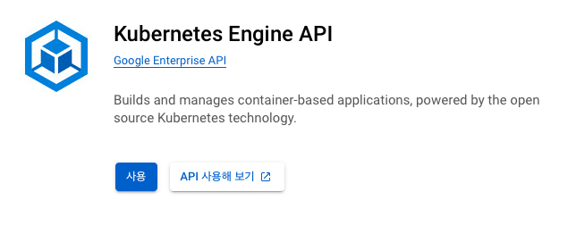

본 장에서부터는 본격적으로 쿠버네티스 실습 내용을 기록하였다.
실습은 GKE(Google Kubernetes Engine)과 kind를 사용하였다.


# 4.1 실습 준비


본격적으로 컨테이너를 생성하기 전에 gcloud와 kind를 설치해두어야 한다.
kind는 [[쿠버네티스 완벽 가이드] 03. 쿠버네티스 환경](./kubernetes_3.md)에서 설치하는 방법을 안내하였다.
GKE는 아래와 같이 설치 가능하다.


```sh
# Google Cloud SDK(gcloud 포함) 설치
$ curl https://sdk.cloud.google.com | bash

# 설치한 gcloud 명령어를 사용할 수 있도록 셀 재기동
$ exec -l $SHELL

# gcloud init
$ gcloud init

# GKE에서 사용 가능한 쿠버네티스 버전 확인
$ gcloud container get-server-config --zone asia-northeast3-a # asia-northeast3는 서울 리전
```


본격적으로 gcloud를 사용하기 전에 앞서 `gcloud init`에서 선택한 프로젝트에 결제 방법이 선택되어 있어야 하며, Google Cloud의 Kubernetes Engine API가 enable되어야 한다.
Kubernetes Engine API는 결제 방법이 선택되어 있어야 enable 가능하다.


<div align="left">

</div>


```sh
# GKE 클러스터 'k8s' 생성
$ gcloud container clusters create k8s \
--cluster-version 1.24.2-gke.300 \ # validMasterVersion에 있는 쿠버네티스 버전 지정
--zone asia-northeast3-a \ # 존 설정
--num-nodes 3 \ # 노드 수
--machine-type n1-standard-1 \ # 인스턴스 유형 지정
--enable-network-policy \ #네트워크 정책 기능 활성화
--enable-vertical-pod-autoscaling # VerticalPodAutoscaler 활성화

# GKE 클러스터에 대한 권한을 다시 가져오는 경우
$ gcloud container clusters get-credentials k8s --zone asia-northeast3-a

# 알파 기능을 활성화한 클러스터 생성 시에는 아래와 같다.
# 알파 기능을 활성화한 클러스터는 30일 후에 삭제된다.
$ gcloud container clusters create k8s-alpha \
--cluster-version 1.24.2-gke.300 \
--zone asia-northeast3-a \
--num-nodes 3 \
--machine-type n1-standard-1 \
--enable-network-policy \
--enable-vertical-pod-autoscaling \
--enable-kubernetes-alpha \ # 쿠버네티스 알파 기능의 활성화
--no-enable-autorepair --no-enable-autoupgrade # 알파 기능을 활성화하기 때문에 일부 기능은 비활성화
```


다음으로는 구글 계정이 관리자 권한으로 쿠버네티스 클러스터를 관리할 수 있도록 다음 명령어를 실행해 두어야 한다. 구글 계정은 관리자 권한으로 관리하고 싶은 계정을 지정해야 한다.


```sh
# 사용자에게 모든 리소스의 접속 권한 부여
$ kubectl create clusterrolebinding user-cluster-admin-binding \
--clusterrole=cluster-admin \
--user=SOMEONE@google.co.kr
```


GCE는 비교적 종량에 대한 과금 단가가 비싸기 때문에 불필요한 클러스터는 삭제해 두는 것이 좋다.


```sh
gcloud container clusters delete k8s --zone asia-northeast3-a
```


최신 버전의 기능은 3장에서 소개한 kind(Kubernetes in Docker)에서 구축한 클러스터를 사용한다.


```sh
$ kind create cluster --name kind-alpha-cluster --config kind-alpha.yaml
```

# 4.2 쿠버네티스 기초


쿠버네티스는 쿠버네티스 마스터와 쿠버네티스 노드로 구성되어 있다. 마스터는 API 엔드포인트 제공, 컨테이너 스케줄링, 컨테이너 스케일링 등을 담당하는 노드이다. 쿠버네티스 노드는 도커 호스트에 해당되며, 실제로 컨테이너를 기동시키는 노드이다. 쿠버네티스 클러스터를 관리하려면 CLI도구인 kubectl과 YAML형식이나 JSON형식으로 된 매니페스트 파일을 사용하여 쿠버네티스 마스터에 '리소스'를 등록해야 한다. 매니페스트 파일은 가독성을 고려하여 YAML 형식으로 작성하는 것이 일반적이다. kubectl은 매니페스트 파일 정보를 파탕으로 쿠버네티스 마스터가 가진 API에 요청을 보내 쿠버네티스를 관리한다. 쿠버네티스 API는 RESTful APi 라이브러니나 curl 명령어 도구를 사용하여 직접 API를 호출하여 쿠버네티스를 관리할 수도 있다.


## 4.3 쿠버네티스와 리소스


쿠버네티스를 관리하기 위해 등록하는 '리소스'는 컨테이너의 실행과 로드 밸런서 생성 등 많은 종류가 있다. 리소스는 크게 아래와 같이 다섯 가지 카테고리로 구분된다.


|종류|개요|
|---|---|
|워크로드 API 카테고리|컨테이너 실행에 관련된 리소스|
|서비스 API 카테고리|컨테이너를 외부에 공개하는 엔드포인트를 제공하는 리소스|
|컨피그 & 스토리지 API 카테고리|설정/기밀 정보/영구 볼륨 등에 관련된 리소스|
|클러스터 API 카테고리|보안이나 쿼터 등에 관련된 리소스|
|메타데이터 API 카테고리|클러스터 내부의 다른 리소스를 관리하기 위한 리소스|


### 4.3.1 워크로드 API 리소스


워크로드 API 카테고리는 클러스터 위에서 컨테이너를 기동하기 위해 사용되는 리소스이다.


- 파드(Pod)
- 레플리케이션 컨트롤러(ReplicationController)
- 레플리카셋(ReplicaSet)
- 디플로이먼트(Deployment)
- 데몬셋(DaemonSet)
- 스테이트풀셋(StatefulSet)
- 잡(Job)
- 크론잡(CronJob)


### 4.3.2 서비스 API 카테고리


서비스 API 카테고리는 컨테이너 서비스 디스커버리와 클러스터 외부에서도 접속이 가능한 엔드포인트 등을 제공하는 리소스이다. 내부적으로 사용되는 것을 제외하고 사용자가 직접 관리할 수 있는 리소스로 서비스와 인그레스(Ingress)라는 두 종류의 API 카테고리가 있다.


### 4.3.3 컨피그 & 스토리지 API 카테고리


컨피그 & 스토리지 API 카테고리는 설정과 기밀 데이터를 컨테이너에 담거나 영구 볼륨을 제공하는 리소스이다. 시크릿과 컨피그맵은 모두 key-value 형태의 데이터 구조로 되어 있고, 저장할 데이터가 기밀 데이터인지 일반 설정 정보인지에 따라 구분된다.


- 시크릿
- 컨피그맵
- 영구 볼륨 클레임


### 4.3.4 클러스터 API 카테고리


클러스터 API 카테고리는 클러스터 자체 동작을 정의하는 리소스이다. 보안 관련 설정이나 정책, 클러스터 관리성을 향상시키는 기능을 위한 리소스를 제공한다.


- 노드
- 네임스페이스
- 영구 볼륨
- 리소스 쿼터
- 서비스 어카운트
- 롤
- 클러스터 롤
- 롤바인딩
- 클러스터 롤 바인딩
- 네트워크 정책


### 4.3.5 메타데이터 API 카테고리


메타데이터 API 카테고리는 클러스터 내부의 다른 리소스 동작을 제어하기 위한 리소스이다.


- LimitRange
- HorizontalPodAutoscaler(HPA)
- PodDisruptionBudget(PDB)
- 커스텀 리소스 데피니션


## 4.4 네임스페이스로 가상적인 클러스터 분리


쿠버네티스에는 네임스페이스(NameSpace)라는 자체 클러스터 분리 기능이 있다. 하나의 쿠버네티스 클러스터를 여러 팀에서 사용하거나 경우 서비스 환경/스테이징 환경/개발 환경으로 구분하는 경우 사용할 수 있다. 기본 설정에서는 다음과 같은 네 가지 네임스페이스가 사용된다.

- kube-system: 쿠버네티스 클러스터 구성 요소와 애드온이 배포될 네임스페이스
- kube-public: 모든 사용자가 사용할 수 있는 컨피그맵 등을 배치하는 네임스페이스
- kube-node-lease: 노드 하트비트 정보가 저장된 네임스페이스
- default: 기본 네임스페이스


관리형 서비스나 구축 도구로 구축된 경우 대부분의 쿠버네티스 클러스터는 RBAC(Role-Based Access Control)가 기본적으로 설정되어 있다. RBAC는 클러스터 조작에 대한 권한을 네임스페이스별로 구분할 수 있고, 네트워크 정책과 함께 사용하여 네임스페이스 간의 통신을 제어할 수 있는 구조이다.

