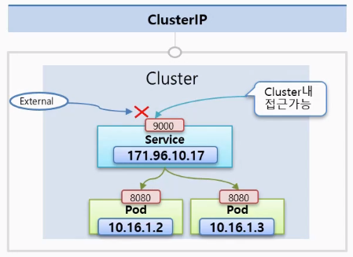

# 6.1 서비스 API 카테고리


서비스 API 카테고리는 클러스터상 컨테이너에 대한 엔드포인트를 제공하거나 레이블과 일치하는 컨테이너의 디스커버리에 사용되는 리소스이다. 내부적으로 사용되는 리소스를 제외하고 사용자가 직접 사용하는 것은 L4 로드밸런싱을 제공하는 서비스 리소스와 L7 로드밸런싱을 제공하는 인그레스 리소스가 있다. 또한, 서비스 리소스에는 제공 목적에 따라 클러스터 내부나 클러스터 외부에서 접속할 수 있는, 접속 창구가 되는 가상 IP 등의 엔드포인트를 제공하고 있다. 그리고 제공 목적에 따라 일곱 가지 서비스 타입을 가지고 있다.

- Cluster IP
- External IP(Cluster IP의 한 종류)
- NodePort
- LoadBalancer
- Headless(None)
- ExternalName
- None-Selector
- 인그레스


# 6.2 쿠버네티스 클러스터 네트워크와 서비스


쿠버네티스 네트워크를 설명하기 전 이전에 설명했던 내용을 다시 한 번 상기시켜보자. 파드 내부에는 여러 컨테이너가 존재할 수 있는데, 하나의 파드 내부의 컨테이너들은 모두 같은 IP주소를 공유한다. 즉, 파드 내부 컨테이너들간의 통신은 localhost로 통신하고, 다른 파드에 있는 컨테이너는 파드의 IP주소로 통신한다.  쿠버네티스 클러스터를 생성하면 노드상에 파드를 위한 내부 네트워크가 자동으로 구성된다. 내부 네트워크 구성은 사용할 CNI(Container Network Interface)라는 플러그형 모듈 구현에 따라 다르지만, 기본적으로 노드별로 다른 네트워크를 구성하고 노드 간 트래픽은 VXLAN이나 L2 Routing 등의 기술로 전송한다. 노드별 네트워크 세그먼트는 쿠버네티스 클러스터 전체에 할당된 네트워크 세그먼트를 자동으로 분할해 할당하므로, 사용자가 설정하지 않아도 된다.</br>


이러한 내부 네트워크가 자동으로 구성되기 때문에 파다는 서비스를 사용하지 않고도 파드 간 통신이 가능하다. 서비스를 사용하면 다음 두 가지 장점을 얻을 수 있다.


- 파드에 트래픽 로드 밸런싱
- 서비스 디스커버리와 클러스터 내부 DNS


## 6.2.1 파드에 트래픽 로드 밸런싱


서비스는 수신한 트래픽을 여러 파드에 로드밸런싱 하는 기능을 제공한다. 디플로이먼트를 사용하여 여러 파드를 구성하면, 각 파드에는 서로 다른 IP주소가 부여되기 때문에 로드 밸런싱 구조를 자체적으로 구현하려면 각 파드의 IP주소를 매번 조회하거나 전송 대상의 목적지를 설정해야 한다. 하지만, 서비스를 사용하면 여러 파드에 대한 로드밸런싱을 자동으로 구현할 수 있다. 또한, 서비스는 로드 밸런싱의 엔드포인트를 제공한다.


```yaml
apiVersion: apps/v1
kind: Deployment
metadata:
  name: sample-deployment
spec:
  replicas: 3
  selector:
    matchLabels:
      app: sample-app
  template:
    metadata:
      labels:
        app: sample-app
    spec:
      containers:
        - name: nginx-container
          image: amsy810/echo-nginx:v2.0
```


```sh
# 디플로이먼트 생성
$ kubectl apply -f sample-deployment.yaml
deployment.apps/sample-deployment configured

# 생성된 파드 레이블 출력
$ kubectl get pods -o custom-columns="NAME:{.metadata.name},LABEL:{.metadata.labels}"
NAME                                 LABEL
sample-deployment-65b84c8657-b5795   map[app:sample-app pod-template-hash:65b84c8657]
sample-deployment-65b84c8657-nfhch   map[app:sample-app pod-template-hash:65b84c8657]
sample-deployment-65b84c8657-v244g   map[app:sample-app pod-template-hash:65b84c8657]
sample-pod                           <none>

# 출력 시 특정 JSON Path(예제에서는 레이블) 값만을 출력
$ kubectl get pods sample-deployment-65b84c8657-b5795 -o jsonpath='{.metadata.labels}'
{"app":"sample-app","pod-template-hash":"65b84c8657"}%
```


다음으로는, 엔드포인트의 서비스 종류에 ClusterIP를 사용하는 서비스를 생성해보겠다. 서비스 종류는 나중에 자세히 설명하겠지만, ClusterIP는 클러스터 내부에서만 사용 가능한 가상 IP를 가진 엔드포인트를 제공하는 로드 밸런서를 구성한다. 서비스는 `.spec.selector`에 정의할 셀렉터 조건에 따라 트래픽을 전송한다.


```yaml
apiVersion: v1
kind: Service
metadata:
  name: sample-clusterip
spec:
  type: ClusterIP
  ports:
    - name: "http-port"
      protocol: "TCP"
      port: 8080
      targetPort: 80
  selector:
    app: sample-app
```


서비스를 생성하면 로드 밸런서의 트래픽이 전송되는 파드를 확인해보자. 먼저 `app: sample-app` 레이블을 가진 파드 IP 주소를 확인해야 한다.


```sh
# 서비스 생성
$ kubectl apply -f sample-clusterip.yaml
service/sample-clusterip created

# 지정한 레이블을 가진 파드 정보 중 특정 JSON Path를 컬럼으로 출력
$ kubectl get pods -l app=sample-app -o custom-columns="NAME:{metadata.name},IP:{status.podIP}"
NAME                                 IP
sample-deployment-65b84c8657-b5795   10.244.2.8
sample-deployment-65b84c8657-nfhch   10.244.1.8
sample-deployment-65b84c8657-v244g   10.244.3.35

# 서비스 정보 확인 (엔드포인트: 10.96.214.33)
$ kubectl get services sample-clusterip
NAME               TYPE        CLUSTER-IP     EXTERNAL-IP   PORT(S)    AGE
sample-clusterip   ClusterIP   10.96.214.33   <none>        8080/TCP   46s

# 서비스 상세 정보 확인
$ kubectl describe service sample-clusterip
Name:              sample-clusterip
Namespace:         default
Labels:            <none>
Annotations:       <none>
Selector:          app=sample-app
Type:              ClusterIP
IP Family Policy:  SingleStack
IP Families:       IPv4
IP:                10.96.214.33
IPs:               10.96.214.33
Port:              http-port  8080/TCP
TargetPort:        80/TCP
Endpoints:         10.244.1.8:80,10.244.2.8:80,10.244.3.35:80
Session Affinity:  None
Events:            <none>

# 별도 파드를 생성하여 접속
$ kubectl apply -f sample-pod.yaml
pod/sample-pod created

$ kubectl exec -it sample-pod -- /bin/bash

# 서비스 엔드포인트로 요청
root@sample-pod: curl -s http://10.96.214.33:8080
Host=10.96.214.33  Path=/  From=sample-deployment-65b84c8657-v244g  ClientIP=10.244.1.9  XFF=
```


Endpoints 부분에 아무 것도 표시되지 않았을 경우 셀렉터 조건이 맞지 않을 가능성이 있다. 이번 예제에서는 서비스 엔드포인트 타입을 ClusterIP로 설정했기 때문에 가상 엔드포인트는 클러스터 내부에서만 호출 가능하다.


### 여러 포트 할당


이전 예제에서는 서비스에 하나의 포트만 할당했었는데, 서비스에 여러 포트를 할당 가능하다. 아래 예제에서는 ClusterIP의 8080 포트를 파드 80포트로, ClusterIP의 8443 포트를 파드 443 포트로 로드밸런싱한다.


```yaml
apiVersion: v1
kind: Service
metadata:
  name: sample-clusterip-multi
spec:
  type: ClusterIP
  ports:
    - name: "http-port"
      protocol: "TCP"
      port: 8080
      targetPort: 80
    - name: "https-port"
      protocol: "TCP"
      port: 8443
      targetPort: 443
  selector:
    app: sample-app
```


### 이름을 사용한 포트 참조


위 예제에서는 `targetPort`를 직접 지정했는데, 파드의 포트 정의에 이름을 지정해 놓으면 이름을 사용하여 참조할 수 있다. 디플로이먼트의 포트 정의에서 80 포트를 http로 명명하고, 서비스에서 참조할 때는 targetPort에서 http를 참조한다.


```yaml
---
apiVersion: v1
kind: Pod
metadata:
  name: sample-named-port-pod-80
  labels:
    app: sample-app
spec:
  containers:
  - name: nginx-container
    image: amsy810/echo-nginx:v2.0
    ports:
    - name: http # 포트에 이름 지정
      containerPort: 80
---
apiVersion: v1
kind: Pod
metadata:
  name: sample-named-port-pod-81
  labels:
    app: sample-app
spec:
  containers:
  - name: nginx-container
    image: amsy810/echo-nginx:v2.0
    env:
    - name: NGINX_PORT
      value: "81"
    ports:
    - name: http # 포트에 이름 지정
      containerPort: 81
```


```yaml
apiVersion: v1
kind: Service
metadata:
  name: sample-named-port-service
spec:
  type: ClusterIP
  ports:
  - name: "http-port"
    protocol: "TCP"
    port: 8080
    targetPort: http
  selector:
    app: sample-app
```


```sh
# 파드 생성
$ kubectl apply -f sample-named-port-pods.yaml
pod/sample-named-port-pod-80 created
pod/sample-named-port-pod-81 created

# 서비스 생성
$ kubectl apply -f sample-named-port-service.yaml
service/sample-named-port-service created

# 서비스 목적지 엔드포인트 확인
$ kubectl describe service sample-named-port-service
Name:              sample-named-port-service
Namespace:         default
Labels:            <none>
Annotations:       <none>
Selector:          app=sample-app
Type:              ClusterIP
IP Family Policy:  SingleStack
IP Families:       IPv4
IP:                10.96.197.223
IPs:               10.96.197.223
Port:              http-port  8080/TCP
TargetPort:        http/TCP
Endpoints:         10.244.3.36:80,10.244.2.9:81
Session Affinity:  None
Events:            <none>

# 파드 IP 주소 확인
$ kubectl get pods -o wide
NAME                                 READY   STATUS    RESTARTS   AGE    IP            NODE                   NOMINATED NODE   READINESS GATES
sample-named-port-pod-80             1/1     Running   0          117s   10.244.3.36   kind-cluster-worker    <none>           <none>
sample-named-port-pod-81             1/1     Running   0          117s   10.244.2.9    kind-cluster-worker3   <none>           <none>
```


## 6.2.2 클러스터 내부 DNS와 서비스 디스커버리


서비스 디스커버리란 특정 조건의 대상이 되는 멤버를 보여주거나 이름에서 엔드포인트를 판별하는 기능이다. 쿠버네티스에서 서비스 디스커버리란 서비스에 속해 있는 파드를 보여주거나 서비스명에서 엔드포인트 정보를 반환하는 것을 말한다. </br>


서비스 디스커버리 방법은 크게 세가지가 있다.


- 환경 변수를 사용한 서비스 디스커버리
- DNS A 레코드를 사용한 서비스 디스커버리
- DNS SRV 레코드를 사용한 서비스 디스커버리


### 환경 변수를 사용한 서비스 디스커버리


파드 내부에서는 환경 변수에서도 같은 네임 스페이스 서비스를 확인할 수 있다. `-`이 포함된 서비스명은 _로 변경된 후 대문자로 변환된다. `docker --links ...`로 실행했을 때와 같은 형식으로 환경 변수가 저장되기 때문에 도커 자체에서 사용하던 환경에서 마이그레이션할 때도 사용하기 편하다. 그러나 파드가 생성된 후 생성이나 삭제에 따라 변경된 환경 변수가 먼저 기동한 파드 환경에서 자동으로 다시 등록되지 않기 때문에 예기치 못한 장애로 이어질 수 있다. 그런 경우에는 먼저 생성한 파드를 다시 생성하면 된다. </br>


`sepc.enableServiceLinks`를 false로 설정하면 환경 변수 추가를 비활성화할 수 있다. 이 파라미터의 기본값은 true로 설정되어 있다.


```sh
# pod 확인
$ kubectl get pods
NAME                                 READY   STATUS    RESTARTS   AGE
sample-deployment-65b84c8657-b5795   1/1     Running   0          59m
sample-deployment-65b84c8657-nfhch   1/1     Running   0          59m
sample-deployment-65b84c8657-v244g   1/1     Running   0          59m

# 환경 변수에 등록된 서비스 정보 확인
$ kubectl exec -it sample-deployment-65b84c8657-b5795 -- env | grep -i kubernetes
KUBERNETES_PORT=tcp://10.96.0.1:443
KUBERNETES_SERVICE_PORT_HTTPS=443
KUBERNETES_SERVICE_PORT=443
KUBERNETES_SERVICE_HOST=10.96.0.1
KUBERNETES_PORT_443_TCP_ADDR=10.96.0.1
KUBERNETES_PORT_443_TCP_PORT=443
KUBERNETES_PORT_443_TCP_PROTO=tcp
KUBERNETES_PORT_443_TCP=tcp://10.96.0.1:443
```


### DNS A 레코드를 사용한 서비스 디스커버리


다른 파드에서 서비스로 할당되는 엔드포인트에 접속하려면 당연히 목적지가 필요하지만, 할당된 IP 주소를 사용하는 방법 외에도 자동 등록된 DNS 레코드를 사용할 수 있다. 쿠버네티스에서 IP 주소를 사용하는 방법 외에도 자동 등록되 DNS 레코드를 사용할 수 있다. 쿠버네티스에서 IP 주소를 편하게 관리하려면 기본적으로 자동 할당된 IP 주소에 연결된 DNS명을 사용하는 것이 바람직하다. 할당되는 IP 주소는 서비스를 생성할 때마다 변경되므로 IP 주소를 송신 측 컨테이너 설정 파일 등에서 명시적으로 설정하면 변경될 때마다 설정 파일 등을 변경해야 하기 때문에 컨테이너를 변경 불가능한 상태로 유지할 수 없다.


아래와 같이 http://sample-culsterip:8080 으로 요청했을 때 cluster-ip의 이름이 해석되고 10.96.214.33(엔드포인트)로 요청이 발송되도록 되어 있다. 실제로 등록된 정식 FQDN은 '서비스명.네임스페이스명.svc.cluster.local'로 되어 있다. 이 FQDN에는 서비스가 충돌하지 않도록 네임스페이스 등이 포함되어 있는데, 컨테이너 내부의 /etc/resolve.conf에 다음과 같은 내용 (search로 시작하는 행)이 있기 때문에 `sample-clusterip.default`나 sample-clusterip 만으로 이름을 해석할 수 있다. 이 설정은 기본 네임스페이스라면 `default.svc.cluster.local`이 들어가 있듯이 네임스페이스별로 다르다. 동일한 네임스페이스라면 sample-clusterip로 해석이 가능하지만 다른 네임스페이스라면 sample-clusterip.default와 같이 네임스페이스명을 붙여 이름을 해석해야 한다.


```sh
$ kubectl exec -it sample-pod -- curl -s http://sample-clusterip:8080
Host=sample-clusterip  Path=/  From=sample-deployment-65b84c8657-v244g  ClientIP=10.244.1.9  XFF=

$ kubectl exec -it sample-pod -- curl -s http://sample-clusterip:8080
Host=sample-clusterip  Path=/  From=sample-deployment-65b84c8657-b5795  ClientIP=10.244.1.9  XFF=
...

# sample-clusterip.default.svc.cluster.local의 이름 해석 확인
$ kubectl exec -it sample-pod -- dig sample-clusterip.default.svc.cluster.local
...
;; QUESTION SECTION:
;sample-clusterip.default.svc.cluster.local. IN A

;; ANSWER SECTION:
sample-clusterip.default.svc.cluster.local. 30 IN A 10.96.214.33

$ kubectl exec -it sample-pod -- dig sample-clusterip.default.svc.cluster.local
...
;; QUESTION SECTION:
;sample-clusterip.default.svc.cluster.local. IN A

;; ANSWER SECTION:
sample-clusterip.default.svc.cluster.local. 30 IN A 10.96.214.33

;; Query time: 1 msec
;; SERVER: 10.96.0.10#53(10.96.0.10)
;; WHEN: Fri Sep 09 06:47:11 UTC 2022
;; MSG SIZE  rcvd: 141

# /etc/resolv.conf 확인
$ kubectl exec -it sample-pod -- cat /etc/resolv.conf
search default.svc.cluster.local svc.cluster.local cluster.local
nameserver 10.96.0.10
options ndots:5

# 역질의
$ kubectl exec -it sample-pod -- dig -x 10.96.214.33
...
;; QUESTION SECTION:
;33.214.96.10.in-addr.arpa.	IN	PTR

;; ANSWER SECTION:
33.214.96.10.in-addr.arpa. 30	IN	PTR	sample-clusterip.default.svc.cluster.local.

;; Query time: 2 msec
;; SERVER: 10.96.0.10#53(10.96.0.10)
;; WHEN: Fri Sep 09 06:55:09 UTC 2022
;; MSG SIZE  rcvd: 147
```


### DNS SRV 레코드를 사용한 서비스 디스커버리


정방향과 역방향으로 DNS 레코드가 질의되는 것을 확인하였는데, SRV 레코드를 사용해서 서비스 엔드포인트를 확인할 수도 있다. SRV 레코드는 포트명과 프로토콜을 사용하여 서비스를 제공하는 포트 번호를 포함한 엔드포인트를 DNS로 해석하는 구조다. 레코드 형식은 다음과 같다. 서비스의 포트명과 프로토콜에는 접두사 _가 포함되므로 주의하자.


`_서비스포트명_프로토콜.서비스명.네임스페이스명.svc.cluster.local`


```yaml
apiVersion: v1
kind: Service
metadata:
  name: sample-clusterip
spec:
  type: ClusterIP
  ports:
    - name: "http-port"
      protocol: "TCP"
      port: 8080
      targetPort: 80
  selector:
    app: sample-app
```


실제로 SVR을 확인해보면, 다음과 같이 목적지 호스트명 sample-clusterip.default.svc.cluster.local과 포트 번호 8080을 해석할 수 있다. SRV 레코드를 해석할 수 있는 소프트웨어의 경우 이와 같은 서비스를 제공하는 포트 번호를 포함한 엔드포인트까지 DNS로 해석할 수 있다.


```sh
# SRV 레코드가 다른 파드에서 해석이 가능한지 확인
$ kubectl exec -it sample-pod -- dig _http-port._tcp.sample-clusterip.default.svc.cluster.local SRV
...

;; OPT PSEUDOSECTION:
; EDNS: version: 0, flags:; udp: 4096
; COOKIE: 1df44dd154a59433 (echoed)
;; QUESTION SECTION:
;_http-port._tcp.sample-clusterip.default.svc.cluster.local. IN SRV

;; ANSWER SECTION:
_http-port._tcp.sample-clusterip.default.svc.cluster.local. 30 IN SRV 0 100 8080 sample-clusterip.default.svc.cluster.local.
```


# 6.3 ClusterIP 서비스


ClusterIP 서비스는 쿠버네티스의 가장 기본이 되는 `type: ClusterIP` 서비스다. 이 서비스를 생성하면 클러스터 내부에서만 통신 가능한 Internal Network에 생성되는 가상 IP가 할당된다. 따라서 ClusterIP라고 불린다. ClusterIP는 각 노드상에서 실행 중인 시스템 구성 요소 kube-proxy가 파드로 전송을 실시한다. ClusterIP는 쿠버네티스 클러스터 외부에서 트래픽을 수신할 필요가 없는 환경에서 클러스터 내부 로드 밸런서로 사용된다. 기본적으로는 쿠버네티스 API에 접속하기 위한 Kubernetes 서비스가 생성되어 있고, ClusterIP가 발급되어 있다.


```sh
# 쿠버네티스 API에 접속할 수 있도록 쿠버네티스 서비스가 생성됨
$ kubectl get services
NAME               TYPE        CLUSTER-IP     EXTERNAL-IP   PORT(S)    AGE
kubernetes         ClusterIP   10.96.0.1      <none>        443/TCP    41d
sample-clusterip   ClusterIP   10.96.214.33   <none>        8080/TCP   80m
```


<div align="center">
  
</div>


## 6.3.1 ClusterIP 생성


매니페스트는 기존 사용했던 sample-clusterip 매니페스트를 사용한다. `type: ClusterIP`를 지정하면 ClusterIP 서비스를 생성할 수 있다. `spec.ports[].port`에는 ClusterIP에서 수신할 포트 번호를 지정하고, `spec.ports[].targetPort`는 목적지 컨테이너 포트 번호를 지정한다.


## 6.3.2 ClusterIP 가상 IP 정적 지정


애플리케이션에서 데이터베이스 서버를 지정하는 경우 기본적으로 쿠버네티스 서비스에 등록된 클러스터 내부 DNS 레코드를 사용하여 호스트를 지정하는 것이 바람직하다. 그러나, IP주소로 지정해야 하는 경우 ClusterIP를 정적으로 지정할 수도 있다.


ClusterIP를 자동 할당이 아닌 수동으로 설정할 경우 `spec.clusterIP`를 지정한다.


```yaml
apiVersion: v1
kind: Service
metadata:
  name: sample-clusterip-vip
spec:
  type: ClusterIP
  clusterIP: 10.51.246.81
  ports:
    - name: "http-port"
      protocol: "TCP"
      port: 8080
      targetPort: 80
  selector:
    app: sample-app
```


서비스가 이미 생성된 후에는 ClusterIP를 변경할 수 없다. 쿠버네티스에서는 `kubectl apply`를 사용하여 설정값을 변경할 수 있다고 설명하지만, 쿠버네티스 특성상 ClusterIP 값 등과 같은 일부 필드는 변경할 수 없게 설정되어 있다.


# 6.4 ExternalIP 서비스


ExternalIP는 특정 쿠버네티스 노드 IP주소:포트에서 수신한 트래픽을 컨테이너로 전송하는 형태로 외부와 통신할 수 있도록 하는 서비스다. 그리고 특별한 이유가 없는 경우에는 ExternalIP 서비스 대신 나중에 설명할 NodePort 서비스를 사용하는 것이 더 좋다.


## 6.4.1 ExternalIP 서비스 생성


```yaml
apiVersion: v1
kind: Service
metadata:
  name: sample-externalip
spec:
  type: ClusterIP
  externalIPs:
    - 172.18.0.2
    - 172.18.0.3
  ports:
    - name: "http-port"
      protocol: "TCP"
      port: 8080
      targetPort: 80
  selector:
    app: sample-app
```


ExternalIP는 ClusterIP의 한 종류이기 때문에 type은 역시 ClusterIP로 지정한다. `spec.externalIPs`에는 쿠버네티스 노드 IP(10.178.0.61 등)를, `spec.ports[].port`에는 쿠버네티스 노드의 IP와 ClusterIP에서 수신할 포트 번호를, `spec.ports[].targetPorts`에는 목적지 컨테이너 포트를 지정한다. 또한, ExternalIP에서 사용하는 IP는 모든 쿠버네티스 노드의 IP를 넣을 필요가 없다.</br>


ExternalIP에 사용 가능한 IP주소는 노드 정보에서 확인할 수 있다. 생성한 ExternalIP 서비스를 확인해보면, 컨테이너 내부에서의 통신은 ClusterIP를 사용하기 위해 ClusterIP도 자동으로 확보된다.


```sh
# 쿠버네티스 노드 목록과 주소 출력
$ kubectl get nodes -o custom-columns="NAME:{metadata.name},IP:{status.addresses[].address}"
NAME                         IP
kind-cluster-control-plane   172.18.0.5
kind-cluster-worker          172.18.0.4
kind-cluster-worker2         172.18.0.3
kind-cluster-worker3         172.18.0.2

# ExternalIP 서비스 확인
$ kubectl get services
NAME                TYPE        CLUSTER-IP     EXTERNAL-IP             PORT(S)    AGE
kubernetes          ClusterIP   10.96.0.1      <none>                  443/TCP    41d
sample-clusterip    ClusterIP   10.96.214.33   <none>                  8080/TCP   96m
sample-externalip   ClusterIP   10.96.170.55   172.18.0.2,172.18.0.3   8080/TCP   21s

# 외부에서 ExternalIP로 통신
$ curl -s http://172.18.0.2:8080
```


## 출처
https://dev-youngjun.tistory.com/20