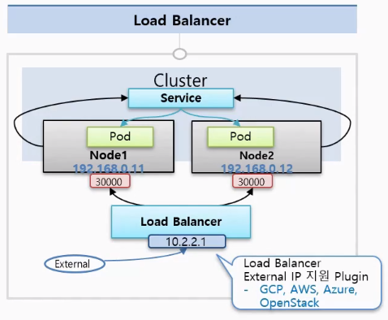

# 6.5 NodePort


NodePort 서비스는 ExternalIP와 비슷하다. 앞서 설명한 ExternalIP는 지정한 쿠버네티스 노드의 IP 주소:포트에서 수신한 트래픽을 컨테이너로 전송하는 형태로 외부와 통신할 수 있었다. 반면 NodePort는 모든 쿠버네티스 노드의 IP 주소:포트에서 수신한 트래픽을 컨테이너에 전송하는 형태로 외부와 통신할 수 있다. ExternalIP와 유사하지만, Listen할 때 0.0.0.0:포트를 사용하여 모든 IP주소로 바인드하는 형태이다. 여기서 주의할 점은 외부라는 것이 클러스터 외부를 뜻하는 것이 아니라, 파드 네트워크(내부 네트워크) 외부의 클러스터 네트워크를 의미한다. </br>
생성한 NodePort를 확인해보면 컨테이너 내부에서의 통신에 ClusterIP를 사용하기 위해 ClusterIP도 자동으로 확보된다. 컨테이너 내부에서 확인해보면 클러스터 내부 DNS에서 반환하는 서비스 디스커버리 IP 주소는 ClusterIP가 된다.


<div align="center">
  
</div>


## 6.5.1 NodePort 생성


```yaml
apiVersion: v1
kind: Service
metadata:
  name: sample-nodeport
spec:
  type: NodePort
  ports:
    - name: "http-port"
      protocol: "TCP"
      port: 8080
      targetPort: 80
      nodePort: 30080
  selector:
    app: sample-app
```


- `spec.ports[].port`: ClusterIP에서 수신할 포트 번호
- `spec.ports[].targetPort`: 목적지 컨테이너 포트 번호
- `spec.ports[].nodePort`: 모든 쿠버네티스 노드에서 수신할 포트 번호. 명시적으로 지정하지 않으면 빈 포트 번호가 자동으로 할당된다.


```sh
# NodePort 서비스 확인
$ kubectl apply -f sample-nodeport.yaml
service/sample-nodeport created

$ kubectl get services
NAME                TYPE        CLUSTER-IP      EXTERNAL-IP             PORT(S)          AGE
kubernetes          ClusterIP   10.96.0.1       <none>                  443/TCP          43d
sample-nodeport     NodePort    10.96.235.205   <none>                  8080:30080/TCP   5s

$ kubectl exec -it sample-pod -- dig sample-nodeport.default.svc.cluster.local
...
;; QUESTION SECTION:
;sample-nodeport.default.svc.cluster.local. IN A

;; ANSWER SECTION:
sample-nodeport.default.svc.cluster.local. 30 IN A 10.96.235.205

# Kind Cluster에서 요청
$ curl -s http://localhost:30080
Host=localhost  Path=/  From=sample-deployment-65b84c8657-nfhch  ClientIP=172.18.0.3  XFF=
```


## 6.5.2 NodePort 주의점


NodePort에서 사용할 수 있는 포트 범위는 통상적으로 30000 ~ 32767(쿠버네티스 기본값)이며, 범위 외의 포트를 지정하려고 하면 에러가 발생한다.</br>
또만, 당연하게도 같은 포트로 여러 서비스를 띄울 수 없다.


```yaml
apiVersion: v1
kind: Service
metadata:
  name: sample-nodeport-fail
spec:
  type: NodePort
  ports:
    - name: "http-port"
      protocol: "TCP"
      port: 8080
      targetPort: 80
      nodePort: 8888
  selector:
    app: sample-app
```


```sh
$ kubectl apply -f sample-nodeport-fail.yaml
The Service "sample-nodeport-fail" is invalid: spec.ports[0].nodePort: Invalid value: 8888: provided port is not in the valid range. The range of valid ports is 30000-32767
```


# 6.6 LoadBalancer


LoadBalancer 서비스는 서비스 환경에서 클러스터 외부로부터 트래픽을 수신할 때 가장 실용적이고 사용하기 편리한 서비스이다. LoadBalancer는 쿠버네티스 클러스터 외부의 로드 밸런서에 외부 통신이 가능한 가상 IP 주소를 엔드포인트로 할당할 수 있다. 외부 로드 밸런서를 사용하려면 쿠버네티스 클러스터가 구축된 인프라가 이 구조에 맞도록 설계되어 있어야 한다. 현재는 GCP/AWS/애저(Azhure)/OpenStack을 비롯한 클라우드 프로바이저가 LoadBalancer 서비스를 사용할 수 있는 환경을 제공하고 있다. Docker Desktop for Mac/Windows에서는 LoadBalancer 서비스를 생성하면 localhost(127.0.0.1)의 IP주소를 사용하여 접속할 수 있게 한다. 따라서 같은 포트 번호를 사용하여 여러 LoadBalancer 서비스를 생성할 수 없으므로 주의하자.</br>
NodePort나 ExternalIP에서는 결국 하나의 쿠버네티스 노드에 할당된 IP주소로 통신하기 때문에 그 노드가 단일 장애점이 되어 버린다. 하지만 LoadBalancer의 경우 쿠버네티스 노드와 별도로 외부 로드 밸런서를 사용하기 때문에 노드 장애가 발생해도 크게 문제가 되지 않는다. 구조는 NodePort를 생성하고 클러스터 외부로 로드 밸런서에 쿠버네티스 노드로 밸런싱을 하는 형태이다. 쿠버네티스 노드에 장애가 발생한 경우에는 그 노드에 트래픽을 전송하지 않음으로써 자동으로 복구하게 되어 있다.

<div align="center">
  
</div>


## 6.6.1 LoadBalancer 생성


```yaml
apiVersion: v1
kind: Service
metadata:
  name: sample-lb
spec:
  type: LoadBalancer
  ports:
    - name: "http-port"
      protocol: "TCP"
      port: 8080
      targetPort: 80
      nodePort: 30082
  selector:
    app: sample-app
```


- `spec.ports[].port`: 로드 밸런서에 할당되는 가상 IP와 ClusterIP에서 수신할 포트 번호.
- `spec.ports[].targetPort`: 목적지 컨테이너 포트 번호
- `spec.ports[].nodePort`: 모든 쿠버네티스 노드 IP주소에서 수신할 포트 번호


```sh
$ kubectl apply -f sample-lb.yaml
service/sample-lb created

# 서비스 확인
$ kubectl get services sample-lb -o wide
NAME        TYPE           CLUSTER-IP     EXTERNAL-IP   PORT(S)          AGE     SELECTOR
sample-lb   LoadBalancer   10.96.83.102   <pending>     8080:30082/TCP   2m35s   app=sample-app
```


LoadBalancer 생성 직후에는 가상 IP 할당이 완료되지 않아 pending 상태로 보이지만, 몇 초에서 수십 초 경이 지나면 생성이 완료된다. LoadBalancer 서비스를 생성하게 되면, 컨테이너 내부에서의 통신은 ClusterIP를 사용하므로 ClusterIP와 클러스터-파드간 통신에 관여하는 NodePort도 생성된다. (kind를 사용했을 경우 metalLB를 사용하여 추가적으로 서비스를 올려야 LoadBalancer 사용이 가능하다.)


## 6.6.2 로드 밸런서에 할당디는 가상 IP 정적 지정


실제 서비스 운영 환경에서는 외부로부터 요청을 수신하는 IP 주소에 대해 DNS 설정 등의 이유로 고정 IP를 사용하려는 경우가 많다. 이런 경우 `spec.loadBalancerIP`로 외부 LoadBalancer에서 사용하는 IP 주소를 지정할 수 있다.


```yaml
apiVersion: v1
kind: Service
metadata:
  name: sample-lb-fixip
spec:
  type: LoadBalancer
  loadBalancerIP: 127.0.0.1
  ports:
    - name: "http-port"
      protocol: "TCP"
      port: 8080
      targetPort: 80
  selector:
    app: sample-app
```


## 6.6.3 로드 밸런서 뱡화벽 정책 설정


LoadBalancer 서비스를 생성하면 기본적으로 외부로 완전 공개된다. GKE와 아마존 EKS에서는 LoadBalancer 서비스의 `spec.loadBalancerSourceRanges`에 접속을 허가하는 발신 측 네트워크를 지정하면 클러스터 밖의 외부 로드 밸런서에 클라우드 프로바이더가 제공하는 방화벽 기능을 사용하여 접속 제한을 설정할 수 있다. 지정하지 않을 경우, 0.0.0.0/0이 지정되어 전 세계에 공개된다.


```yaml
apiVersion: v1
kind: Service
metadata:
  name: sample-lb-fw
spec:
  type: LoadBalancer
  ports:
    - name: "http-port"
      protocol: "TCP"
      port: 8080
      targetPort: 80
  selector:
    app: sample-app
  loadBalancerSourceRanges:
  - 10.0.0.0/8
```


# 6.7 그 외의 기능 (세션 어피니티 등)


## 6.7.1 세션 어피니티


서비스에서는 세션 어피니티(Session Affinity)를 설정할 수 있다. 예를 들어, ClusterIP 서비스에서 활성화한 경우 ClusterIP로 보내진 트래픽은 서비스에 연결된 어느 하나의 파드에 전송된 후 다음 트래픽도 계속 같은 파드에 보내진다. 서비스에 대한 설정은 `spec.sessionAffinity`와 `spec.sessionAffinityConfig`을 사용한다. 현재 구현된 ClusterIP에서는 클라이언트 IP 주소(발신 측 IP 주소)를 바탕으로 목적지를 결정하게 된다. 이 세션 어피니티의 기능은 각 쿠버네티스 노드에 iptables로 구현되어 있으며, 최대 세션 고정 시간(`sessionAffinityConfig.clientIP.timeoutSeconds`)을 설정할 수 있다. 그리고 `spec.sesisonAffinity` 기본값은 0이다.


```yaml
apiVersion: v1
kind: Service
metadata:
  name: sample-session-affinity
spec:
  type: LoadBalancer
  selector:
    app: sample-app
  ports:
  - name: http-port
    protocol: TCP
    port: 8080
    targetPort: 80
    nodePort: 30084
  sessionAffinity: ClientIP
  sessionAffinityConfig:
    clientIP:
      timeoutSeconds: 10
```


```sh
# Session Affinity 생성
$ kubectl apply -f sample-session-affinity.yaml
service/sample-session-affinity created

# 첫 번째 요청
$ kubectl exec -it sample-pod -- curl http://sample-session-affinity.default.svc.cluster.local:8080
Host=sample-session-affinity.default.svc.cluster.local  Path=/  From=sample-deployment-65b84c8657-b5795  ClientIP=10.244.1.2  XFF=

# 두 번째 요청
$ kubectl exec -it sample-pod -- curl http://sample-session-affinity.default.svc.cluster.local:8080
Host=sample-session-affinity.default.svc.cluster.local  Path=/  From=sample-deployment-65b84c8657-b5795  ClientIP=10.244.1.2  XFF=

# 세 번째 요청
$ kubectl exec -it sample-pod -- curl http://sample-session-affinity.default.svc.cluster.local:8080
Host=sample-session-affinity.default.svc.cluster.local  Path=/  From=sample-deployment-65b84c8657-b5795  ClientIP=10.244.1.2  XFF=

# 10초 뒤 요청
$ kubectl exec -it sample-pod -- curl http://sample-session-affinity.default.svc.cluster.local:8080
Host=sample-session-affinity.default.svc.cluster.local  Path=/  From=sample-deployment-65b84c8657-v244g  ClientIP=10.244.1.2  XFF=
```


NodePort나 LoadBalancer 레벨에서도 세션 어피니티를 활성화할 수 있으나, 같은 노드의 같은 ClientIP라도 같은 파드에 전송된다고 보장할 수 없으므로 잘 사용되지 않는다.


## 6.7.2 노드 간 통신 제외와 발신 측 IP 주소 유지


NodePort와 LoadBalancer 서비스에서 쿠버네티스 노드에 도착한 요청은 노드를 통해 파드에서 로드 밸런싱하게 되어 있으므로 불필요한 2단계 로드 밸런싱이 이루어진다. 예를 들어, LoadBalancer 서비스에서 로드 밸런서가 로드 밸런싱하여 노드에 도착한 요청은 노드를 통해 파드에도 로드 밸런싱되는 형태이다. 이 2단계 로드 밸런싱은 균일하게 요청을 분산하기에는 쉽지만, 불필요한 Latency Overhead가 발생하거나 밸런싱을 수행할 때 네트워크 주소 변환이 이루어져 발신 측 IP 주소가 유실되는 특징이 있다.</br>


반면 데몬셋은 하나의 노드에 하나의 파드가 배치되므로, 굳이 다른 노드의 파드에 전송하지 않고 같은 노드에만 통신하고 싶은 경우가 있다. 그런 경우 `spec.externalTrraficPolicy`를 이용할 수 있다. 단, ClusterIP에서는 사용할 수 없다.


|externalTrafficPolicy 설정값|설명|
|---|---|
|Cluster(기본값)|노드에 트래픽이 도착한 후 다른 노드에 있는 파드를 포함하여 다시 로드 밸런싱함으로써 파드 부하를 균등하게 분산.|
|Local|노드에 트래픽이 도착한 후 노드 간 로드 밸런싱을 하지 않는다.|


`spec.externalTrafficPolicy`가 Cluster인 경우 앞서 설명한 바와 같고, Local인 경우 LoadBalancer 서비스와 NodePort 서비스 둘 다 외부에서 해당 노드에 도착한 요청은 그 노드상에 있는 파드에만 전송된다. 만약, 해당 노드상에 파드가 없다면 요청에 응답할 수 없다. LoadBalancer 서비스에서 사용하면 별도로 헬스 체크용 NodePort가 할당되기 때문에 파드가 존재하지 않는 노드에는 로드 밸런서에서 요청이 전송되지 않는다. 헬스 체크용 NodePort는 `spec.healthCheckNodePort`에서 설정할 수 있다. 이 설정은 LoadBalancer 서비스와 `externalTrafficPolicy`가 Local인 경우에만 설정 가능하다.


```yaml
apiVersion: v1
kind: Service
metadata:
  name: sample-lb-local
  type: LoadBalancer
  externalTrafficPolicy: Local
  healthCheckNodePort: 30086
  ports:
  - name: "http-port"
    protocol: "TCP"
    port: 8080
    targetPort: 80
    nodePort: 30085
  selector:
    app: sample-app
```


## 출처
https://dev-youngjun.tistory.com/20