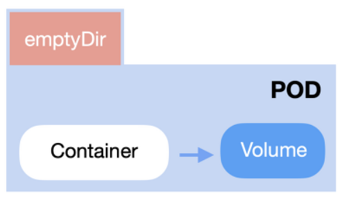
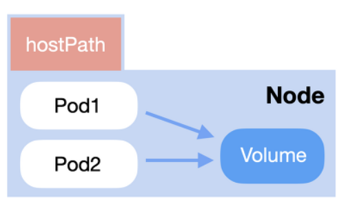

# 7.5 영구 볼륨 클레임 리소스


영구 볼륨 클레임 리소스는 영구 볼륨을 사용하기 위한 리소스이다. 종류에는 볼륨, 영구 볼륨, 영구 볼륨 클레임이 있는데, 각각의 차이점은 다음과 같다.


- 볼륨: 미리 준비된 사용 가능 볼륨 등을 매니페스트에서 직접 지정하여 사용할 수 있게 하는 것이다. 설정된 볼륨의 사용은 가능하나, 신규 볼륨을 생성하거나 기존 볼륨을 삭제하는 것은 불가능하다.
- 영구 볼륨: 외부 영구 볼륨을 제공하는 시스템과 연계하여 신규 볼륨을 생성하거나 기존 볼륨을 삭제하는 등의 작업이 가능하다. 매니페스트를 통해 별도로 생성 가능하다. 볼륨과 영구 볼륨은 같은 플러그인을 제공한다.
- 영구 볼륨 클레임: 생성된 영구 볼륨 리소스를 할당하는 리소스이다. 영구 볼륨은 클러스터에 볼륨을 등록만 하기 때문에 실제 파드에서 사용하려면 영구 볼륨 클레임을 정의하고 사용해야 한다. 동적 프로비저닝 기능을 사용한 경우 영구 볼륨 클레임이 사용된 시점에 영구 볼륨을 동적으로 생성할 수 있다.

</br>

## 7.6 볼륨


쿠버네티스에서는 볼륨을 추상화하여 파드와 느슨하게 결합된 리소스로 정의하고 있다. 볼륨 플로그인은 다음과 같이 제공되는데, 앞서 설명한 시크릿과 컨피그맵도 볼륨 플러그인의 한 종류이다. 볼륨은 영구 볼륨과 다르게 정적으로 파드에 볼륨을 지정하므로 플러그인에 따라 충돌이 있을 수 있다.


- emptyDir
- hostPath
- downwardAPI
- projected
- nfs
- iscsi
- cephfs

</br>

### 7.6.1 emptyDir

</br>
<div align="left">
  
</div>
</br>

emptyDir는 local Volume 중 하나이며, 파드 내의 파일 시스템을 할당하여 컨테이너들의 임시 디스크 영역으로 사용할 수 있는 플러그인이다. 파드가 종료 되면 삭제된다. 호스트의 임의 영역을 마운트할 수 없으며 파일을 참조할 수도 없다.

</br>

```yaml
apiVersion: v1
kind: Pod
metadata:
  name: sample-pod-emptydir
spec:
  containers:
  - image: nginx:1.16
    name: nginx-container
    volumeMounts:
    - mountPath: /cache
      name: cache-volume
  volumes:
  - name: cache-volume
    emptyDir: {}
```
</br>

emptyDir은 위와 같이 volumes.emptyDir를 통해 파드에서 생성된다. `emptyDir` 필드에서는 디스크 사이즈의 리소스 제한, 메모리 영역의 리소스 제한 역시 가능하다.

```yaml
apiVersion: v1
kind: Pod
metadata:
  name: sample-pod-emptydir-resource-limits
spec:
  containers:
  - image: nginx:1.16
    name: nginx-container
    volumeMounts:
    - mountPath: /data
      name: resource-volume-disk
    - mountPath: /cache
      name: resource-volume-memory
  volumes:
  - name: resource-volume-disk
    emptyDir:
      sizeLimit: 128Mi
  - name: resource-volume-memory
    emptyDir:
      medium: Memory
      sizeLimit: 128Mi
```

<br/>

## 7.6.2 hostPath

hostPath는 쿠버네티스 노드 상의 파일시스템 영역을 할당하여, 이를 컨테이너에 매핑하는 플러그인이다. emptyDir과 다르게, 호스트의 임의 영역을 마운트할 수 있기 때문에 사용할 때 호스트의 어떤 영역을 사용할지 지정해야 한다. 또한, 노드에 장애가 일어나지 않는다면, 파드가 지워지더라도 영향을 받지 않는 플러그인이다. 사용 시 type을 지정해야 하는데, 종류는 다음과 같다.

- Directory: 기존에 생성된 디렉터리의 경로 지정.
- DirectoryOrCreate: 기존의 생서된 디렉터리의 경로 지정. 경로에 존재하지 않을 경우 새롭게 생성.
- File: 기존에 존재하는 파일의 경로 지정.
- FileOrCreate: 기존에 존재하는 파일의 경로 지정. 경로에 존재하지 않을 경우 새롭게 생성.
- Socket: UNIX 소켓
- BlockDevice: (Linux Node에서만 사용 가능) Block Device
- CharDevice: (Linux Node에서만 사용 가능) Character Device

</br>
<div align="left">
  
</div>
</br>

```yaml
apiVersion: v1
kind: Pod
metadata:
  name: sample-pod-hostpath
spec:
  containers:
  - image: nginx:1.16
    name: nginx-container
    volumeMounts:
      name: sample-hostpath
      path: /srv
  volumes:
  - name: sample-hostpath
    hostPath:
      path: /etc
      type: Directory
```

</br>

## 7.6.3 downwardAPI

환경 변수를 사용할 때 사용했던 필드들인 fieldRef, resourceFieldRef의 사용 방법과 유사한데, 생성된 후 파드의 경로에 파일로써 존재한다.

```yaml
apiVersion: v1
kind: Pod
metadata:
  name: sample-downard-api
spec:
  containers:
  - image: nginx:1.16
    name: nginx:1.16
    volumeMounts:
      name: downard-api-volume
      path: /srv
  volumes:
  - name: downard-api-volume
    downardAPI:
      items:
      - path: "podname"
        fieldRef:
          fieldPath: metadata.name
      - path: "cpu-request"
        fieldRef:
          fieldPath: requests.cpu
```

</br>

```sh
$ kubectl exec -it sample-downard-api -- ls /srv
cpu-request podname
```

</br>

## 7.6.4 projected

`projected`는 secret/configmap/downardAPI/serviceAccountToken의 볼륨 마운트를 하나의 디렉터리에 통합하는 플러그인이다.

```yaml
apiVersion: v1
kind: Pod
metadata:
  name: sample-projected
spec:
  containers:
  - name: nginx-container
    image: nginx:1.16
    volumeMounts:
    - name: projected-volume
      path: /srv
  voumes:
  - name: projected-volume
    projected:
      sources:
      - secret:
          name: sample-db-auth
          items:
          - key: username
            path: secret/username.txt
      - configmap:
          name: sample-configmap
          items:
          - key: nginx.conf
            path: configmap/nginx.conf
      -downardAPI:
          items:
          - path: "podname"
            fieldRef:
              fieldPath: metadata.name
```

</br>

생성하고 나면 /srv 경로 아래에 세 가지 종류의 파일이 저장된다.

</br>

```yaml
$ kubectl exec -it sample-projected --ls /srv
configmap podname secret

$ kubectl exec -it sample-projected --ls /srv/configmap
nginx.conf

$ kubectl exec -it sample-projected --ls /srv/secret
username.txt
```

</br>

#  출처
https://peterica.tistory.com/272</br>