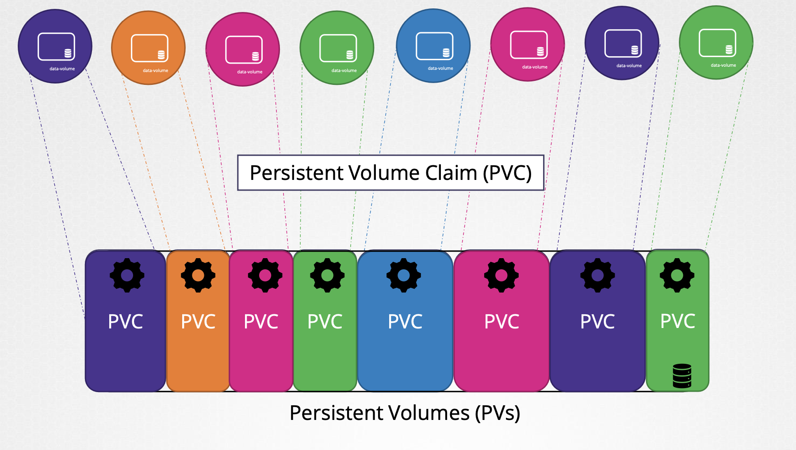

# 7.7 영구 볼륨(PV)

대규모 시스템이 모여 있는 클러스터 내에서 Pod가 생성될 때마다, Storage를 설정해줘야 한다. 모든 Pod에 일일히 설정하기는 너무 번거롭다. 쿠버네티스에는 중앙화된 거대한 pool의 스토리지를 생성하고, 각 유저들에게 조금씩 이를 쪼개어(carve out) 줄 수 있는데, 이러한 기능을 Persistent Volume이라고 한다.

</br>

영구 볼륨(Persistent Volume)이란 쿠버네티스에서 영속성 영역으로 확보된 볼륨이다. 기존에 설명한 볼륨은 파드 정의 안에 직접 정의 하는 형태이지만, 영구 볼륨은 개별 리소스로 생성한다. 파드에서 이를 직접적으로 연결하는 것은 불가능하다. 이를 연결하기 위해서는 영구 볼륨 클레임(Persistent Volume Claim) 리소스를 생성하고, 이를 파드의 `spec.volumes.persistentVolumeClaim` 필드에서 연결할 수 있다.

</br>

영구 볼륨은 기본적으로 네트워크를 통해서 마운트하는 디스크 타입이다. 단일 노드 시에는 테스트용으로 hostPath가 제공되지만, 영구 볼륨으로는 실용적이지 않다. 사용 가능한 플러그인의 종류는 다음과 같다.

- GCE Persistent Disk
- AWS EBS(Elastic Block Store)
- Azure File
- nfs
- iSCSI
- Ceph(RBD, CephFS)
- OpenStack Cinder
- GlusterFS
- Container Store Interface (CSI)


</br>

## 7.7.1 CSI(Container Store Interface)

`CSI(Container Store Interface)`는 컨테이너 오케스트레이션 엔진과 스토리지 시스템을 연결하는 인터페이스이다. 과거에는 쿠버네티스에서 프로바이더용 플러그인이 개발되었지만, 플러그인이 업데이트가 있을 때마다 쿠버네티스의 변경이 불가피하였다. 여러 종류의 Storage에 대한 종속성을 해결하기 위해 벤더들의 표준을 지정하였고, 이를 지원하는 플러그인이 CSI이다. 벤더의 종류는 아래와 같다.

- Amazon EBS(Elastic Block Store)
- Azure Desk
- Port Works
- Dell EMC Isilon
- PowerMax Unity
- XtermIO

</br>

## 7.7.2 영구 볼륨 생성

영구 볼륨을 생성할 때에는 다음과 같은 항목들을 고려해야 한다.

- 레이블
- 용량
- Access Mode
- Reclaim Policy
- Mount Option
- Storage Class
- HostPath
- 각 플러그인 특유의 설정

</br>

### 7.7.2.1 레이블

동적 프로비저닝을 사용하지 않고 영구 볼륨을 생성하는 경우 영구 볼륨 종류를 알 수 없기 때문에 레이블을 지정하는 것이 좋다. `metadata.labels`애서 지정한다.

</br>

### 7.2.2.2 용량

용량을 지정할 때 주의해야 할 점은 동적 프로비저닝을 사용할 수 없는 환경에서는 작은 용량의 영구 볼륨도 준비해두어야 한다는 점이다. 영구 볼륨 클레임에서 작은 용량의 클레임이 요청된 경우, 생성된 영구 볼륨 중 가장 비슷한 용량이 지정되기 때문이다. `spec.capacity.storage`에서 지정한다.

</br>
<div align="left">
  
</div>
</br>

### 7.2.2.3 접근 모드

접근 모드는 Volume이 호스트에 어떻게 마운트되어야 하는지를 정의한다.

- ReadWriteOnce(RWO): 단일 노드에서 Read/Write 가능
- ReadMany(ROX): 여러 노드에서 Read 가능
- ReadWriteMany(RWX): 여러 노드에서 Read/Write 가능

주의할 점은 각 모드는 파드 단위가 아닌, 노드 단위이다. 한 노드 내의 여러 파드에서 동시에 Claim한다면 동시에 Read/Write도 가능하다는 이야기이다. 특히 `ReadWriteMany(RXO)`의 경우 하나라도 쓰기 요청이 있는 파드가 있다면, 다른 노드에서 마운트가 불가능하기 떼문에 영구 볼륨 클레임을 지정할 때 `readOnly`로 지정한다. `spec.volumes[].persistentVolumeClaim.readOnly`에서 지정한다.

</br>

### 7.2.2.4 Reclaim Policy

Reclaim Policy는 영구 볼륨을 사용한 후 처리 방법을 제어하는 정책이다. 영구 볼륨 클레임에서 사용된 후 그 영구 볼륨 클레임이 삭제되었을 때 영구 볼륨의 동작을 설정한다. `spec.persistentVolumeReClaimPolicy`를 설정하는 방법은 다음 세 가지 이다.

- Delete
  - 영구 볼륨 자체가 삭제된다.
- Retain
  - 영구 볼륨 자체를 삭제하지 않고 유지한다.
  - 또 다른 영구 볼륨 클레임에 의해 이 영구 볼륨이 다시 마운트되지 않는다.
- Recycle
  - 영구 볼륨 데이터를 삭제하고, 재사용 가능 상태로 만든다.
  - 다른 영구 볼륨 클레임에서 다시 마운트 가능.
  - 이 정책은 쿠버네티스에서 더 이상 사용되지 않는다.

</br>

### 7.2.2.5 Storage Class

GKE에는 기본으로 `kubernetes.io/gce-pd`라는 프로비저너가 설정된 스토리지 클래스가 정의되어 있다. 프로비저너는 클라우드 환경의 API를 호출하는 등 동적으로 영구 볼륨을 프로비저닝하는 구조이다. 따라서 GKE에서 기본 설정 그대로 영구 볼륨 클레임을 사용하면 자동으로 동적 프로비저닝된다.

</br>

### 7.2.2.6 Mount Option

영구 볼륨의 종류에 따라 `spec.mountOptions`를 설정하여 마운트 옵션을 추가로 설정할 수 있다.

</br>

### 7.2.2.7 HostPath

spec.hostPath에는 스토리지가 사용할 노드의 로컬 디렉토리 경로를 지정한다.

</br>

### 7.2.2.8 영구 볼륨 플러그인 특유의 설정

각 영구 볼륨 종류마다 설정 항목이 조금씩 다르다.

```yaml
# gcePersistentDisk의 경우
gcePersistentDisk:
  pdName: sample-gce-pv
  fsType: ext4

# nfs 플러그인의 경우
nfs:
  server: xxx.xxx.xxx.xxx
  path: /nfs/sample
```

</br>

이렇게 모든 설정을 고려하여 아래와 같은 영구 볼륨(PV)의 생성이 가능하다.

```yaml
apiVersion: v1
kind: PersistentVolume
metadata:
  name: sample-pv
  labels:
    type: pv
    environment: stg
spec:
  capacity:
    storage: 10Gi
  accessModes:
  - ReadWriteOnce
  hostPath:
    path: /tmp/data
  persistentVolumeReclaimPolicy: Retain
  storageClass: manual
  # nfs:
  #   server: xxx.xxx.xxx.xxx
  #   path: /nfs/sample
```

</br>

# 7.8 영구 볼륨 클레임 (PVC)

`영구 볼륨 클레임(Persistent Volume Claim)`은 영구 볼륨을 요청하는 리소스이다. 앞에서 설명한 영구 볼륨은 영구 볼륨 클레임을 통해 사용하는 형태이다. 영구 볼륨 클레임에서 지정된 조건(용량, 레이블)을 기반으로 현재 가지고 있는 영구 볼륨에서 적당한 볼륨을 할당한다. 영구 볼륨 클레임을 생성할 때는 아래와 같은 항목을 설정할 수 있다.

- 레이블 셀렉터
- 용량
- Access Mode
- StorageClass

</br>

```yaml
apiVersion: v1
kind: PersistentVolumeClaim
metadata:
  name: sample-pvc
spec:
  selector:
    matchLabels:
      type: pv
    matchExpressions:
    - key: environment
      operator: In
      values:
        - stg
  resources:
    requests:
      storage: 3Gi
  accessModes:
  - ReadWriteOnce
  storageClassName: manual
```

</br>

이와 같은 PersistentVolume과 PersistentVolumeClaim이 존재한다면, 파드에서는 다음과 같이 볼륨 마운트할 수 있다.

```yaml
apiVersion: v1
kind: Pod
metadata:
  name: sample-pod-pvc
spec:
  containers:
  - name: nginx-container
    image: nginx:1.16
    volumeMounts:
    - name: sample-pvc
      mountPath: /usr/share/nginx
  volumes:
  - name: sample-pvc
    persistentVolumeClaim: sample-pvc
```

</br>

volumeMounts에서는 몇 가지 옵션을 지정할 수 있다. `readOnly`는 말 그대로 마운트할 때 readOnly 옵션을 주는 케이스이다. hostPath는 컨테이너에 호스트 영역을 보여주기 때문에 보안상 그다지 좋지 않다. 어쩔 수 없이 hostPath로 마운트해야 하는 경우 최소한 readOnly 옵션을 주는 것이 좋다.

</br>

`subPath`는 볼륨 마운트 시 특정 디렉터리를 루트로 마운트하는 기능이다. 즉, 호스트의 특정 경로를 subPath로 지정하면, 해당 경로를 mountPath에 마운트한다.

</br>

```yaml
apiVersion: v1
kind: Pod
metadata:
  name: sample-volumemount-option-pod
spec:
  containers:
  - image: nginx:1.16
    name: nginx-container
    volumeMounts:
    - mountPath: /srv
      name: sample-volumemount-option-pv
      readOnly: true
      subPath: /path1
  volumes:
  - name: sample-volumemount-option-pv
    hostPath:
      path: /etc
      type: DirectoryOrCreate
```

</br>

# 7.9 StorageClass

Static Provisioning Volume이란 GKE와 같은 클라우드 환경에서 Persistent Volume을 요청하기 위해 클라우드 내에 Disk를 프로비저닝한 뒤, 이와 같은 이름으로 PV를 요청하는 것을 말한다. 이러한 과정이 자동적으로 일어나면 좋기 때문에 Storage Class가 도입되었다. Storage Class는 구글 클라우드 같은 클라우드 서비스에 자동적으로 디스크 프로비저닝할 수 있도록 프로비저너를 정의할 수 있다. 그리고 자동으로 Pod에 마운트된다. 이를 Dynamic Provisioning of Volumes라고 한다. 즉, Storage Class가 생성되면, PV와 이와 연관된 스토리지들이 자동적으로 생성되므로 PV를 정의할 필요가 없게 된다. PVC에는 storageClassName을 붙여서 요청해주면 된다.

</br>

```sh
# Google Cloud disk provisioning
gcloud beta compute disks create --size 1GB --region us-east1 pd-disk
```

</br>

```yaml
apiVersion: storage.k8s.io/v1
kind: StorageClass
metadata:
  name: google-storage
provisioner: kubernetes.io/gce-pd
volumeBindingMode: WaitForFirstConsumer
---
apiVersion: v1
kind: PersistentVolume
metadata:
  name: pv-vol1
spec:
  accessModes:
      - ReadWriteOnce
  capacity:
      storage: 500Mi
  gcePersistentDisk:
    pdName: pd-disk
    fsType: ext4
  persistentVolumeReclaimPolicy: Retain
---
apiVersion: v1
kind: PersistentVolumeClaim
metadata:
  name: myclaim
spec:
  accessModes:
      - ReadWriteOnce
  storageClassName: google-storage
  resources:
     requests:
       storage: 500Mi
```

</br>

#  출처
https://peterica.tistory.com/272</br>