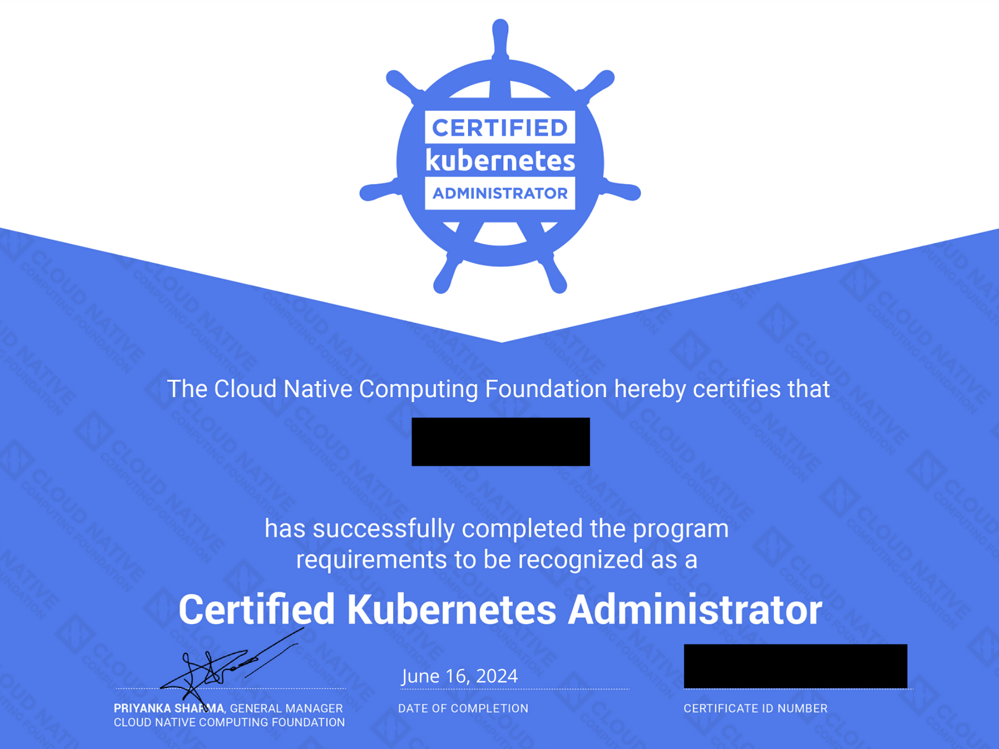
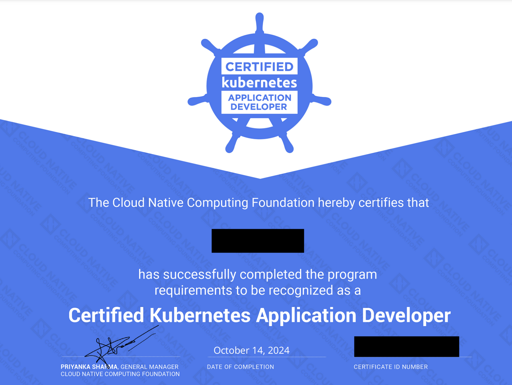
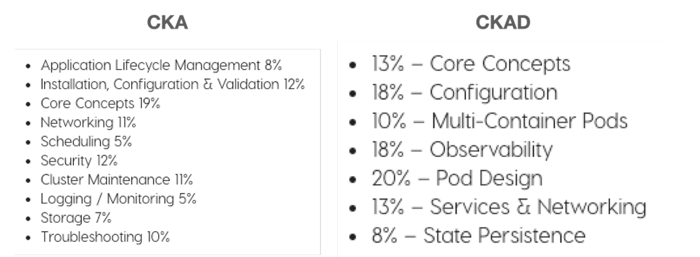
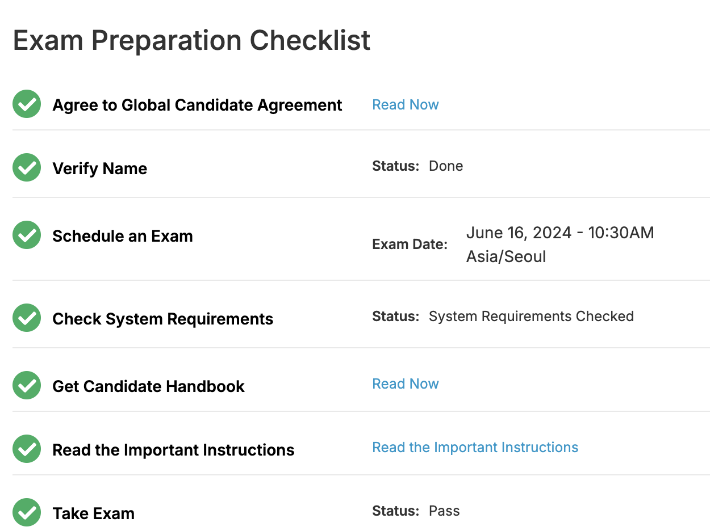
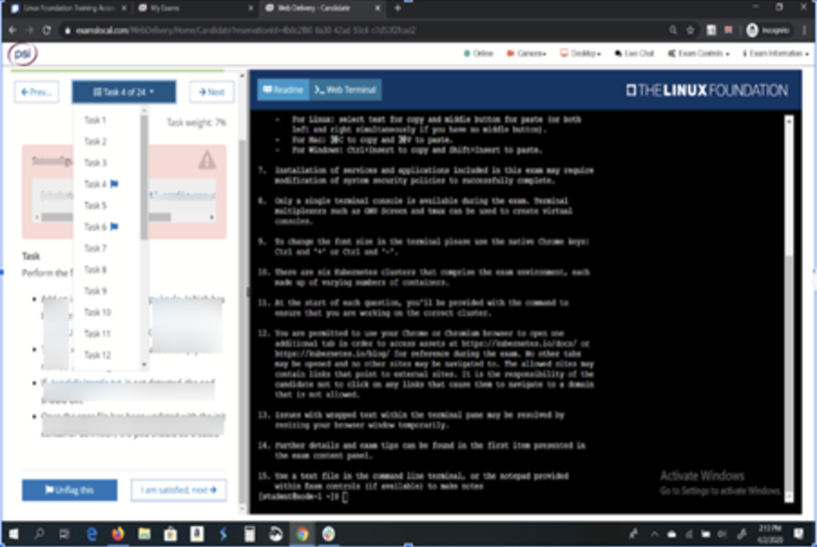

## CKA, CKAD 합격 후기

 

  
  

 

지난 2022년 7월부터 시작한 kubernetes 공부가 2024년 6~10월이 되서야 비로소 성과를 만들어 낼 수 있었다. 그 기간동안 지속적으로 공부한 기간도 있고, 잠시 쉰 기간도 있다 보니 첫 자격증 취득에도 꽤 많은 시간이 걸렸던 것 같다. 블로그에도 여러 자료를 올리기도 하고 했지만 중간에 중단했는데 그 때문에 더 뜬금없이 자격증 취득 후기를 올리게 된 것 같다.

 

개인적으로는 노트 앱에 자료는 계속 정리를 해오긴 했지만 귀찮니즘으로 블로그에는 올리지 않았었는데, 차례차례 올려볼 예정이다.

 

자격증을 취득하면서 느낀점은 역시 실무에서 사용하면서 이론과 실습이 병행되어야 빠르게 익숙해지고 금방 취득이 가능한 것 같다는 점이었다. 나의 경우 실무에서는 사용하지 않았지만 쿠버네티스나 컨테이너를 사용하는 것이 BE의 덕목 중 하나가 되면서 위기감에 자연스레 공부하게 된 것 같다. 또한, Go를 사용하는 업무 특성상 Go로 작성되었다는 쿠버네티스의 구조도 궁금증을 일으킨 것도 공부를 시작하게 된 계기 중 하나가 되었다.

 

## 쿠버네티스의 시험 종류

본격적으로 시험 후기를 작성하기에 앞서 Linux Foundation이 주관하는 쿠버네티스 자격증에 대해 소개부터 하고 시작하겠다. Linux Foundation에는 리눅스, 쿠버네티스 자격증 등을 주관하고 있는데 쿠버네티스 관련으로는 총 5개의 자격증이 있다.

 

> CKA(Certified Kubernetes Administrator), CKAD(Certified Kubernetes Application Developer), CKS(Certified Kubernetes Security Specialist), NCNA(Kubernetes and Cloud Native Associate), KCSA(Kubernetes and Cloud Native Security) 

 

이중 CKA, CKAD, CKS는 실습형 시험이고, KCNA, KCSA는 객관형 시험이다. 이 다섯가지 자격을 모두 클리어하면 `Kubestronaut`라는 자격이 주어진다고 한다. 나는 이 중 CKA와 CKAD를 취득한 것이고 쿠버네티스 자격증에 입문하는 대부분이 이 두 시험을 치루게 된다.

 

## CKA와 CKAD 비교

CKA는 영문명 그대로 쿠버네티스 클러스터 전반에 대한 운영에 대한 내용이다. 따라서 각 Object들을 생성/삭제/수정하는 방법 외에도 쿠버네티스 클러스터 구조, 보안, 버전 업데이트, 설치, 트러블 슈팅 등등 다양한 주제를 다루게 된다. 특히 시험 환경은 여러 클러스터를 운영하는 쿠버네티스 운영자의 입장에서 문제들을 해결하는 방식이다.

 

CKAD는 쿠버네티스를 이용하는 개발자의 입장에서 각종 Object들을 다루는 내용이 중점이 된다. 따라서 CKA보다는 비교적 적은 범위가 출제되고 각 Object들에 대한 설정은 보다 자세하게 공부해야 한다. 그 외에 heml을 다루는 부분이 시험 문제에 출제되기도 한다.

 

 

  

 

즉, 시험 범위는 CKA가 조금 더 넓은 편이고, CKAD 시험범위 대부분이 포함되지만 일부 내용은 CKAD에만 포함된 내용도 있다. 전체적인 시험 출제 유형은 아래와 같다.

 

### CKA 시험 유형
- Pod, Deployment, Service Object 생성
- Deployment Scale 조정
- 특정 컨테이너 이미지와 네임스페이스가 포함된 Pod 생성
- Deployment에 연결하는 Service 생성(Cluster IP), Ingress 생성
- A 네임스페이스에 있는 파드와 통신할 수 있는 B 네임스페이스에 포함된 Network Policy를 생성하는 문제
- PV(Persistent Volume), PVC(Persistent Volume Claim) 생성 및 볼륨을 연동하는 Pod 생성과 같은 문제
- Role 및 RoleBinding을 생성하고 연동하는 문제들이 나왔다.
- 클러스터 트러블슈팅 (notReady -> Ready)
    - kubelet / kubectl 설정 변경
- kubectl log를 통해서 pod의 로그 확인하기 (error 로그 출력 후 저장)
- 모든 노드의 InternalIP 출력 후 저장 (jsonPath)
- 특정 워커노드 drain 하기
- etcd 백업, 리스토어 ( 리스토어는 이미 백업이 존재하여, 내가 백업한 db말고 지문에서 백업해놓은 db로 리스토어 해야 함)
- 마스터노드 kubeadm, kubectl, kubelet 업그레이드 ( master만 하라고 지문에 되어 있었음 )
- 특정 조건의 파드생성하기 ( Tolerations )
- 사이드카 컨테이너 생성해서 로그 추출하기 (emptydir 사용)
- 멀티컨테이너 파드 생성하기 (2개 컨테이너 와 각기 다른 env 설정)
- rolling update 및 undo rollback 후 rollback history 저장
- 지문에 맞게 network policy 생성
- 지문에 맞게 ingress 생성 후 curl로 테스트
- csr 생성하여 승낙하여 지문에 맞게 role 생성 후 해당 유저에게 rolebinding
- deployment & service expose
- pv, pvc와 pod 만들기 (스토리지 클래스는 이미 생성되어있음, storage 증설)
- cpu가장 많이 사용하는 pod name 저장 (top)

 

### CKAD 시험 유형
- 키, 밸류 제공 → 시크릿 만들고 그 시크릿을 파드에 env secretRefValue 추가
- Resourece Request
- deployment의 pod 템플릿에 resouce request, limit 지정 (half, maximum 이런식으로 제시함)
- deployment, svc, ingress 제공, curl 명령어 제공해주고 deployment 수정없이 curl 성공하게끔 만들어야함
- ingress에 svc name이 다르게 들어가있어서 수정
- svc에 target port가 pod의 container port와 달라서 수정
- deployment 제공해주고, maxSurge, maxUnavailable, replica 수 조정 → 그 이후 버전 바꾸고 롤링 업데이트 되게끔함 (Canary 업데이트)
- deployment 배포 후 이미지 변경, rollout undo로 되돌리기
- deployment에 serviceaccount set 해주기
- deployment 의 pod 템플릿에 serviceaccount 변경 후 저장, 파드 로그 확인
- docker file 이미지로 제공한 이미지이름:tag달아서 build →  제시한 이름.tar 형식으로 docker save
	- docker build -t {이미지명}:{태그명} {Dockerfile경로}
- 제시한 조건대로 cronjob만들고, 만든 크론잡을 사용하는 job 생성하기
- readinessProbe, livenessProbe 추가
- 예전 버전의 yaml 제공, 현버전에 맞게 api 바꿔서 배포
	- kubernetes.io docs 참고해서 wget으로 kubectl-convert 다운 받기
	- 권한 chmod +x 로 주고 /usr/local/bin 으로 옮기기
	- kubectl-convert -f 예전버전.yaml > 신규버전.yaml
	- k apply -f 신규버전.yaml
- pod 배포, 문제에서 제공하는 env name, value 넣어서 배포
- deployment 배포, 제공하는 포트 및 NodePort 타입으로 deployment를 svc로 expose
- networkpolicy를 제공해주고, a,b,c 파드에서 c가 a,b로만 통신될 수 있도록 수정
- pod에 security context 넣기

 

두 시험과 CKS를 포함한 세 종류의 시험은 모두 유사한 환경에서 치뤄진다. 시험을 예약하고 당일이 되면 시험 페이지에 입장할 수 있는 버튼이 활성화된다. 그 버튼을 통해 시험을 치루면 가상 데스크톱 환경 (VDI)에 접속하기 위한 프로그램 설치를 하게 되고 이를 통해 리눅스 기반의 시험 환경으로 접속할 수 있게 된다. 둘다 환경은 유사하나, CKA는 여러 클러스터의 Context를 변경해가면서 문제를 풀이하게 된다면, CKAD는 ssh로 서버에 접속해서 문제를 해결하게 된다.

 

## 시험 예약하기

시험을 예약하기에 앞서 Linux Foundation에 가입이 필요하다. 가입 절차가 끝나면 시험 예약이 가능한데, 외국 사이트다 보니 Visa/MasterCard 지원하는 외화 결제 가능 카드로 결제해야 한다. 시험비가 보통 $395인데, 요즘 환율을 생각하면 55만원에 달한다... Linux Foundation에서는 정기적으로 할인 쿠폰을 제공해주는데 메일링리스트를 구독하거나 나의 경우 아래 Git을 참고하였다. 시험은 한번 예약하면 총 2번의 기회가 주어진다. 즉, 한번 탈락하더라도 만회할 기회가 있다는 것이다.

[Linux Foundation Coupons](https://github.com/techiescamp/linux-foundation-coupon)

 

시험을 예약하는 방법은 다른 블로그를 참조하면 자세히 나와 있으니 자세한 방법은 생략하겠다. 시험은 온라인으로 가상환경에서 치뤄지므로 시험관을 위해 마이크, 카메라, 스피커가 준비되어 있어야 한다. 시험을 예약하면 아래와 같은 화면에 접근이 가능한데, 시험을 치루기 전에 준비 사항들을 점검할 수 있다. 시험 시 여권이나 본인을 인증할 수 있는 신분증이 있어야 하는데 본인 이름이나 여권 정보들을 넣는 부분도 있고 시험을 예약할 수 있는 화면도 존재한다. 또한, 시험을 치루는 환경이 적절한지 (마이크, 스피커, 브라우저 등 테스트)를 검사할 수도 있다. 모든 절차가 끝나면 Take Exam 부분에 비활성화된 버튼이 생기고 시험일이 도래하면 버튼이 활성화된다.

 

  

 

 

시험에 입장하기 위해서는 위에서 말한 대로 VDI 환경 접속을 위한 프로그램을 설치하게 되고, 시험 환경에 들어가게 되면 아래와 같은 환경을 볼 수 있다. (아래 화면은 실제 시험 환경과 유사한 killer.sh의 화면이다.) 좌측에는 시험 문제가 보이며 우측 화면이 VDI 환경이다. 우측 화면에서 linux shell, firefox 브라우저를 오픈해서 Kubernetes Document를 볼 수 있도록 화면을 적절히 분배해서 사용해야 한다. (앞서 얘기하지 않았지만, CKA, CKAD, CKS는 모두 오픈북 시험이다.) 사용하는 모니터가 너무 작거나 네트워크 환경이 유선이 아닌 경우 시험을 볼 때 지옥을 경험할 수 있다.

 

  

 

시험 환경이 리눅스이다 보니 윈도우나 맥북에서 사용하던 복사/붙여넣기 키가 통하지 않는다. ctrl + c / ctrl + v 대신 ctrl + insert / shift + insert를 사용해야 하므로 시험 시 헷갈리지 않으려면 미리 killer.sh 환경에서 연습이 필요할 수 있다.

 

두 시험 모두 시험 시간은 2시간으로 총 17문제 정도가 주어진다. 시험은 부분점수가 존재하므로 답을 모르더라도 최대한 풀어보는 것이 좋다. 그리고 시간 분배가 중요하므로 잘 모르는 문제는 넘어 갔다가 나중에 다시 확인해야 한다. 오픈북이라고 한 문제만 너무 잡고 있는 것 보다는 전략적으로 시간 분배하도록 하자.

 

두 시험 모두 유효기간은 2년이다 (과거에는 3년이었던 적도 있는데 2024년 4월부터 2년으로 변경되었다.) 즉, 2년마다 시험을 갱신해야 한다.

## 시험 공부하기

거의 모든 CKA, CKAD 시험 후기를 보면 시험 공부를 위해 세 가지 강의를 추천한다.

 

- [Udemy Certified Kubernetes Administrator (CKA) with Practice Tests](https://www.udemy.com/course/certified-kubernetes-administrator-with-practice-tests/?couponCode=KRLETSLEARNNOW)
- [[따배씨] CKA 시리즈](https://www.youtube.com/playlist?list=PLApuRlvrZKojqx9-wIvWP3MPtgy2B372f)
- [Kubernetes Certified Application Developer (CKAD) with Tests](https://www.udemy.com/course/certified-kubernetes-application-developer/?couponCode=KRLETSLEARNNOW)

 

Udemy 강의는 이론부터 실전(Kodekloud 실습 쿠폰을 통해 kubernetes 클러스터 실습 가능), 모의 시험까지 제공하는 엄청난 가성비 강의이다. 또한, 완전 영어 강의지만 그렇게 어렵지 않은 수준으로 강의해주므로 CKA, CKAD의 Bible처럼 여겨진다. 강의의 마지막에는 Lightling Lab과 Mock Exam이 제공되는데, 두세번은 반복해서 풀어보는 것을 추천한다. 실제 시험과 가장 유사한 난이도로 출제된다.

 

이성미 강사님의 따배씨는 실제 출제되는 유형을 위주로 연습한다. 이론에 대해서도 알려주시지만 실전 연습할 때는 이 강의를 보는 것도 좋다. 다만 따배씨 쿠버네티스는 CKA만 지원된다. (2024/11/16 현재)

 

그 외에도 Linux Foundation에서 시험을 예악하면, Killer.sh에서 실제 시험 환경과 유사한 VDI환경에서 시험을 치룰 수 있도록 모의 시험을 제공해준다. 시험마다 2회씩 제공되는데, 실제 시험보다는 훨씬 어려운 수준이라 점수가 낮더라도 너무 낙담할 필요는 없다. 실제 시험 환경을 경험해본다는 데에 의미를 두면 된다.

 

## 시험 후기

마지막으로 시험을 치룬 후기도 올려보자면... CKA는 처음 쿠버네티스를 접하고나서부터 취득하기 까지 대략 2년의 시간이 흘렀던 것 같다. 그 사이에 몇 번이나 공부를 하다가 중단하다를 반복하였는데, 올해 초에 무조건 올해에는 딴다고 결심하였고 다른 취득한 사람의 후기를 찾아보다 보니 자신감이 생겨 몇 개월 만에 취득하게 된 것 같다. 역시나 시험은 자신감이 중요하다는 생각이 들었다.

 

CKAD는 아무래도 CKA와 시험범위가 많이 겹치다 보니 빠르게 취득할 수 있을거라 생각했고 다시 2-3달만에 취득하게 된 것 같다. 실제로는 몇일만 더 공부하면 (readinessProbe, livenessProbe, Canary Update, helm, docker, job, cronjob만 추가로 공부하면) 쉽게 취득할 수 있을것이다. 나의 경우 전체 범위를 한 번 더 둘러보다 보니 시간이 더 허비되었는데 CKA를 봤다면 크게 다르지 않았다.

 

사실 이 후기가 좀 두서가 없긴 한데, 최대한 여러 블로그의 내용을 한군데에 집약하고 싶었다. 시험이 시간이 지나면서 바뀐 부분도 많기도 해서 가능하면 최근에 올린 후기를 보고 준비하는 것이 좋을 것 같다. 다시 한 번 말하지만 CKA, CKAD 시험은 자신감이 중요한 것 같다. 잘 모르는 분야라고 너무 쫄 필요는 없는 것 같다. 여러 번 반복하고 하다 보면 문외한에서 쿠버네티스가 익숙해진 자신을 발견할 수 있을 것 이다.

 

## 시험에 참고한 사이트
https://peterica.tistory.com/category/Kubernetes/CKA%26CKAD 
https://cumulus.tistory.com/95 
https://nayoungs.tistory.com/entry/CKACertified-Kubernetes-Administrator-%ED%95%A9%EA%B2%A9-%EB%B0%8F-%EC%8B%9C%ED%97%98-%ED%9B%84%EA%B8%B0 