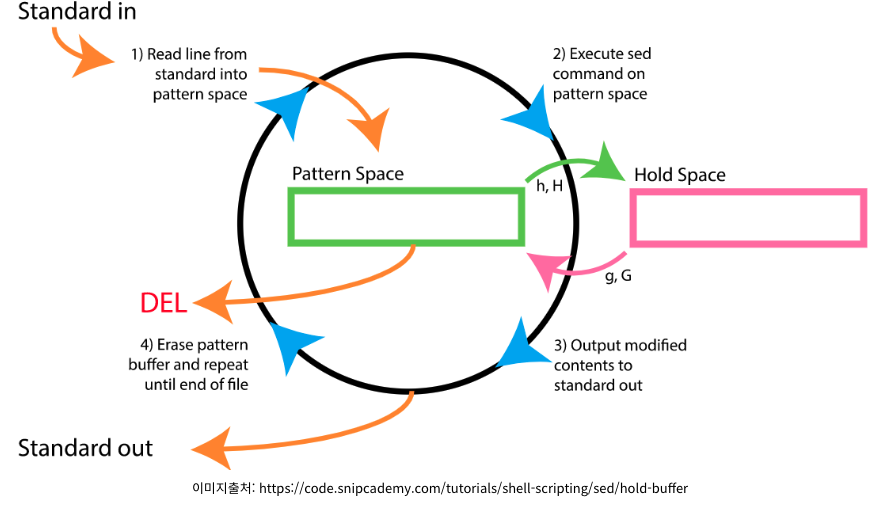

리눅스 서버에서 작업하다보면 특정 문서를 수정할 일이 생기게 된다. 보통 문서 전체를 수정하기보다는 특정 설정 값을 하나씩 설정하게 되는데 파일이 하나라면 vi 편집기로 수정이 가능하나, 파일이 여러 개인 경우, 한 파일 내에서 공통적으로 수정할 부분이 여러 군데인 경우 vi 편집기를 통한 수정은 번거로울 수 있다. 이럴 때 sed 명령어를 사용하면 쉽게 편집이 가능하다. 사용 방법을 하나씩 파악해보자.


<div align="left">

</div>


sed 명령어에는 내부적으로 두 개의 워크 스페이스를 사용한다. 이 두 버퍼는 각각 패턴 스페이스(패턴 버퍼), 홀드 스페이스(홀드 버퍼)라고 한다. 패턴 스페이스는 라인 단위로 읽을 때 읽힌 라인이 임시로 저장되는 버퍼이다. sed 명령어로 출력할 때, 이 버퍼의 내용을 출력하게 되는데 실제로 sed 명령어로 뭔가 조작을 하더라도 원본이 바로 수정되는 것이 아니라, 이 버퍼의 내용이 수정된다. 홀드 스페이스는 좀 더 길게 가지고 있는 저장소로, 읽어 온 여러 행을 저장한다. 즉, 어떤 내용을 홀드 스페이스에 저장하면, sed가 다음 행을 읽더라도 나중에 내가 원할 때 불러와서 재사용할 수 있다.


본격적으로 내용을 확인하기 전에, 예시 파일을 생성하였다. 파일 명은 `example`로 지정하였다.


```sh
# 예시 파일 내용
one
two
three
four
five
six
seven
eight
nine
ten

```


## 1) 특정 범위 만큼 파일 내용 출력
`-n`: 작업한 부분만 출력하기 위한 옵션</br>
`-e`: 여러 조건을 사용하여 출력</br>
`p`: 패턴에 따라 찾은 라인을 출력하는 플래그</br>
`,`: 범위를 지정하기 위한 플래그</br>
`^`: 시작 플래그</br>
`$`: 끝 플래그</br>


```sh
# 첫 번째 행만 출력
$ sed -n '1p' example
one

# -n 옵션 없이 첫 번째 행 출력
$ sed '1p' example
one
one
two
three
four
five
six
seven
eight
nine
ten


# 네 번째 행부터 여섯 번째 행까지 출력
$ sed -n '4,6p' example
four
five
six

# 일곱 번째 행부터 마지막까지 출력
$ sed -n '7,$p' example
seven
eight
nine
ten


# -e 조건을 사용하여 여러 조건 출력
$ sed -n -e '1p' -e '3,5p' example
one
three
four
five
```


## 2) 특정 라인 제거
`/`: / 사이에 있는 글자</br>
`d`: 삭제 플래그</br>


sed 명령어는 수정한 작업에 대해 원래을 파일을 건드리지 않는다. 이를 적용시키기 위해서는 stdout 버퍼로 별도 파일로 저장하거나 `-i` 옵션을 붙여줘야 한다. 이 때 BSD OS(Mac)의 경우 sed -i 옵션을 사용할 경우에는 제대로 적용되지 않는데, 리눅스에 보편적으로 설치되어 있는 GNU sed 와 다르기 때문이다. 이를 위해 `brew install gnu-sed`를 사용하여 `gsed` 명령어로 대체할 수 있다. sed 명령어에서도 `-i -e`로 적용 가능하긴 하다.


```sh
# 빈 라인 모두 제거
$ sed '/^$/d' example
one
two
three
four
five
six
seven
eight
nine
ten

# 빈 라인 제거해서 새로울 파일에 저장
$ sed '/^$/d' example > example_new
$ cat example_new
one
two
three
four
five
six
seven
eight
nine
ten

# 빈 라인 제거해서 원본 파일에 적용
$ sed -i -e '/^$/d' example
$ cat example
one
two
three
four
five
six
seven
eight
nine
ten
```


## 3) 치환
`s`: switch의 약자로, 치환할 때 사용하는 플래그</br>
`g`: 치환할 부분을 문서 전체에서 찾을 때 사용하는 플래그</br>
`i`: 변경 대상을 찾을 때 대소문자를 무시</br>


```sh
$ sed -i -e 's/five/fives/g' example
$ cat example
one
two
three
four
fives
six
seven
eight
nine
ten

$ sed -i -e 's/fives/FIVES/g' example
$ cat example
one
two
three
four
FIVES
six
seven
eight
nine
ten

$ sed -i -e 's/fives/five/gi' example
$ cat example
one
two
three
four
five
six
seven
eight
nine
ten

# 특정 라인만 변경
$ sed -i -e '3 s/three/throw/g' example
$ cat example
one
two
throw
four
fives
six
seven
eight
nine
ten
```


## 4) 그 외의 플래그


|옵션|의미|
|---|---|
|-n, --quiet|패턴 스페이스에 있는 내용들을 자동으로 출력하지 않음|
|-e script, --expression script|실행할 스크립트 지정|
|-f script-file, --file script-file |실행할 스크립트 파일 지정|
|-i, --in-place|변경된 내용 파일에 저장|
|-E, -r, --regex-extended|확장 정규식 패턴 사용|


## 출처
https://jhnyang.tistory.com/287</br>
https://etloveguitar.tistory.com/47