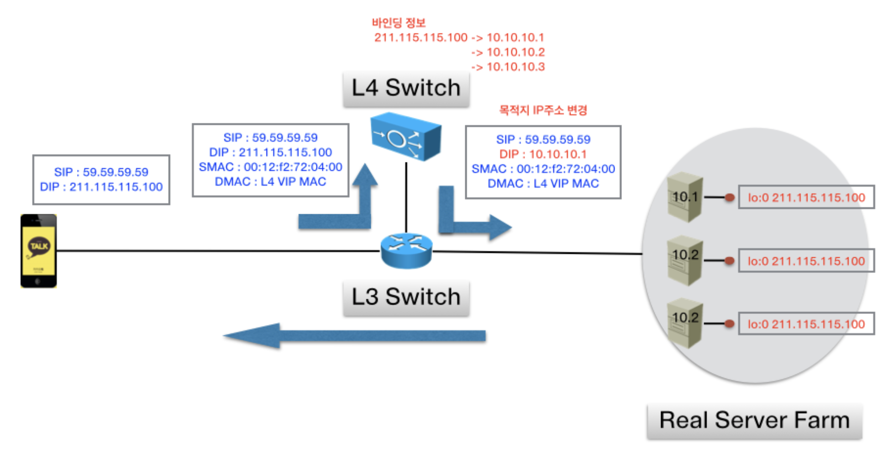
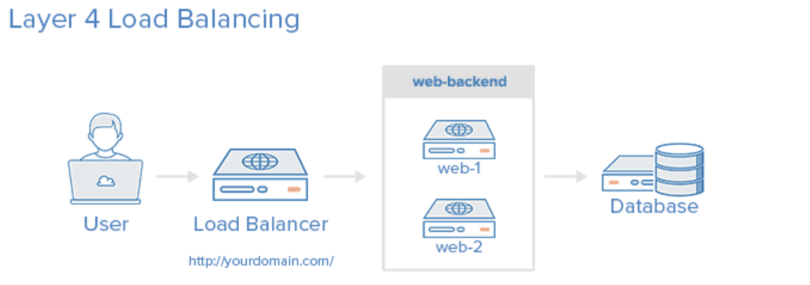
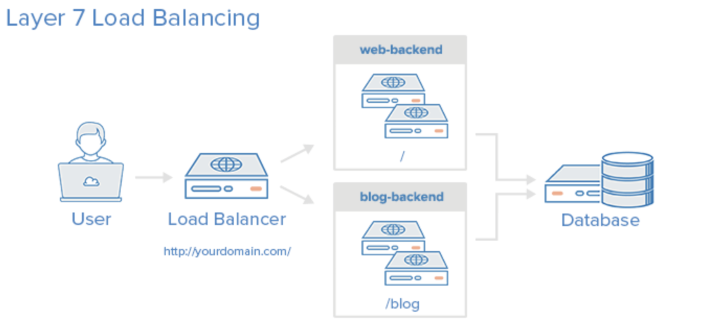

# 1. 부하 분산 방법

대부분의 인터넷을 기반으로 오픈되어 있는 서비스들의 실운영 서버는 클라우드 환경이던 컨테이너 환경이던 트래픽을 견디게 하기 위해 여러 가지 방법들을 사용한다. 서비스의 부하를 견디게 하기 위한 방법에는 크게 두 가지가 있다.

- `Scale Up`: Server 하드웨어의 스펙을 높이는 방법.

- `Scale Out`: Server를 병렬적으로 여러 대로 늘려서 부하를 분산시키는 방법.

두 가지 방법 모두 그럴듯한데, 경우에 따라 다르긴 하지만 `Scale Up` 보다는 `Scale Out`의 장점 때문에 이를 선택하는 경우가 많다. 첫 번째로 하드웨어 스펙을 높이는 것 보단, 비슷한 스펙으로 서버를 하나 더 구축하는 것이 비용면에서 더 효율적이다. 두 번째로 서버 하나에서 장애가 발생하더라도 나머지 서버가 살아 있다면 무중단 서비스를 보장할 수 있다. `로드밸런싱` 이라는 개념은 바로 이 부분에서 나오는데, 트래픽을 여러 서버로 분산시키는 기술을 로드밸런싱이라고 한다.

# 2. 로드밸런싱

## 2.1 로드밸런싱이란?

앞서 설명한 바와 같이, 로드밸런싱이란 하나의 인터넷 서비스가 발생하는 트래픽이 많을 때 여러 대의 서버가 분산처리하여 서버의 로드율 증가, 부하량, 속도 저하를 고려하여 적절히 분산처리하여 해결해주는 서비스를 의미한다. 주요 기능으로는 아래와 같다고 볼 수 있다.

- `NAT(Network Address Translation)`: 사설 IP 주소를 공인 IP 주소로 바꾸는 데 사용하는 통신망의 주소변환기

- `Tunneling`: 인터넷 상에서 보이지 않는 통로를 생성. 데이터를 캡슐화해서 연결된 상호 간에만 캡슐화된 패킷을 구별해 해제 가능.

- `DSR(Dynamic Source Routing Protocol)`: 로드 밸런서 사용 시 서버에서 클라이언트로 되돌아가는 경우 목적지 주소를 스위치의 IP 주소가 아닌 클라이언트의 IP 주소로 전달해서 네트워크 스위치를 거치지 않고 바로 클라이언트를 찾아가는 개념이다.

  

## 2.2 로드밸런서의 종류

로드 밸런서는 OSI Layer의 어떤 단계의 프로토콜을 기준으로 분산처리를 하느냐에 따라 종류가 여러 가지로 나뉜다. 주로 L4와 L7 로드밸런서가 많이 사용되는데, L4부터 IP와 Port 정보를 바탕으로 로드밸런싱이 가능하기 때문이다.

### L2
- Mac 주소를 바탕으로 로드밸런싱한다.

### L3
- IP 주소를 바탕으로 로드밸런싱한다.

### L4
- Network Layer(IP, IPX)나 Transport Layer(TCP, UDP)를 바탕으로 로드밸런싱한다.
- IP 주소와 Port, MAC주소, 전송 프로토콜에 따라 트래픽을 나누는 것이 가능하다.
- TCP, UDP

  

### L7
- Application Layer(사용자의 Request) Level에서 로드밸런싱한다.
- HTTP 헤더, 쿠키 등과 같은 사용자의 요청을 기준으로 특정 서버에 트래픽을 분산할 수 있다.
- HTTP, HTTPS, FTP

  

- `X-Forwarded-For`: HTTP 또는 HTTPS 로드 밸런서를 사용할 때 클라이언트의 IP 주소를 식별하는 데 도움을 줍니다.
- `X-Forwarded-Proto`: 클라이언트가 로드 밸런서 연결에 사용한 프로토콜(HTTP 또는 HTTPS)을 식별하는 데 도움을 줍니다.
- `X-Forwarded-Port`: 클라이언트가 로드 밸런서 연결에 사용한 포트를 식별하는 데 도움을 줍니다.

## 2.3 로드밸런서의 알고리즘

각 서버별로 적절한 부하 분산을 위해 로드밸런서는 여러 가지 알고리즘들을 사용한다. 알고리즘의 목표는 가장 균형적으로 모든 서버들에게 트래픽을 분산하는 것 이다.

- `라운드로빈 방식(Round Robin)`: 서버에 들어온 요청을 순서대로 돌아가며 배정하는 방식. 클라이언트의 요청을 순서대로 분배하기 때문에 여러 대의 서버가 동일한 스펙을 갖고 있고, 서버와의 연결이 오래 지속되지 않는 경우 활용하기 적합.
- `가중 라운드로빈 방식(Weighted Round Robin`: 각각의 서버마다 가중치를 매기고 가중치가 높은 서버에 클라이언트 요청을 우선적으로 배분한다. 주로 서버의 트래픽 처리 능력이 상이한 경우 사용되는 부하 분산 방식이다.
- `최소 연결 방식(Least Connections)`: 요청이 들어온 시점에 가장 적은 연결상태를 보이는 서버에 우선적으로 트패릭 분배. 트래픽으로 인해 세션이 길어지는 경우 선호된다.
- `IP 해시 방식(IP Hash Method)`: 사용자의 IP를 Hashing하여 분배하는 방식. 사용자는 항상 같은 서버로 연결되는 것이 보장된다.
- `최소 리스폰스 타임(Least Response Time)`: 서버의 연결 상태와 응답시간을 모두 고려하여 트래픽을 분배. 가장 적은 연결 상태와 가장 짧은 응답시간을 보이는 서버에 우선적으로 로드를 배분한다.
 짧은 응답시간을 보이는 서버에 우선적으로 로드를 배분하는 방식입니다.

## 2.4 로드밸런서의 장애 대응

서비스와 마찬가지로, 로드 밸런서 역시 장애가 발생하면 서비스 전체에 지장을 주게 될 수 있다. 이를 방지하기 위해 로드밸런서에도 이중화 처리가 가능하다. 다만, 서비스와 같이 모든 서버가 Active인 것이 아니라, Active-Stanby 구조로 서로 Health-Check를 하다가 Active 서버가 죽으면 Stanby가 Active가 되는 방식이다.

  

# 출처
https://nesoy.github.io/articles/2018-06/Load-Balancer [Nesoy Blog] 
https://m.post.naver.com/viewer/postView.naver?volumeNo=27046347&memberNo=2521903 [네이버 포스트 IT용어사전]